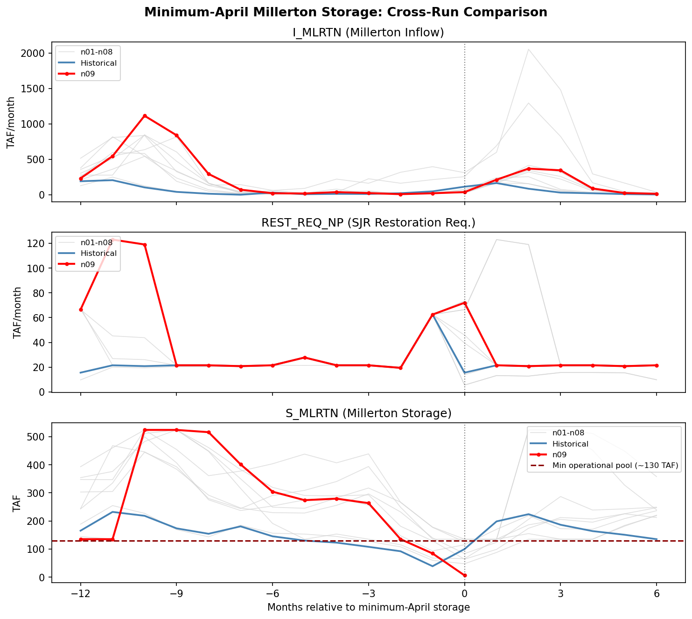

# Addressing Infeasibilities

## Overview

Eight of ten Product B chunks failed during the SJR cycle (SJRBASE). Four failure modes were identified:

1. **Low-flow failures** (n03, n07 -- Jul 1922): Near-zero inflows across all SJR tributaries propogate and cause Mokelumne allocation formula to go negative and seepage constraints to become unsatisfiable.
2. **High-flow failures** (n01, n04, n05, n06 -- June): Millerton inflows of 1,904--2,054 TAF (1.6--1.8x historical max) propagate to overflow a hardcoded 10,000 cfs bookkeeping cap in the Mendota Pool DMC balance.
3. **Low-storage Friant failure** (n09 -- seven fixes): (a) Apr 1962, c14: hard restoration equality infeasible with depleted storage (Fix 4+5); (b) Jun 1933, c14: unboundedness from zero over-delivery penalty misreported as infeasible (Fix 5); (c) Apr 1962, c19: same hard equalities in `SJR_Rest_Req_Cycle2.wresl` (Fix 6); (d) Apr 1962, c24: standalone `boundC_MLRTNmain` equality in `SJR_Rest_Full.wresl` (Fix 7); (e) May 1962, all cycles: divide-by-zero in evaporation scaling when Millerton area = 0 (Fix 8); (f,g) proactive guards on `SJR_Rest_Req_Cycle3.wresl` and `SJR_Rest_Req_Cycle4.wresl` hard equalities (Fix 9, 10).
4. **Initial-timestep failure** (n10 -- Oct 1921): Failure at the first simulation timestep. Root cause not yet identified. Resolved by restoring baseline (historical) SV values for October 1921 from `__calsim_sv_default__.dss`.

*Note: "min operational pool" refers to the minimum storage level (~130 TAF) below which Millerton Lake cannot physically release water through its outlets.*

## Low-Flow Failures

At the failure timestamps in n03 and n07, inflows are at or near zero for all major SJR tributaries simultaneously. Key inflows at Jul 1922 (all values TAF):

| Variable | n03 (Jul 1922) | Hist. Jul 1922 | Hist. Jul Min | Stochastic Pctile |
|----------|---------------|---------------|--------------|-------------------|
| I_MOK079 (Mokelumne) | 0.000 | 4.940 | 0.000 (WY 1924) | 0.0% |
| I_PARDE (Pardee) | 0.000 | 0.030 | 0.000 (WY 1924) | 0.0% |
| I_PEDRO (Don Pedro) | 0.000 | 32.510 | 0.000 (WY 1934) | 0.0% |
| I_NHGAN (New Hogan) | 0.000 | 0.370 | 0.000 (WY 1924) | 0.0% |
| I_MCLRE (McClure) | 2.590 | 86.300 | 2.690 (WY 1931) | 0.4% |
| I_MLRTN (Millerton) | 15.229 | 267.100 | 17.890 (WY 1924) | 0.0% |
| I_BCK040 (Bear Creek) | 0.000 | 0.130 | 0.000 (WY 1925) | 0.0% |
| I_DED044 (Deadman) | 0.000 | 0.010 | 0.000 (WY 1924) | 0.0% |

*Stochastic Pctile: rank within the all 10 chunks July distribution.*

The stochastic May-Jul total (~41-46 TAF/month) is roughly half the driest historical year (88 TAF/month, WY 2015) and 1/22 of the historical WY 1922 value. This level of simultaneous drought across all SJR tributaries is unprecedented in the historical record (all values TAF/month):

| Variable | n03 WY1922 | n07 WY1922 | Hist. WY1922 | Hist. Min (WY2015) | Stochastic Pctile (n03/n07) |
|----------|-----------|-----------|-------------|-------------------|----------------------------|
| I_MOK079 (Mokelumne) | 0.000 | 0.000 | 14.333 | 0.000 | 0.0% / 0.0% |
| I_PARDE (Pardee) | 0.000 | 0.000 | 0.263 | 0.037 | 0.0% / 0.0% |
| I_PEDRO (Don Pedro) | 3.836 | 3.582 | 141.563 | 9.370 | 0.5% / 0.3% |
| I_NHGAN (New Hogan) | 0.042 | 0.079 | 3.733 | 0.500 | 0.2% / 0.8% |
| I_MCLRE (McClure) | 16.580 | 15.195 | 301.067 | 22.803 | 0.5% / 0.3% |
| I_MLRTN (Millerton) | 25.900 | 22.364 | 571.080 | 55.300 | 0.7% / 0.5% |
| Total | 46.4 | 41.2 | 1032.0 | 88.0 | -- |

*Stochastic Pctile: rank across all per-WY averages for all 10 chunks.*

Figure 1: Mokelumne / Pardee Inflow Traces Around WY 1922


*Failing chunks n03 and n07 (red) show zero inflows for I_MOK079 and I_PARDE through most of WY 1922. Blue line is the CalSim historical baseline.*


**WRESL Constraints**

Two constraint groups become infeasible under these extreme low flows.

**1. Mokelumne Annual Allocation Formula**

In `Run/SanJoaquin/LowerMokelumne/Mok_WS.wresl` (line ~228), the July dry-year adjustment computes remaining riparian allocation for Jul-Sep:

```
define AnnAlloc60n_NA5adjusted{
    ...
    case July{
         condition month == JUL .AND. AnnAlloc60n_NA5 <= 17
         value (16.1-20.6*Cumdist_60N_NA5dv(-1)-20.6*dist_60N_NA5_OctFebdv(-1))
               /(1-Cumdist_60N_NA5dv(-1)-dist_60N_NA5_OctFebdv(-1))}
```

`Cumdist` and `dist_OctFeb` are fixed demand distribution fractions from applied-water patterns. The formula fires in July during dry years (`AnnAlloc60n_NA5 <= 17`, i.e., Oct-Jun Pardee FNF < 250 TAF). The causal chain:

1. Extended zero Pardee inflows -> dry year classification (`AnnAlloc60n_NA5 = 16.1`)
2. July adjustment activates
3. The fixed demand pattern allocates >78% of annual demand to Oct-Jun, so the numerator goes negative
4. The negative result (~-4.8 to -5.0 TAF) propagates as a negative upper bound on deliveries -- infeasible since deliveries must be non-negative

CalSim error output confirms: `annalloc60n_na5adjusteddv = -4.81` (n03), `-4.96` (n07).

**2. Bear Creek / Deadman Creek Seepage Constraints**

In `Run/SanJoaquin/Merced/Merced_Ops.wresl` (line ~611), the Stevinson water rights delivery is bounded by available supply:

```
goal setD_BCK006_ESC004_WR_2 {D_BCK006_ESC004_WR < I_BUR005 + I_BCK040
    + SG105_BCK040_15 + SG106_BCK035_15 + SG107_BCK031_15
    + SG108_BCK024_15 + SG109_BCK017_15 + SG110_BCK010_15 + SG111_BCK006_15}
```

This caps delivery at the sum of Bear Creek basin inflows plus seepage terms (`SG105..SG111`). The seepage terms carry forward lagged values via `setNegSG*` / `setPosSG*` goals with penalty `SGPHIGH = 77777`. Under extended zero-inflow conditions, these lagged terms do not reset to zero, so the RHS can resolve to a small negative number -- but `D_BCK006_ESC004_WR >= 0`, making the LP infeasible.

CalSim error output confirms violations at: `setnegsg105_bck040_15`, `setnegsg98_ded019_13`, `setd_bck006_esc004_wr_2`.


## High-Flow Failures

All four chunks (n01, n04, n05, n06) fail in June with identical mechanisms. Quantile mapping produces Millerton inflows that far exceed historical range (all values TAF):

| Variable | n01 Jun 1980 | n04 Jun 2006 | n05 Jun 1968 | n06 Jun 1944 | Hist. Max (all time) | Stochastic Pctile |
|----------|-------------|-------------|-------------|-------------|--------------------|--------------------|
| I_MLRTN (Millerton) | 1904.4 | 2054.0 | 2054.0 | 2054.0 | 1170.1 (Jun 1983) | 99.3% / 99.4% / 99.4% / 99.4% |

*Stochastic Pctile: rank within the all-chunk June distribution (10 chunks x 100 Junes); four values shown as n01/n04/n05/n06.*

Figure 2: Millerton Inflow Traces Around WY 1944 (n06)


*Chunk n06 (red) shows a June 1944 inflow of 2054 TAF, far exceeding the historical baseline (blue, 285.7 TAF).*

**WRESL Constraints**

The physical routing network is not the bottleneck -- all SJR channel arcs from Millerton through Sack Dam are unbounded `std` type, and the flood arc `C_SJR205_flood` can absorb excess. The infeasibility originates in the Mendota Pool DMC water balance in `SJR_Cycle_Defs_Local.wresl` (lines ~147-163):

```
define mdota_max {value 10000.0}

goal MendotaBalance   {mdota_above - mdota_below = mp_inflow - mp_deliveries - Sack_short}
goal MPInf_abv_force  {mdota_above < INT_MPInflow_abv * mdota_max}
goal MPInf_blw_force  {mdota_below < mdota_max - INT_MPInflow_abv * mdota_max}

goal limitDMC116 {C_DMC116 < mdota_below}
```

Where `mp_inflow = C_FSL005 + C_SJR205`. This integer-gated decomposition splits the Mendota Pool position into surplus (`mdota_above`) and deficit (`mdota_below`), capped at `mdota_max = 10000` cfs. With stochastic I_MLRTN of 1904-2054 TAF (~32,000-34,500 cfs-equivalent), `C_SJR205` can reach 25,000+ cfs. The net surplus far exceeds 10,000 cfs, and neither integer setting can satisfy the balance:

- `INT_MPInflow_abv = 1`: requires `mdota_above = (surplus >> 10000)` -- exceeds cap
- `INT_MPInflow_abv = 0`: requires `mdota_below < 0` -- violates non-negativity

CalSim error output confirms `mendotabalance` and `mpinf_abv_force` are named in the infeasible constraint set for all four chunks (n01, n04, n05, n06).


## Low-Storage Friant Failure

Chunk n09 fails at April 1962, Cycle 14 (sjrbase). Unlike the n03/n07 low-flow failures where all tributaries go to zero simultaneously, n09 exhibits a single-basin drought: Millerton inflow (I_MLRTN) collapses while the SJR restoration requirement (REST_REQ_NP) remains high. The model drains Millerton storage below min operational pool attempting to satisfy the restoration release, then cannot balance the continuity equation.

Key values at the failure timestep (April 1962, all values TAF):

| Variable | n09 Apr 1962  | Rank (all chunks) |
|----------|-------------|--------------------|
| I_MLRTN (Millerton inflow) | 37.5  | 3.3rd percentile |
| REST_REQ_NP (non-pulse restoration req.) | 72.0  | 89th percentile |
| REST_REQ_P (pulse restoration req.) | 11.1  | -- |
| REST_REQ total (NP + P) | 83.1  | -- |
| S_MLRTN (storage at crash) | 6.0  | below min operational pool (~130 TAF) |

*The non-pulse restoration requirement alone is 1.9x the total Millerton inflow for the month. In April the SJR restoration schedule splits into a non-pulse block (Apr 1-15) and a pulse block (Apr 16-30); the total requirement is 83.1 TAF. The infeasibility is triggered by the non-pulse component because `meetSJRR` enforces REST_RCH_NP as a hard equality -- pulse flow is handled by a separate constraint.*

Millerton storage drops from ~280 TAF in October 1961 through min operational pool and down to 6 TAF by the crash month, while inflows remain depressed (8--37 TAF/month) for 6+ consecutive months.

Figure 3: Minimum-April Millerton Storage: Cross-Run Comparison



*Three-panel comparison of Millerton Lake conditions around each run's minimum-April storage event (month 0). Top: Millerton inflow (I_MLRTN). Middle: SJR restoration requirement (REST_REQ_NP). Bottom: Millerton storage (S_MLRTN) with min operational pool (~130 TAF) dashed line. Grey lines are n01--n08, blue is the historical baseline, red is n09. Only n09 drops well below min operational pool, reaching 6 TAF at the crash month. The preceding months show n09's elevated restoration requirement (~62--72 TAF in Mar--Apr) coinciding with persistently low inflows (~8--37 TAF/month).*

**Millerton Mass Balance at Minimum-April Storage**

The table below compares the Millerton Lake water budget at each run's worst (minimum-storage) April. Only n09 ends with storage near zero; all other runs maintain tens to hundreds of TAF of headroom. The column "Avail" = S(Mar) + I(Apr) - REST_NP(Apr) shows how much water remains after meeting the non-pulse restoration requirement -- n09's 49.7 TAF is the lowest, and after evaporation and other losses (43.7 TAF), only 6 TAF remains.

*Note: The S(Apr) values come from DV outputs written by earlier cycles (1-13) that do not enforce SJR restoration constraints. The infeasibility occurs when Cycle 14 (sjrbase) attempts to impose the hard `meetSJRR` equality on top of these depleted conditions -- the LP solver finds no feasible allocation that simultaneously satisfies the bypass equality, reservoir mass balance, non-negative storage, and downstream seepage constraints within the April timestep.*

| Run | Year | S(Mar) | I(Apr) | REST_NP | Avail | Other | S(Apr) |
|-----|------|--------|--------|---------|-------|-------|--------|
| n01 | 1926 | 139.7 | 75.0 | 73.5 | 141.1 | 57.6 | 83.5 |
| n02 | 1993 | 67.7 | 43.8 | 5.6 | 106.0 | 40.2 | 65.7 |
| n03 | 1926 | 135.0 | 255.3 | 66.4 | 323.8 | 188.8 | 135.0 |
| n04 | 2014 | 128.8 | 25.8 | 45.9 | 108.7 | 44.9 | 63.8 |
| n05 | 1968 | 178.1 | 310.9 | 66.4 | 422.6 | 287.6 | 135.0 |
| n06 | 1953 | 177.0 | 41.0 | 39.4 | 178.6 | 53.6 | 125.0 |
| n07 | 2001 | 59.7 | 23.2 | 5.6 | 77.4 | 29.9 | 47.5 |
| n08 | 1949 | 93.2 | 67.3 | 13.9 | 146.6 | 31.4 | 115.1 |
| hist | 2014 | 38.7 | 113.4 | 15.6 | 136.6 | 36.8 | 99.8 |
| **n09** | **1962** | **84.2** | **37.5** | **72.0** | **49.7** | **43.7** | **6.0** |

*All values in TAF. S(Mar) = end-of-March storage from DV; I(Apr) = April inflow from SVs; REST = non-pulse restoration requirement (REST_REQ_NP) from SVs; Avail = S(Mar) + I(Apr) - REST; Other = evaporation + non-restoration deliveries (computed as Avail - S(Apr)); S(Apr) = end-of-April storage from DV (pre-sjrbase cycles). Each row shows that run's worst April -- the year with minimum S(Apr).*

The n09 crash is driven by the combination of two factors that do not co-occur in any other run:

1. **High restoration requirement**: REST_REQ_NP = 72.0 TAF, consuming 59% of the total budget (S(Mar) + I(Apr) = 121.7 TAF). Compare n07, which starts with *less* storage (59.7) and *less* inflow (23.2) but survives because its REST is only 5.6 TAF.
2. **Low inflow during a drawdown**: I_MLRTN = 37.5 TAF (3.3rd percentile of all-chunk Aprils), arriving after months of below-average inflow that already depleted storage from ~280 TAF to 84 TAF.

**WRESL Constraints**

Two hard constraints in `Run/SanJoaquin/Friant/SJR_Rest_Req_Cycle1.wresl` jointly cause the infeasibility:

```
goal setMLRTN_rel {C_MLRTN > MLRTN_rel}          ! line 10: total release >= restoration target
goal meetSJRR     {D_SJR205_SJR201 = REST_RCH_NP} ! line 50: bypass flow = non-pulse requirement
```

`meetSJRR` is the binding constraint. It forces exactly 72 TAF through the Gravelly Ford bypass in April. Millerton's water budget for the month is S(Mar) + I(Apr) = 84.2 + 37.5 = 121.7 TAF. After the 72 TAF bypass, evaporation (~6 TAF), and other deliveries (~38 TAF from prior-cycle allocations), the reservoir would need to end at approximately 6 TAF -- well below min operational pool and leaving no feasible solution once the LP enforces non-negative storage across all connected nodes. The `setMLRTN_rel` inequality (release >= target) is then also unsatisfiable because it requires at least the same 72 TAF outflow that already exhausts the reservoir.

CalSim error output confirms the infeasible constraint set: `meetsjrr`, `continuitymlrtn`, `evap_mlrtn` (negative evaporation ~-0.189 TAF), and downstream seepage/connectivity constraints (`setpossgXX_sjr` SG54-SG63, `continuitysjr205` through `continuitysjr265`).

### Follow-on: Unboundedness at June 1933 (Fix 5)

After applying Fix 4 (relaxing `meetSJRR` to a penalized soft constraint under low storage), n09 was re-run. The April 1962 failure was resolved, but a new failure appeared at June 1933, Cycle 14 (sjrbase). WRIMS reported this as "infeasible," but LP analysis with the HiGHS solver revealed the true cause: **LP unboundedness, not infeasibility**.

**Root Cause**

At June 1933, Millerton storage S_MLRTN(-1) = 123.67 TAF, which is below the 130 TAF threshold, so the `lowStorage` case of Fix 4's `meetSJRR` fires. Fix 4 set `lhs>rhs penalty 0` on the over-delivery side, meaning zero penalty for D_SJR205_SJR201 exceeding REST_RCH_NP. In the SJRBASE cycle (cycle 14), D_SJR205_SJR201 carries a solver reward of -500,000 from its priority weighting. With zero penalty for over-delivery and no effective upper bound on D_SJR205_SJR201 in cycle 14, the LP optimizer drives D_SJR205_SJR201 toward infinity -- each additional CFS earns 500,000 at zero cost. Later cycles (SJR_Rest_Full, SJR_Rest_VA) include `setSJRRflow {D_SJR205_SJR201 < Rest_Rch_Target}` which would cap the variable, but SJRBASE does not include these files.

The LP relaxation (all integers relaxed, zero objective) is feasible, confirming the continuous constraint system has no conflicts. All 16 combinations of the 4 binary variables are feasible with a zero objective. But with the actual WRIMS objective function, all 16 combinations are unbounded. WRIMS/CBC misreports unbounded LPs as "infeasible" (Status:-1).

**Key evidence from LP analysis:**

- LP file: 3,500 columns, 3,419 rows, 4 binary variables
- 280 variables have negative costs (rewards) and infinite upper bounds in the exported LP
- Only one variable actually drives unboundedness: `d_sjr205_sjr201` (cost = -500,000)
- Bounding `d_sjr205_sjr201` alone (at any finite value) makes the LP optimal
- Constraints on `d_sjr205_sjr201`: `continuitysjr205`, `continuitysjr201`, `meetsjrr`, `set_srrp_lmt1`, recapture limits, `sjrr_passthru` -- none provide an effective upper bound because free seepage variables at SJR205 absorb excess flow

**Verification**: Simulating Fix 5 (adding penalty 9999999 to the over-delivery side) with HiGHS confirms both LP and MIP solve optimally: D_SJR205_SJR201 = 0, C_MLRTN = 215, S_MLRTN = 135 (physically reasonable).


## Initial-Timestep Failure (n10)

Chunk n10 failed at October 1921 -- the first simulation timestep -- reported as `maxdiversionrate_total in svar definition: Initial data of rnchowr_rem_totaldv in dss file doesn't exist` (`wr_ranchomurieta.wresl`, cycle 14 sjrbase). `rnchowr_rem_totaldv` is a *decision variable*, not an SV, so it is absent from the SV DSS by design; the message is a downstream symptom of the first-timestep LP failing, reported where the Rancho Murieta SVAR reads a prior-cycle DV that the infeasible solve never produced.

The trigger is a pathological stochastic cold-start. A diff of the compiled `ProductB_SV_n10.dss` against baseline at Oct 1921 confirms the compile introduces no data defect -- all 19,063 paths are present with valid, non-sentinel values -- but n10's Oct 1921 draw is extreme for an October. Most relevant: `I_CSM035` (Cosumnes River inflow, which drives the Rancho Murieta water-right logic) is **19.5 TAF vs 0.33 TAF baseline (~59x)**; Sacramento-basin unimpaired flows are also 10-17x baseline (`UNIMP_OROV` 81 -> 823, `UNIMP_YUBA` 25 -> 436) and initial storages are shifted (`S_OROVLLEVEL5` 3057 -> 2731). October is the cold-start timestep, so there is no prior month of dynamics to absorb the shock. The exact binding LP constraint was not isolated (would require LP export as in the n09 analysis), but the Cosumnes inflow matches the variable named in the error.

This is why n10 is the only chunk needing a *data* fix rather than a WRESL fix: each chunk draws a different October 1921, and n10 is the only one whose extreme draw lands on the cold-start month (the others fail mid-run, where a valid prior state exists). The failure was resolved by replacing all SV values at October 1921 with baseline historical values from `__calsim_sv_default__.dss`, leaving the remaining period (November 1921 -- September 2021) unchanged. The fix script (`infeasibilities/n10.py`) copies the existing `ProductB_SV_n10.dss` to `ProductB_SV_n10_fixed.dss` and overwrites the 1920-decade DSS blocks through October 1921 with baseline values.

**This fix is a manual post-step and is not part of `product_b_compilation.py`. Recompiling n10 regenerates `ProductB_SV_n10.dss` and does not produce the `_fixed` file -- `n10.py` must be re-run after every recompile, and the n10 CalSim study must point at `ProductB_SV_n10_fixed.dss`.**


## Proposed Fixes

Four targeted WRESL edits address code that assumes historical-range inputs.

**Fix 1 -- Mokelumne allocation floor** (`Mok_WS.wresl`, line ~228): Floor the dry-year July adjustment at zero. The `max(0, ...)` prevents negative delivery bounds; under normal operations the floor is never reached.

```
    case July{
         condition month == JUL .AND. AnnAlloc60n_NA5 <= 17
         value max(0., (16.1-20.6*Cumdist_60N_NA5dv(-1)-20.6*dist_60N_NA5_OctFebdv(-1))
                       /(1-Cumdist_60N_NA5dv(-1)-dist_60N_NA5_OctFebdv(-1)))}
```

**Fix 2 -- Bear/Deadman Creek delivery guard** (`Merced_Ops.wresl`, line ~611): When both inflows are zero, cap delivery at zero without referencing lagged seepage terms. Under normal conditions the constraint is unchanged.

```
goal setD_BCK006_ESC004_WR_2 {
    lhs D_BCK006_ESC004_WR
    case noInflow {
        condition I_BCK040 < 0.001 .AND. I_BUR005 < 0.001
        rhs 0.
    }
    case normalOps {
        condition always
        rhs I_BUR005 + I_BCK040 + SG105_BCK040_15 + SG106_BCK035_15
            + SG107_BCK031_15 + SG108_BCK024_15 + SG109_BCK017_15
            + SG110_BCK010_15 + SG111_BCK006_15
        lhs<rhs penalty 0
    }
}
```

**Fix 3 -- Mendota Pool bookkeeping cap** (`SJR_Cycle_Defs_Local.wresl`, line ~147): Increase `mdota_max` from 10,000 to 50,000 cfs. Physical routing is unaffected since downstream arcs are already unbounded. Precautionary: also increase `Sack_max` from 1,500 to 5,000.

```
define mdota_max {value 50000.0}
```

**Fix 4 -- SJR restoration bypass guard** (`SJR_Rest_Req_Cycle1.wresl`, line 50): When previous-month Millerton storage is below 130 TAF (min operational pool), relax the hard restoration bypass equality to a penalized soft constraint. The solver can then reduce bypass flow to match available supply rather than draining the reservoir. The minimum-release inequality (`setMLRTN_rel`, line 10) remains hard -- once the bypass equality is relaxed, the solver can satisfy the release inequality by routing less water overall. Under normal operations (storage >= 130 TAF), `meetSJRR` remains a hard equality -- identical to the original WRESL.

**Fix 5 -- Over-delivery penalty on relaxed meetSJRR** (`SJR_Rest_Req_Cycle1.wresl`, line 50, same goal as Fix 4): Fix 4 originally set `lhs>rhs penalty 0` on the over-delivery side of the lowStorage case. This created LP unboundedness because D_SJR205_SJR201 has a solver reward of -500,000 in SJRBASE and no effective upper bound in cycle 14 -- the optimizer drives it to infinity at zero cost. Setting `lhs>rhs penalty 9999999` makes the net cost of over-delivery +9,499,999 per CFS (penalty 9,999,999 minus reward 500,000), preventing unboundedness while preserving the relaxation intent. Combined with Fix 4:

```
! line 10 -- unchanged
goal setMLRTN_rel {C_MLRTN > MLRTN_rel}

! line 50 -- modified (Fix 4 + Fix 5)
goal meetSJRR {
    lhs D_SJR205_SJR201
    case lowStorage {
        condition S_MLRTN(-1) < 130.
        rhs REST_RCH_NP
        lhs>rhs penalty 9999999
        lhs<rhs penalty 9999999
    }
    case normalOps {
        condition always
        rhs REST_RCH_NP
    }
}
```

**Fix 6 -- Cycle 2 restoration guard** (`SJR_Rest_Req_Cycle2.wresl`, lines ~109-110, cycle 19 sjr_wq1): After Fixes 4+5 resolved the cycle 14 failures, n09 was re-run and failed again at April 1962 in cycle 19. `SJR_Rest_Req_Cycle2.wresl` (included in sjr_wq1) contains two independent hard equalities that impose the same restoration flow requirement:
- `meetSJRR`: `D_SJR205_SJR201 = REST_RCH_NP` (2122 CFS = 126 TAF)
- `boundC_MLRTNmain`: `C_MLRTNM = SJRR_rel_new` (2068 CFS = 123 TAF)

With S_MLRTN(-1) = 85 TAF and near-zero Millerton inflow at April 1962, the available water cannot satisfy either constraint. HiGHS confirms true infeasibility (LP relaxation with zero objective is infeasible), distinct from the unboundedness in Fix 5. Fix: apply the same `lowStorage` guard (S_MLRTN(-1) < 130) to both goals in Cycle 2, with penalty 9999999 on both sides. Verified: LP kOptimal, MIP kOptimal. Solution: D_SJR205_SJR201 = 1482 CFS (640 CFS deficit vs 2122 target), C_MLRTN = C_MLRTNM = 1428 CFS (all available water released).

```
! lines ~109-110 -- modified (Fix 6)
goal boundC_MLRTNmain {
    lhs C_MLRTNM
    case lowStorage {
        condition S_MLRTN(-1) < 130.
        rhs SJRR_rel_new
        lhs>rhs penalty 9999999
        lhs<rhs penalty 9999999
    }
    case normalOps {
        condition always
        rhs SJRR_rel_new
    }
}

goal meetSJRR {
    lhs D_SJR205_SJR201
    case lowStorage {
        condition S_MLRTN(-1) < 130.
        rhs REST_RCH_NP
        lhs>rhs penalty 9999999
        lhs<rhs penalty 9999999
    }
    case normalOps {
        condition always
        rhs REST_RCH_NP
    }
}
```

**Fix 7 -- Full-system restoration guard** (`SJR_Rest_Full.wresl`, line ~133, cycle 24 gw_initial): After Fix 6 resolved cycle 19, n09 failed again at April 1962 in cycle 24. `SJR_Rest_Full.wresl` (included in gw_initial) has a standalone `boundC_MLRTNmain` equality with no accompanying `meetSJRR` -- `setSJRRflow` is an upper-bound inequality (`D_SJR205_SJR201 <= Rest_Rch_Target`) that is already safe. With S_MLRTN(-1) = 85 TAF, `fix_c_mlrtnf = 0` (locked from SJR_PULSE cycle), and near-zero Millerton inflow, C_MLRTNM cannot reach the required 1698 CFS (~101 TAF). HiGHS confirms genuine infeasibility (zero-objective LP is infeasible, distinct from the Fix 5 unboundedness). Fix: apply the same `lowStorage` guard to `boundC_MLRTNmain` alone. Verified: LP kOptimal, MIP kOptimal. Solution: C_MLRTN = C_MLRTNM = 1428 CFS, deficit = 270 CFS vs 1698 CFS target.

```
! line ~133 -- modified (Fix 7)
goal boundC_MLRTNmain {
    lhs C_MLRTNM
    case lowStorage {
        condition S_MLRTN(-1) < 130.
        rhs SJRR_rel_new
        lhs>rhs penalty 9999999
        lhs<rhs penalty 9999999
    }
    case normalOps {
        condition always
        rhs SJRR_rel_new
    }
}
```

**Fix 8 -- Zero-area evaporation guard** (`friant_wsf.wresl` line 41, `friant_rain_fld_est.wresl` line 15, all cycles): After Fixes 4-7 resolved the LP infeasibilities, n09 failed at May 1962 cycle 13 with two divide-by-zero errors. Both `TREvap_sep` and `TF_est_evap` compute evaporation via `A17last * evap / A_MLRTNlast`, which divides by Millerton surface area from the previous timestep. When Fixes 4-7 allow Millerton to drain to ~0 TAF in April 1962, `A_MLRTNlast = 0` for May. Both files are globally included (all cycles). Fix: add a `zeroArea` case returning 0.0 when `A_MLRTNlast < 0.01`. Physically correct: zero reservoir area means zero evaporation scaling.

```
! friant_wsf.wresl line 41 -- modified (Fix 8a)
define TREvap_sep {
    case zeroArea {
        condition A_MLRTNlast < 0.01
        value 0.0
    }
    case normalOps {
        condition always
        value A17last*FREvap_sep/A_MLRTNlast
    }
}

! friant_rain_fld_est.wresl line 15 -- modified (Fix 8b)
define TF_est_evap {
    case zeroArea {
        condition A_MLRTNlast < 0.01
        value 0.0
    }
    case normalOps {
        condition always
        value A17last*Friant_est_evap/A_MLRTNlast
    }
}
```

**Fix 9 -- Cycle 3 restoration guard (proactive)** (`SJR_Rest_Req_Cycle3.wresl`, line ~50, SJR_PULSE): `meetSJRR` is a hard equality with April/May case structure (`REST_RCH_P` vs `REST_RCH_NP`). Same low-storage failure pattern as Cycles 1 and 2. Fix: insert `lowStorage` as the first case (highest priority), so it fires before the month-specific cases. Under normal storage, original April/May behavior is preserved.

```
! line ~50 -- modified (Fix 9)
goal meetSJRR {
    lhs D_SJR205_SJR201
    case lowStorage {
        condition S_MLRTN(-1) < 130.
        rhs REST_RCH_NP
        lhs>rhs penalty 9999999
        lhs<rhs penalty 9999999
    }
    case April {
        condition month==APR
        rhs REST_RCH_P
    }
    case MayOtherwise {
        condition always
        rhs REST_RCH_NP
    }
}
```

**Fix 10 -- Cycle 4 restoration guard (proactive)** (`SJR_Rest_Req_Cycle4.wresl`, lines ~202, ~205, SJR_WQ2): Same pattern as Cycle 2 (Fix 6) -- both `boundC_MLRTNmain` and `meetSJRR` are hard equalities. Fix: apply `lowStorage` guard to both goals. `meetSJRR`'s lowStorage case takes priority over the April/May split.

```
! line ~202 -- modified (Fix 10)
goal boundC_MLRTNmain {
    lhs C_MLRTNM
    case lowStorage {
        condition S_MLRTN(-1) < 130.
        rhs SJRR_rel_new
        lhs>rhs penalty 9999999
        lhs<rhs penalty 9999999
    }
    case normalOps {
        condition always
        rhs SJRR_rel_new
    }
}

! line ~205 -- modified (Fix 10)
goal meetSJRR {
    lhs D_SJR205_SJR201
    case lowStorage {
        condition S_MLRTN(-1) < 130.
        rhs REST_RCH_NP
        lhs>rhs penalty 9999999
        lhs<rhs penalty 9999999
    }
    case April {
        condition month==APR
        rhs REST_RCH_P
    }
    case MayOtherwise {
        condition always
        rhs REST_RCH_NP
    }
}
```

