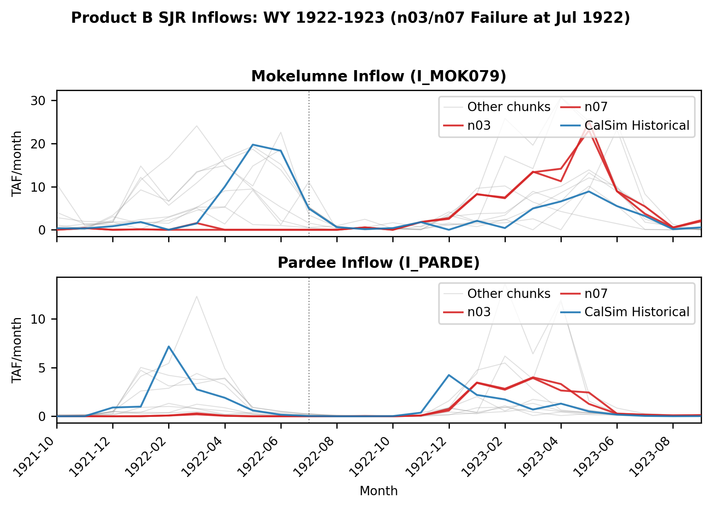
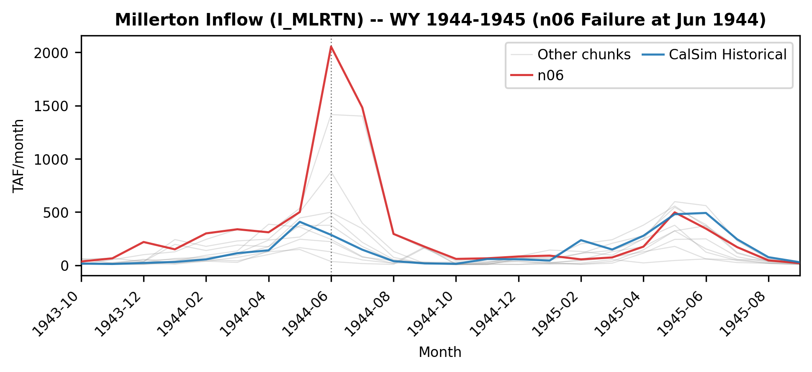

# Addressing Infeasibilities

## Overview

Six of ten Product B chunks failed during the SJR cycle (SJRBASE). Two failure modes were identified:

1. **Low-flow failures** (n03, n07 -- Jul 1922): Near-zero inflows across all SJR tributaries propogate and cause Mokelumne allocation formula to go negative and seepage constraints to become unsatisfiable.
2. **High-flow failures** (n01, n04, n05, n06 -- June): Millerton inflows of 1,904--2,054 TAF (1.6--1.8x historical max) propagate to overflow a hardcoded 10,000 cfs bookkeeping cap in the Mendota Pool DMC balance.

## Low-Flow Failures

At the failure timestamps in n03 and n07, inflows are at or near zero for all major SJR tributaries simultaneously. Key inflows at Jul 1922 (all values TAF):

| Variable | n03 (Jul 1922) | Hist. Jul 1922 | Hist. Jul Min | Stochastic Pctile |
|----------|---------------|---------------|--------------|-------------------|
| I_MOK079 (Mokelumne) | 0.000 | 4.940 | 0.000 (WY 1924) | 0.0% |
| I_PARDE (Pardee) | 0.000 | 0.030 | 0.000 (WY 1924) | 0.0% |
| I_PEDRO (Don Pedro) | 0.000 | 32.510 | 0.000 (WY 1934) | 0.0% |
| I_NHGAN (New Hogan) | 0.000 | 0.370 | 0.000 (WY 1924) | 0.0% |
| I_MCLRE (McClure) | 2.590 | 86.300 | 2.690 (WY 1931) | 0.4% |
| I_MLRTN (Millerton) | 15.229 | 267.100 | 17.890 (WY 1924) | 0.0% |
| I_BCK040 (Bear Creek) | 0.000 | 0.130 | 0.000 (WY 1925) | 0.0% |
| I_DED044 (Deadman) | 0.000 | 0.010 | 0.000 (WY 1924) | 0.0% |

*Stochastic Pctile: rank within the all 10 chunks July distribution.*

The stochastic May-Jul total (~41-46 TAF/month) is roughly half the driest historical year (88 TAF/month, WY 2015) and 1/22 of the historical WY 1922 value. This level of simultaneous drought across all SJR tributaries is unprecedented in the historical record (all values TAF/month):

| Variable | n03 WY1922 | n07 WY1922 | Hist. WY1922 | Hist. Min (WY2015) | Stochastic Pctile (n03/n07) |
|----------|-----------|-----------|-------------|-------------------|----------------------------|
| I_MOK079 (Mokelumne) | 0.000 | 0.000 | 14.333 | 0.000 | 0.0% / 0.0% |
| I_PARDE (Pardee) | 0.000 | 0.000 | 0.263 | 0.037 | 0.0% / 0.0% |
| I_PEDRO (Don Pedro) | 3.836 | 3.582 | 141.563 | 9.370 | 0.5% / 0.3% |
| I_NHGAN (New Hogan) | 0.042 | 0.079 | 3.733 | 0.500 | 0.2% / 0.8% |
| I_MCLRE (McClure) | 16.580 | 15.195 | 301.067 | 22.803 | 0.5% / 0.3% |
| I_MLRTN (Millerton) | 25.900 | 22.364 | 571.080 | 55.300 | 0.7% / 0.5% |
| Total | 46.4 | 41.2 | 1032.0 | 88.0 | -- |

*Stochastic Pctile: rank across all per-WY averages for all 10 chunks.*

Figure 1: Mokelumne / Pardee Inflow Traces Around WY 1922



*Failing chunks n03 and n07 (red) show zero inflows for I_MOK079 and I_PARDE through most of WY 1922. Blue line is the CalSim historical baseline.*


**WRESL Constraints**

Two constraint groups become infeasible under these extreme low flows.

**1. Mokelumne Annual Allocation Formula**

In `Run/SanJoaquin/LowerMokelumne/Mok_WS.wresl` (line ~228), the July dry-year adjustment computes remaining riparian allocation for Jul-Sep:

```
define AnnAlloc60n_NA5adjusted{
    ...
    case July{
         condition month == JUL .AND. AnnAlloc60n_NA5 <= 17
         value (16.1-20.6*Cumdist_60N_NA5dv(-1)-20.6*dist_60N_NA5_OctFebdv(-1))
               /(1-Cumdist_60N_NA5dv(-1)-dist_60N_NA5_OctFebdv(-1))}
```

`Cumdist` and `dist_OctFeb` are fixed demand distribution fractions from applied-water patterns. The formula fires in July during dry years (`AnnAlloc60n_NA5 <= 17`, i.e., Oct-Jun Pardee FNF < 250 TAF). The causal chain:

1. Extended zero Pardee inflows -> dry year classification (`AnnAlloc60n_NA5 = 16.1`)
2. July adjustment activates
3. The fixed demand pattern allocates >78% of annual demand to Oct-Jun, so the numerator goes negative
4. The negative result (~-4.8 to -5.0 TAF) propagates as a negative upper bound on deliveries -- infeasible since deliveries must be non-negative

CalSim error output confirms: `annalloc60n_na5adjusteddv = -4.81` (n03), `-4.96` (n07).

**2. Bear Creek / Deadman Creek Seepage Constraints**

In `Run/SanJoaquin/Merced/Merced_Ops.wresl` (line ~611), the Stevinson water rights delivery is bounded by available supply:

```
goal setD_BCK006_ESC004_WR_2 {D_BCK006_ESC004_WR < I_BUR005 + I_BCK040
    + SG105_BCK040_15 + SG106_BCK035_15 + SG107_BCK031_15
    + SG108_BCK024_15 + SG109_BCK017_15 + SG110_BCK010_15 + SG111_BCK006_15}
```

This caps delivery at the sum of Bear Creek basin inflows plus seepage terms (`SG105..SG111`). The seepage terms carry forward lagged values via `setNegSG*` / `setPosSG*` goals with penalty `SGPHIGH = 77777`. Under extended zero-inflow conditions, these lagged terms do not reset to zero, so the RHS can resolve to a small negative number -- but `D_BCK006_ESC004_WR >= 0`, making the LP infeasible.

CalSim error output confirms violations at: `setnegsg105_bck040_15`, `setnegsg98_ded019_13`, `setd_bck006_esc004_wr_2`.


## High-Flow Failures

All four chunks (n01, n04, n05, n06) fail in June with identical mechanisms. Quantile mapping produces Millerton inflows that far exceed historical range (all values TAF):

| Variable | n01 Jun 1980 | n04 Jun 2006 | n05 Jun 1968 | n06 Jun 1944 | Hist. Max (all time) | Stochastic Pctile |
|----------|-------------|-------------|-------------|-------------|--------------------|--------------------|
| I_MLRTN (Millerton) | 1904.4 | 2054.0 | 2054.0 | 2054.0 | 1170.1 (Jun 1983) | 99.3% / 99.4% / 99.4% / 99.4% |

*Stochastic Pctile: rank within the all-chunk June distribution (10 chunks x 100 Junes); four values shown as n01/n04/n05/n06.*

Figure 2: Millerton Inflow Traces Around WY 1944 (n06)


*Chunk n06 (red) shows a June 1944 inflow of 2054 TAF, far exceeding the historical baseline (blue, 285.7 TAF).*

**WRESL Constraints**

The physical routing network is not the bottleneck -- all SJR channel arcs from Millerton through Sack Dam are unbounded `std` type, and the flood arc `C_SJR205_flood` can absorb excess. The infeasibility originates in the Mendota Pool DMC water balance in `SJR_Cycle_Defs_Local.wresl` (lines ~147-163):

```
define mdota_max {value 10000.0}

goal MendotaBalance   {mdota_above - mdota_below = mp_inflow - mp_deliveries - Sack_short}
goal MPInf_abv_force  {mdota_above < INT_MPInflow_abv * mdota_max}
goal MPInf_blw_force  {mdota_below < mdota_max - INT_MPInflow_abv * mdota_max}

goal limitDMC116 {C_DMC116 < mdota_below}
```

Where `mp_inflow = C_FSL005 + C_SJR205`. This integer-gated decomposition splits the Mendota Pool position into surplus (`mdota_above`) and deficit (`mdota_below`), capped at `mdota_max = 10000` cfs. With stochastic I_MLRTN of 1904-2054 TAF (~32,000-34,500 cfs-equivalent), `C_SJR205` can reach 25,000+ cfs. The net surplus far exceeds 10,000 cfs, and neither integer setting can satisfy the balance:

- `INT_MPInflow_abv = 1`: requires `mdota_above = (surplus >> 10000)` -- exceeds cap
- `INT_MPInflow_abv = 0`: requires `mdota_below < 0` -- violates non-negativity

CalSim error output confirms `mendotabalance` and `mpinf_abv_force` are named in the infeasible constraint set for all four chunks (n01, n04, n05, n06).


## Proposed Fixes

Three targeted WRESL edits address code that assumes historical-range inputs.

**Fix 1 -- Mokelumne allocation floor** (`Mok_WS.wresl`, line ~228): Floor the dry-year July adjustment at zero. The `max(0, ...)` prevents negative delivery bounds; under normal operations the floor is never reached.

```
    case July{
         condition month == JUL .AND. AnnAlloc60n_NA5 <= 17
         value max(0., (16.1-20.6*Cumdist_60N_NA5dv(-1)-20.6*dist_60N_NA5_OctFebdv(-1))
                       /(1-Cumdist_60N_NA5dv(-1)-dist_60N_NA5_OctFebdv(-1)))}
```

**Fix 2 -- Bear/Deadman Creek delivery guard** (`Merced_Ops.wresl`, line ~611): When both inflows are zero, cap delivery at zero without referencing lagged seepage terms. Under normal conditions the constraint is unchanged.

```
goal setD_BCK006_ESC004_WR_2 {
    lhs D_BCK006_ESC004_WR
    case noInflow {
        condition I_BCK040 < 0.001 .AND. I_BUR005 < 0.001
        rhs 0.
    }
    case normalOps {
        condition always
        rhs I_BUR005 + I_BCK040 + SG105_BCK040_15 + SG106_BCK035_15
            + SG107_BCK031_15 + SG108_BCK024_15 + SG109_BCK017_15
            + SG110_BCK010_15 + SG111_BCK006_15
        lhs<rhs penalty 0
    }
}
```

**Fix 3 -- Mendota Pool bookkeeping cap** (`SJR_Cycle_Defs_Local.wresl`, line ~147): Increase `mdota_max` from 10,000 to 50,000 cfs. Physical routing is unaffected since downstream arcs are already unbounded. Precautionary: also increase `Sack_max` from 1,500 to 5,000.

```
define mdota_max {value 50000.0}
```

