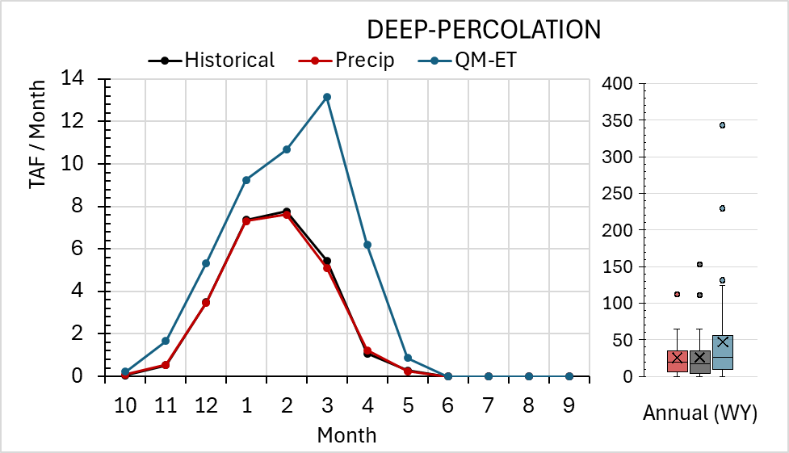
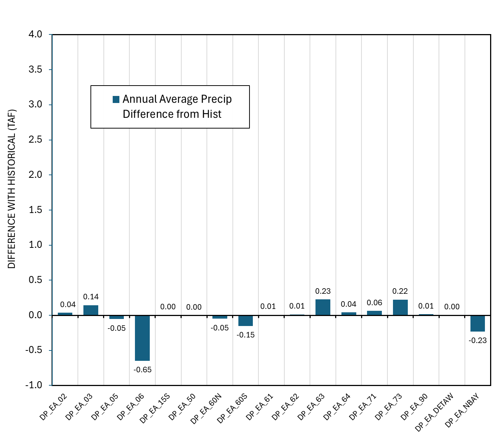
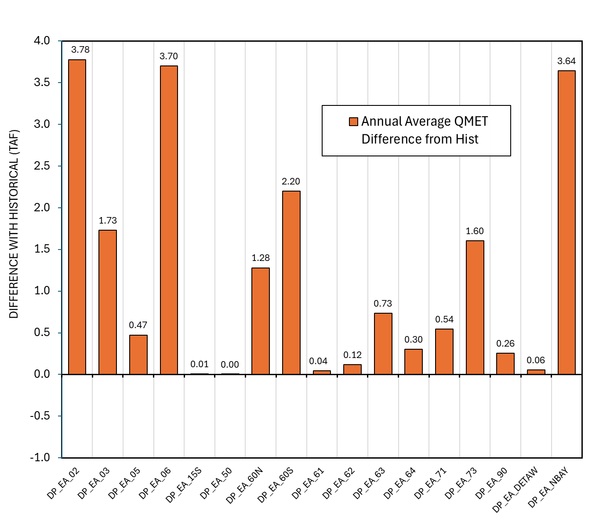
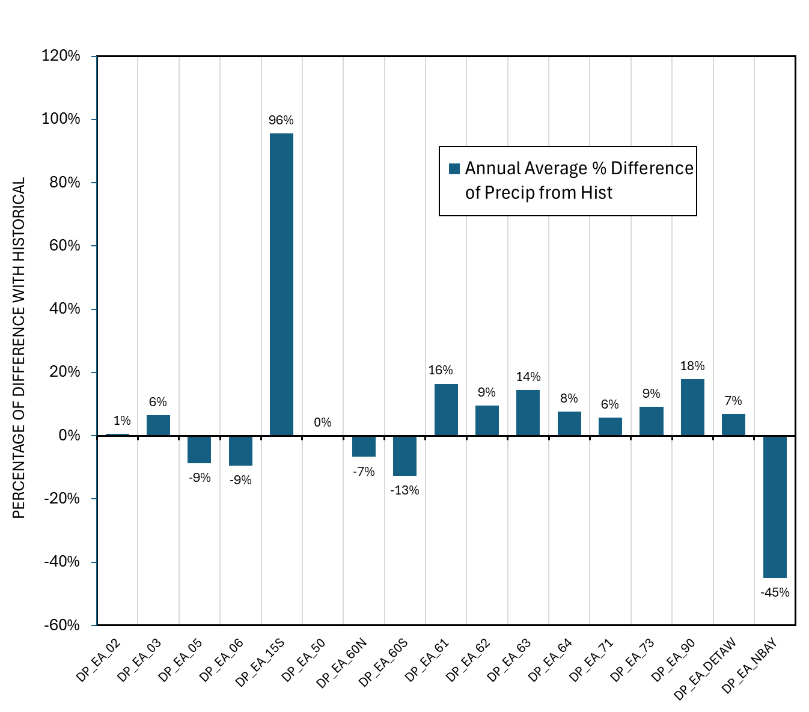

# CalSimHydroEE (17 Variables)

```{admonition} Repository Module
:class: tip

**Module:** `mod_hydrology/calsimhydro_ee/`  
External Elements boundary condition processing
```


**External Elements**

The External Elements (EE) module generates deep percolation outputs for boundary areas outside the main CalSimHydro domain, including the Mono Lake basin and other peripheral Central Valley watersheds. These provide groundwater recharge boundary conditions for the integrated groundwater-surface water modeling framework.

## Methodology

The External Elements module uses evapotranspiration quantile mapped from VIC outputs combined with precipitation taken directly from WGEN data. This approach mirrors the CalSimHydro methodology but applies to boundary regions where less detailed calibration data is available. The module generates exactly 17 deep percolation variables, each corresponding to an External Area (EA) recharge zone.

The EE model was successfully configured using historical WGEN Product A inputs, with scripts requiring modification of hard-coded paths for the project directory structure. Unlike CalSimHydro which uses ET with interannual variation, the EE module employs a simpler input structure reflecting the data-sparse nature of these boundary areas.

## Results

The analysis showed maximum differences of approximately +100% for some exterior areas, a statistic that requires careful interpretation. The extreme percentage reflects the small baseline values in these boundary regions—often fractions of a TAF per year—which amplify relative differences even when absolute differences are minimal. The median absolute difference was less than 1 TAF/yr, and the median percentage difference is manageable when viewed in context of the overall system water balance.

The ET-driven and precipitation-driven effects mirror CalSimHydro's patterns at smaller magnitudes. Quantile-mapped ET produces the maximum +100% deep percolation difference, while slightly lower WGEN precipitation leads to correspondingly lower deep percolation. The dominant signal in EE output is the ET change rather than precipitation, consistent with CalSimHydro findings where ET changes proved more influential than precipitation changes.


*CalSimHydroEE overview from Progress Meeting 2 showing monthly and annual average response for all External Areas. The +100% deep percolation maximum reflects small baseline values in the boundary regions.*



*Absolute differences from historical baseline (annual average) for all External Areas.*



*Percent differences from historical baseline. Extreme percentages (+100%) occur at small-magnitude External Areas where even modest absolute changes produce large relative differences.*

These boundary condition changes should have relatively minor effects on overall CalSim 3 results since the External Elements represent a small fraction of total system water balance. However, they ensure consistency between the stochastic inputs and the boundary conditions used in the groundwater modeling components. Maintaining this consistency avoids introducing artificial discontinuities at the boundary of the primary CalSim domain.

