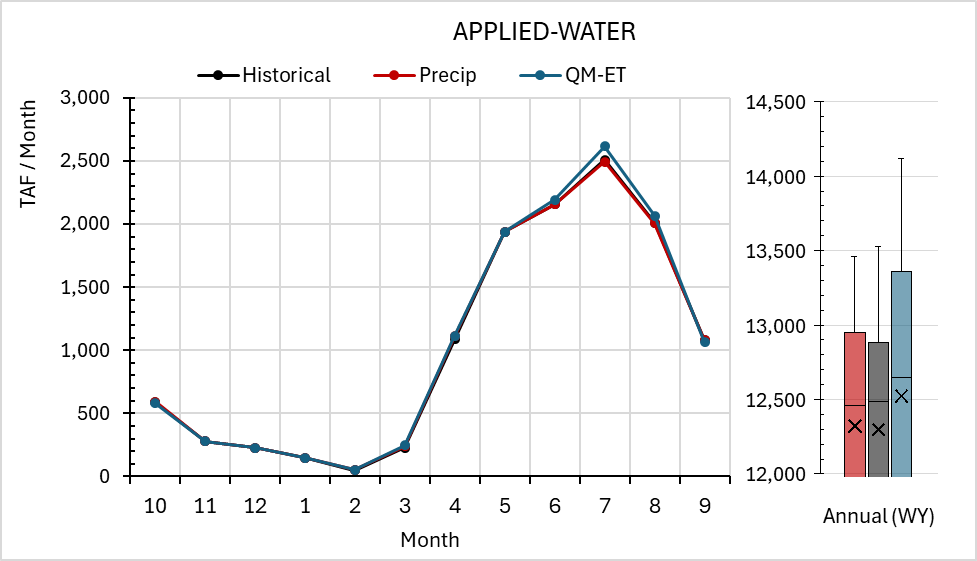
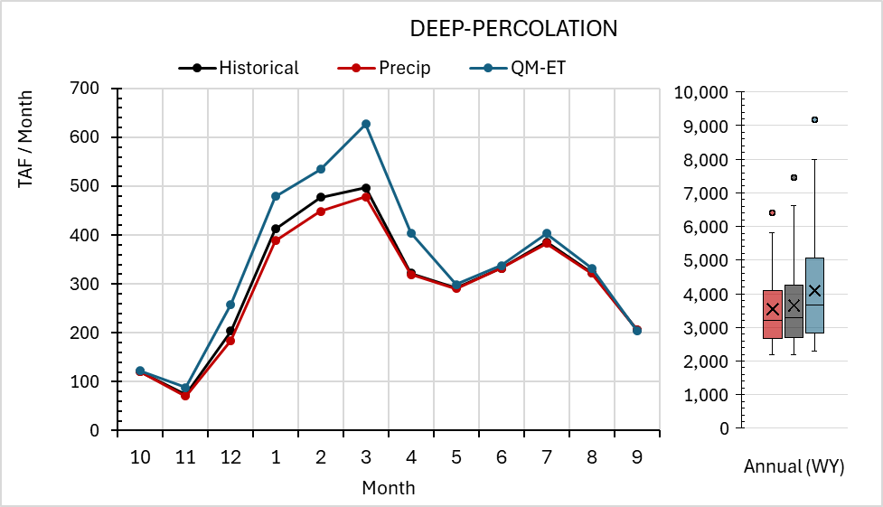
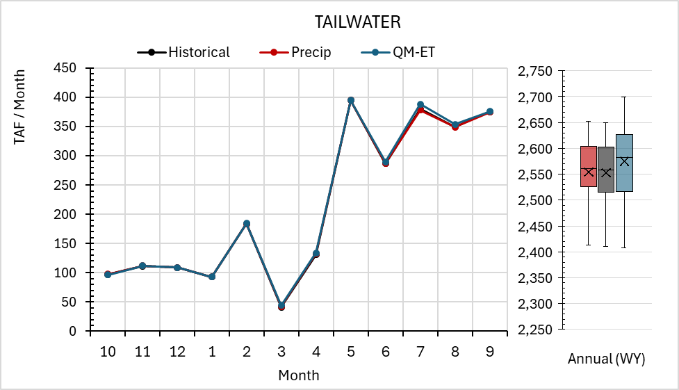

# CalSimHydro (768 Variables)

```{admonition} Repository Module
:class: tip

**Module:** `mod_hydrology/calsimhydro/`  
Sacramento Valley water budget model processing
```


CalSimHydro is a water budget model that calculates agricultural and urban water demands, groundwater interactions, and return flows for 58 Water Budget Areas (WBAs) across California's Central Valley. It provides critical inputs for CalSim 3 including applied water demands, deep percolation, surface runoff, and actual evapotranspiration. By variable count, it is the largest single input category in the CalSim 3 stochastic inventory.

## Methodology

Precipitation and temperature data generated by the weather generator (WGEN) are first processed through the VIC model. The VIC flux outputs—including EVAP, PET_H2OSURF, and PET_SHORT—are then used to develop quantile-mapped evapotranspiration data covering crop ET, reference ET, and pan evaporation. The resulting evapotranspiration outputs together with precipitation directly from the weather generator meteorological data (with no adjustment for precipitation) are subsequently used as inputs to the CalSimHydro simulations.

The CalSimHydro validation process covers the period of 1972–2018, since the quantile-mapped ET input requires a training/testing split that limits the independent testing period to the latter half of the CalSim 3 historical input record. This validation period aligns with the QM testing window used for rim inflows.

An important model version issue arose during processing: CalSimHydro 2015 is required for DCR 2023 compatibility, as the 2020 version is missing WBAs 50 and 91. WBA 91 grid information had to be sourced separately to complete the spatial domain. During initial runs, a DSS file writing issue was traced to mixed string/numeric WBA identifiers (WBA 73 appeared as both text and integer), requiring explicit type handling in the output scripts.

The version incompatibility was first surfaced when the Rebalance model produced errors using L2020A CalSimHydro output, specifically reporting that initial time series for areas "50" and "91" were missing. While the Rebalance package ran successfully with the older L2015A CalSimHydro output, the L2020A output lacked these demand areas because they were not defined in its configuration. Attempts to resolve the issue by changing the PART F identifier from L2020A to L2015A in the DSS file were unsuccessful. After consultation with Mohammad Hassan and Richard Chen, the root cause was identified as missing demand units in the CalSimHydro L2020A configuration—specifically, units 50_PA1, 91_PA, and 91_PR needed to be added. Mohammad provided an updated "Existing CSHydro" model package with the corrected configuration, which was run with the input dataset prior to executing the Rebalance module. This resolved the compatibility problem by ensuring the required demand areas were properly defined in the hydro model output, allowing the Rebalance module to run successfully.

An alternative ET methodology was proposed by MSO in late 2025, separate from the VIC-based approach. After discussion, the team elected to continue with VIC-based QM because the MSO alternative would not be available until June 2026 with the final DCR 2025 release. The ET methodology change was assessed as "low-effort" compared to replacing the hydrologic model, meaning it can be incorporated as a Phase II enhancement without disrupting the current timeline.

## Results

Two separate model simulations were conducted to isolate the effects of precipitation changes alone and evapotranspiration changes alone, enabling clearer attribution of the resulting differences to each factor independently. This decomposition approach was presented at Progress Meetings 1 and 2, providing stakeholders with clear insight into which input change drives which output response.


*Figure 6. CalSimHydro response to quantile-mapped ET changes (1972-2018). The +12% deep percolation bias is driven primarily by lower ET on rangeland, resulting in more water available for percolation.*


*Figure 7. CalSimHydro response to WGEN precipitation changes (1972-2018). The -18% surface runoff bias results from 8% lower precipitation in WGEN compared to CalSim 3 historical.*

The ET-driven simulation revealed that rangeland ET decreased under quantile-mapped inputs while agricultural ET increased slightly—a divergence attributable to the different response of managed and unmanaged land covers to ET adjustments. Lower rangeland ET leaves more water available at the soil surface for percolation, directly causing the +12% deep percolation increase seen across all WBAs. Applied water requirements for agriculture increased to meet higher potential ET requirements, representing the expected physical response where irrigation must compensate for elevated atmospheric demand.

The precipitation-driven simulation showed that 8% lower WGEN precipitation (relative to CalSim 3 historical) translates directly to reduced surface runoff (-18%) with modest effects on other water budget components. This finding confirms that CalSimHydro's surface runoff response is amplified relative to the precipitation input change—a nonlinear response consistent with rainfall-runoff theory where small reductions in precipitation cause proportionally larger reductions in excess precipitation available for runoff.

Monthly analysis across all WBAs confirmed these patterns at seasonal resolution. The combined effects of both ET and precipitation changes were tested in a third simulation, showing that ET changes appear more dominant than precipitation changes in driving overall CalSimHydro output differences. The approximately 300,000 acre-feet annual change across all WBAs represents a meaningful but not disabling shift in the valley-wide water budget.




*CalSimHydro monthly response summation over all WBAs from Progress Meeting 2, showing seasonal patterns of QM-ET effects (top left) and WGEN precipitation effects.*

The San Joaquin River (SJR) Rebalance processing was completed with a maximum difference of +4% deep percolation for the quantile-mapped ET scenario. The rebalance generates 97 additional variables required for CalSim 3 State Variable composition, covering Contract Conservation Yield, Water Use Factor adjustments, and related accounting terms on a March-through-February contract year basis.


*SJR Rebalance annual average response from Progress Meeting 2, showing the separate effects of QM-ET and WGEN precipitation on the San Joaquin basin water budget. The +4% deep percolation maximum is substantially lower than the main CalSimHydro domain.*

