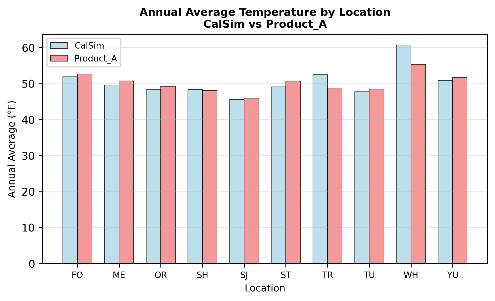
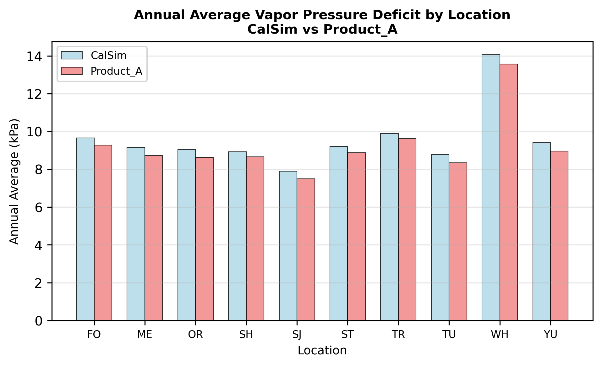
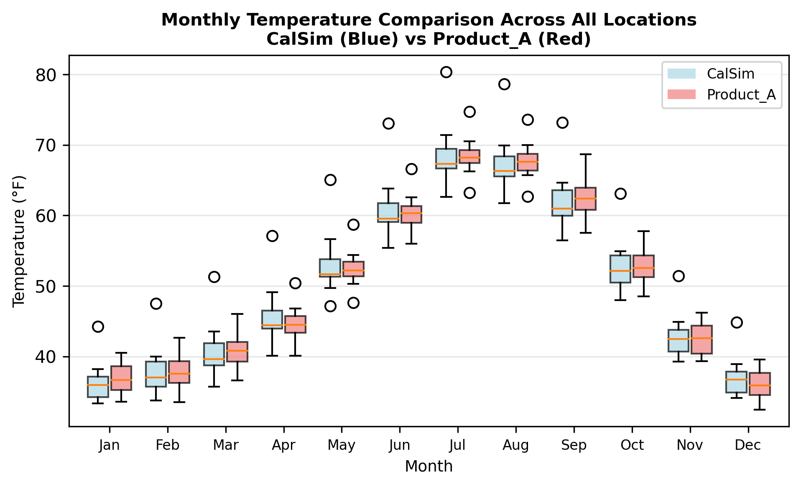
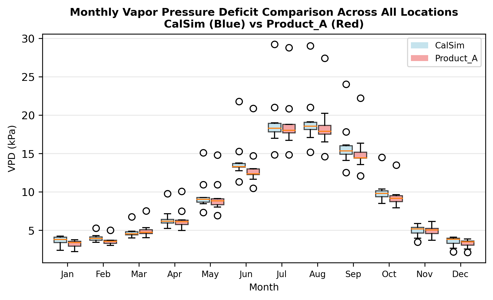

# Climate (56 Variables)

```{admonition} Repository Module
:class: tip

**Module:** `mod_forcing/climate/`  
Climate extractions at point locations and basin averages
```


Climate point locations and basin averages providing forecast DLL inputs and watershed climate summaries for CalSim 3. The 56 inputs span 26 point locations (monthly precipitation at reservoir locations) plus 30 basin-averaged inputs covering precipitation, temperature, and vapor pressure deficit for 10 watershed basins. These variables enable the forecast module to project future water availability based on current climate conditions, replicating operational decision-making processes.

## Methodology

### Point Locations and Basin Averages

The 10 watershed basins receiving full climate characterization (precipitation, temperature, VPD) represent key hydrologic regions across the CalSim domain. Basin averaging appropriately scales point measurements to watershed spatial extent, accounting for elevation gradients, orographic effects, and spatial heterogeneity. The forecast DLL uses these basin averages to develop water year outlooks that inform operational decisions within CalSim's simulation framework.

Upper Horseshoe Bar (UHH) serves as a representative basin for Sacramento River forecasting, with particular importance for Folsom and American River operations. Other basins span the Delta tributaries, San Joaquin tributaries, and eastside streams, ensuring comprehensive climate coverage for forecast generation across all CalSim regions.

### Vapor Pressure Deficit Reconstruction

Vapor pressure deficit (VPD) presents a unique reconstruction challenge since the weather generator does not produce relative humidity or dew point temperature, which are typically required for VPD calculation. VIC model outputs include humidity-related variables, but these are known to have problematic biases that would propagate into VPD estimates. The solution identified exceptional correlation between temperature and VPD at basin scales.

Correlation analysis across all 10 watershed basins revealed R > 0.97 between temperature and VPD, enabling a quantile mapping approach using temperature as the basis variable. This high correlation reflects the fundamental physical relationship where warmer air can hold more water vapor, increasing the vapor pressure deficit for a given absolute humidity. The methodology quantile maps VPD using basin-averaged temperature as the predictor, preserving the statistical relationship while avoiding VIC humidity biases.

## Results

### Vapor Pressure Deficit Validation

Product A validation shows expected bias patterns consistent with temperature-VPD coupling. Temperature exhibits slightly higher values in Product A compared to historical, which propagates to VPD reconstruction as expected from the quantile mapping basis. Precipitation shows slightly lower values in Product A, consistent with documented weather generator behavior. The VPD bias follows temperature trends as anticipated, validating the temperature-based reconstruction methodology.




*Climate validation panels from Progress Meeting 3 showing precipitation, temperature, and VPD comparisons across watershed basins. VPD bias follows the temperature pattern as expected from the QM basis relationship (R > 0.97).*




*Additional climate validation panels showing basin-level results. Trinity (TR) precipitation shows notable discrepancy requiring further grid file investigation.*

:::note Suggested Plot
Three-panel comparison showing monthly time series (WY 1972-2018) for a representative watershed basin: (1) Temperature showing slight positive Product A bias, (2) Precipitation showing slight negative Product A bias, (3) VPD showing positive bias matching temperature pattern. Include monthly box plots showing distribution shifts.
:::

### Trinity Watershed Anomaly

Trinity watershed precipitation exhibits significantly different behavior from other watersheds in the domain, with validation showing larger discrepancies than expected. Investigation revealed potential grid file discrepancies in the source data. The precipitation compilation used a VIC grid file from the CDC/rim inflow folder in baseline hydrology datasets, but the forecast DLL may use a different grid file or spatial averaging approach.

The anomaly was flagged during the January 2026 progress meeting, where further investigation identified that Trinity operates under a unique hydrologic regime: unlike other Sacramento tributaries, Trinity River drains westward to the Pacific Ocean with CVP diversions routed through a tunnel to Whiskeytown Reservoir. This geographic distinction means the VIC grid cells representing Trinity precipitation may not correspond well to the averaging domain the forecast DLL uses for Trinity operations. The precipitation signal that matters operationally is the runoff contribution diverted eastward, not total basin precipitation.

Resolution requires comparing grid files and determining which spatial definition the forecast DLL actually employs. If the discrepancy stems from grid file differences rather than methodology issues, updating to the correct grid file should resolve the anomaly. This highlights the importance of verifying spatial definitions when multiple data sources contribute to CalSim inputs, and the risk of assuming geographic consistency across independently developed model components.

:::note Suggested Plot
Map of the 10 watershed basins with shading indicating Product A vs Historical precipitation difference (blue = wetter, red = drier). Overlay the 26 point locations as markers. Highlight Trinity watershed with annotation about grid file investigation. Include representative basin time series insets showing typical validation performance.
:::

