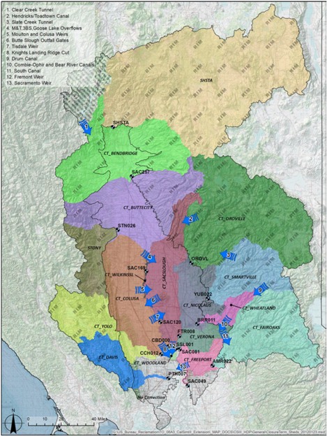
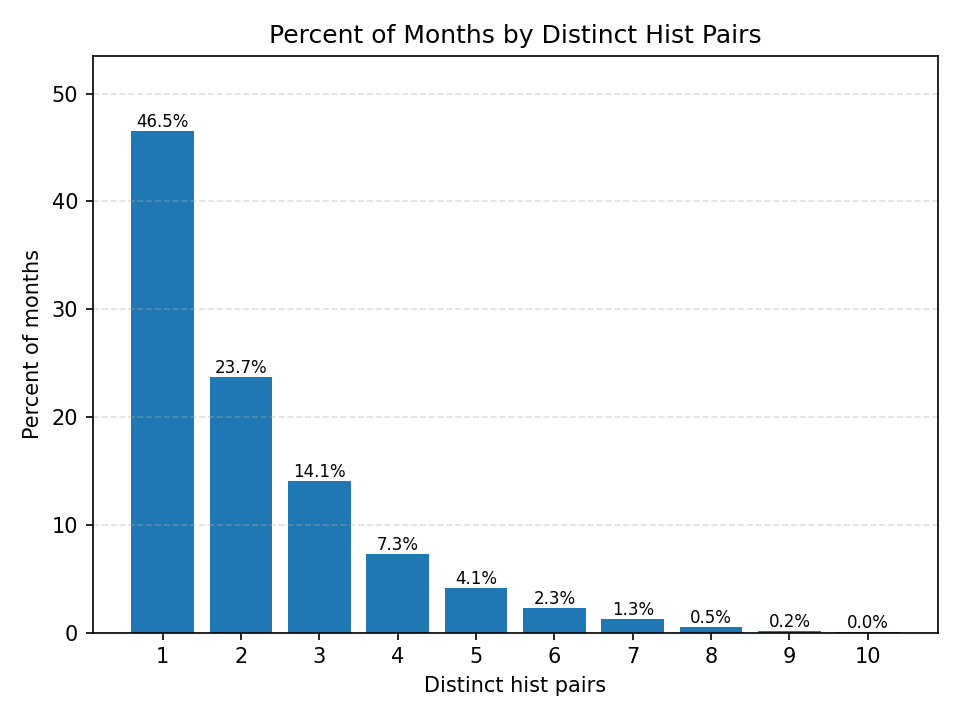
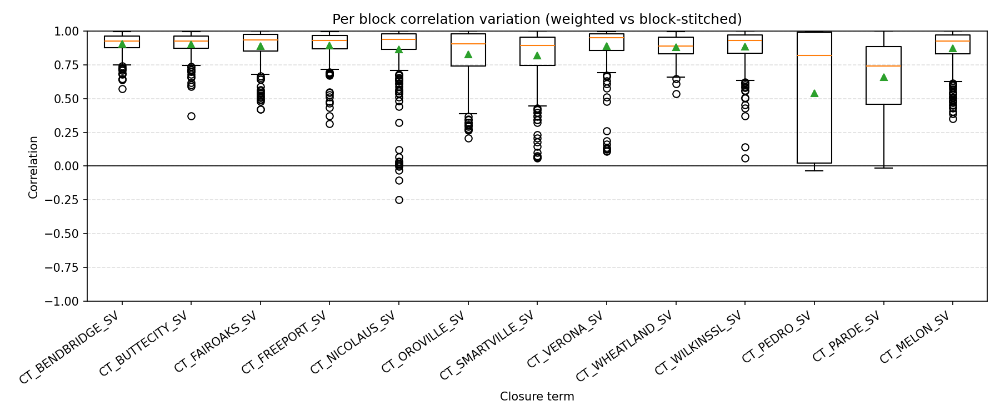

# Closure Terms (26 Variables)

```{admonition} Repository Module
:class: tip

**Module:** `mod_other/closure_terms/`  
Water balance closure adjustments
```


Closure terms represent model error corrections that reconcile differences between modeled and observed flows in CalSim 3. They have no direct physical basis and cannot be recreated from first principles, presenting a unique challenge for stochastic generation.

Of the 26 total closure terms in the CalSim 3 inventory, five terms are zero throughout the historical period and require no generation. Eight San Joaquin terms show repeating annual patterns and can be used directly. The remaining thirteen terms vary through time in non-repeating patterns and require a generation methodology.

## Methodology

Initial investigation attempted to correlate closure terms with upstream unimpaired flows and water year type indices. Monthly correlation with unimpaired flows proved too low for reliable quantile mapping. Only one location (Nicholas) showed correlation greater than 0.5. Annual sum correlation was higher for several terms—Ben Bridge at 0.69, Nicholas at 0.73, and Wilkins at 0.51—but this approach loses the monthly resolution needed for CalSim operations.

A key challenge is that closure terms can show extreme monthly variability within seasons. For example, a November-March sum might be near zero while containing +200 TAF in December and -180 TAF in January. Distributing predicted sums evenly would misrepresent actual operational patterns.

Given the limitations of correlation-based approaches, the team developed a novel weighted-average methodology using WGEN sampling dates. The approach extracts WGEN sampled dates for each synthetic month, calculates the percentage of days sampled from each historical month/year combination, extracts closure term values for each contributing historical period, and weights closure term values by sampling percentage to create the weighted average for each WGEN month.

The methodology leverages a key insight: since WGEN constructs each synthetic month by sampling from historical days, and those sampling dates are recorded, the closure terms can be reconstructed by applying the same temporal mixing. A WGEN month that draws 80% of its days from January 1987 and 20% from January 1992 would receive a closure term value that is 80% of the January 1987 historical closure term plus 20% of January 1992. This approach inherits whatever physical or operational processes originally generated the closure terms without requiring an independent physical model.

```{mermaid}
flowchart TD
    WGEN_MONTH["Synthetic WGEN Month\n(e.g., Jan Year 450)"] --> DATES["Extract Sampled\nHistorical Dates"]
    DATES --> PCT["Calculate % of Days\nfrom Each Historical Month/Year"]

    PCT --> H1["Historical Jan 1987\n(80% of days)"]
    PCT --> H2["Historical Jan 1992\n(20% of days)"]

    H1 --> CT1["Closure Term Value\nJan 1987"]
    H2 --> CT2["Closure Term Value\nJan 1992"]

    CT1 --> WAVG["Weighted Average\n0.80 x CT_1987 + 0.20 x CT_1992"]
    CT2 --> WAVG

    WAVG --> OUTPUT["Synthetic Closure Term\nfor Jan Year 450"]

    style WGEN_MONTH fill:#264653,color:#fff
    style OUTPUT fill:#2d6a4f,color:#fff
```

_WGEN date-weighted closure term reconstruction. Each synthetic month's closure term is a weighted average of historical values, with weights determined by the fraction of days sampled from each historical period._

It is worth noting that closure terms are being retired in future CalSim versions as model improvements reduce the need for empirical error corrections. Several closure terms were already retired in the DCR 2025 draft, simplifying both the CalSim model and this stochastic generation framework. This methodology may not require extensive refinement for Phase II.

## Results


*Closure term locations and their associated upstream unimpaired flows, from CalSim 3 Hydrology Report (DCR 2023), Ch. 16, Fig. 16-4. Each closure term is matched to the nearest upstream gauging station(s).*


*Figure 10. Correlation analysis from Progress Meeting 2 showing monthly (blue) and annual (orange) correlations between closure terms and their best-correlated upstream flows. Green stars mark San Joaquin closure terms (Pedro, Pardee, Melon). Monthly correlations are generally too low for quantile mapping at most locations—only Nicholas exceeds 0.5.*

Analysis of WGEN sampling patterns across the 1,000-year simulation (12,000 months) reveals favorable characteristics for the weighted-average approach. The Progress Meeting 2 presentation included detailed pie charts and distribution plots illustrating these sampling statistics.


*Figure 11. Distribution of dominant-month contribution to each WGEN month. Fully 46.5% of WGEN months are sampled entirely from a single historical month/year (perfect mapping), while only 5.7% have less than 40% from the dominant month.*


*Distribution of distinct historical (month, year) pairs contributing to each WGEN month. About 46.5% come from a single pair, another 45% from 2–4 pairs, and less than 8% involve 5+ distinct source periods.*

The pie chart shows that 46.5% of WGEN months come entirely from a single historical month/year, representing perfect mapping where the weighted average equals the actual historical value. An additional 18.6% have 80–99.9% from the dominant month, and 16.6% have 60–79.9%. Only 5.7% have less than 40% from the dominant month, meaning most synthetic months closely reflect actual historical closure term values rather than heavily blended averages.

Validation using 4-year block comparison shows mean correlation of approximately 0.8 between weighted-average closure terms and “perfect” block-stitched closure terms. The 4-year block analysis directly compares the WGEN-weighted approach against an idealized block-stitching approach that would assign each 4-year block the closure terms from its dominant historical 4-year source. Most blocks show 70–85% coverage from a dominant historical 4-year period, and blocks with lower coverage show correspondingly lower correlation. This relationship validates that the methodology performs best when WGEN sampling is most temporally coherent—precisely the condition that occurs most frequently in the 1,000-year stochastic sequence.


*Coverage ratio distribution for dominant 4-year blocks from Progress Meeting 2. Most blocks show 70–85% coverage from the same historical 4-year period, validating the temporal coherence of WGEN sampling.*


*Box plots of monthly correlation distribution across all 4-year blocks for each closure term, from Progress Meeting 2. Correlation is generally high (mean ~0.8), with wider spread for Don Pedro and Pardee on the San Joaquin, which show more random signal patterns.*

