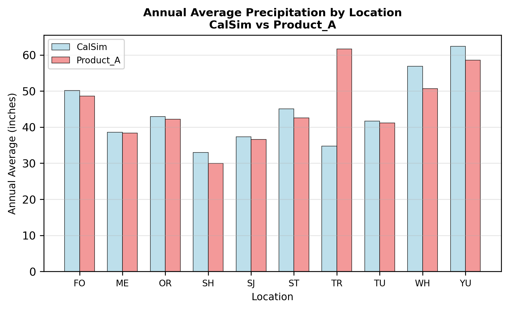
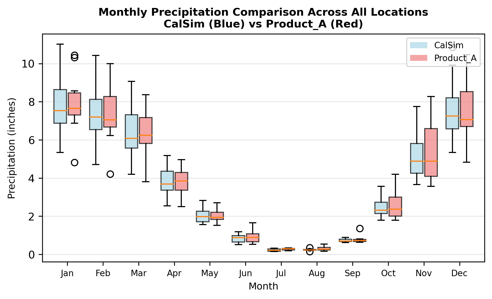

# mod_forcing/climate

```{admonition} Repository Module
:class: tip

**Module:** `mod_forcing/climate/`  
Climate extractions at point locations and basin averages
```

This module develops 56 inputs comprising 26 point locations (monthly precipitation at reservoir locations) and 30 basin-averaged upper watershed inputs (precipitation, temperature, and vapor pressure deficit for 10 watershed basins) that the forecast module uses to project water-year availability.

## Point precipitation and basin averages

The 26 point precipitation locations are extracted from the nearest WGEN grid cell to each reservoir coordinate. Because WGEN precipitation is used directly without bias correction, Product A values inherit any precipitation artifacts relative to the CalSim baseline record.

The 10 basin-averages (precipitation, temperature, VPD) are for the headwater inflow watersheds of the major CVP and SWP reservoirs. On the Sacramento side these are Shasta, Trinity, Whiskeytown, Oroville, Yuba, and Folsom; on the San Joaquin side, New Melones, Don Pedro, McClure, and Millerton. These basin averages are the Upper Headwater Hydrology (UHH) inputs to CalSim 3's hydroforecast DLL, the component that develops the water-year outlooks driving operational decisions. The UHH locations are defined in `reference/uhh_locations.csv`.

## Vapor pressure deficit reconstruction

Vapor pressure deficit (VPD) is hard to reconstruct because the weather generator does not produce the relative humidity or dew point temperature that VPD calculation normally requires. The reconstruction instead exploits the strong correlation between temperature and VPD at basin scale. Correlation analysis across all 10 basins found R > 0.97 between temperature and VPD, supporting a quantile mapping approach with temperature as the basis variable. The correlation reflects the physical relationship that warmer air holds more water vapor, which raises the vapor pressure deficit at a given absolute humidity. VPD is therefore quantile-mapped from basin-averaged temperature.

## Results

Basin-averaged precipitation and temperature are computed using area-weighted grid cells from the VIC grid information files (`_2_uhh_basin_averages.py`). Temperature validation shows slightly higher temperatures in Product A and precipitation shows a slight negative bias. The figures below confirm that the reconstructed VPD distributions match the CalSim historical record across basins and seasons, which supports the temperature-based approach.

::::{tab-set}
:::{tab-item} Precipitation

*Annual average precipitation (inches) for 10 watershed basins, CalSim historical vs Product A. Most basins show a slight Product A deficit, consistent with WGEN behavior, except Trinity (TR), where Product A is notably higher than CalSim, likely reflecting the grid file discrepancy discussed below.*
:::
:::{tab-item} Temperature

*Annual average temperature (deg F) for 10 watershed basins, CalSim historical vs Product A. Most basins show close agreement, but Product A is generally 0.5-1.0 F higher. Whiskeytown (WH) is a notable outlier where CalSim averages approximately 61 deg F compared to Product A at approximately 55 deg F, suggesting a basin definition or elevation weighting discrepancy.*
:::
:::{tab-item} VPD

*Annual average vapor pressure deficit (kPa) for 10 watershed basins, CalSim historical vs Product A. Product A VPD is consistently slightly lower across all basins and Whiskeytown (WH) shows the largest discrepancy, mirroring its temperature offset.*
:::
:::{tab-item} Monthly Results (Precip)

*Monthly precipitation distribution (inches) aggregated across all 10 basins, CalSim historical (blue) vs Product A (red). Box plots show strong seasonal signal peaking in Dec--Jan (~8 inches median) and near-zero in Jul--Aug. Product A closely reproduces the CalSim monthly distributions and interquartile ranges across all seasons.*
:::
:::{tab-item} Monthly Results (Temp)

*Monthly temperature distribution (deg F) aggregated across all 10 basins, CalSim historical (blue) vs Product A (red). Seasonal cycle ranges from approximately 35 deg F in winter to approximately 68 deg F in summer. Product A closely matches CalSim medians and spreads. Upper outliers (circles reaching 73--80 deg F in summer months) reflect the Whiskeytown (WH) basin, which has the highest temperatures in the domain.*
:::
:::{tab-item} Monthly Results (VPD)

*Monthly vapor pressure deficit (kPa) aggregated across all 10 basins, CalSim historical (blue) vs Product A (red). VPD follows the temperature seasonal cycle, ranging from approximately 3--4 kPa in winter to approximately 18--19 kPa in Jul--Aug. Upper outliers reaching approximately 29 kPa in summer reflect the Whiskeytown basin. Product A reproduces the CalSim distributions well, confirming the temperature-based QM approach.*
:::
::::

**Errata**

Trinity watershed precipitation has larger validation discrepancies than expected. This may stem from a grid file mismatch in the source data. The precipitation compilation used the VIC grid file from the CalSim baseline hydrology dataset, whereas the forecast DLL may use a different grid file or spatial-averaging approach.

