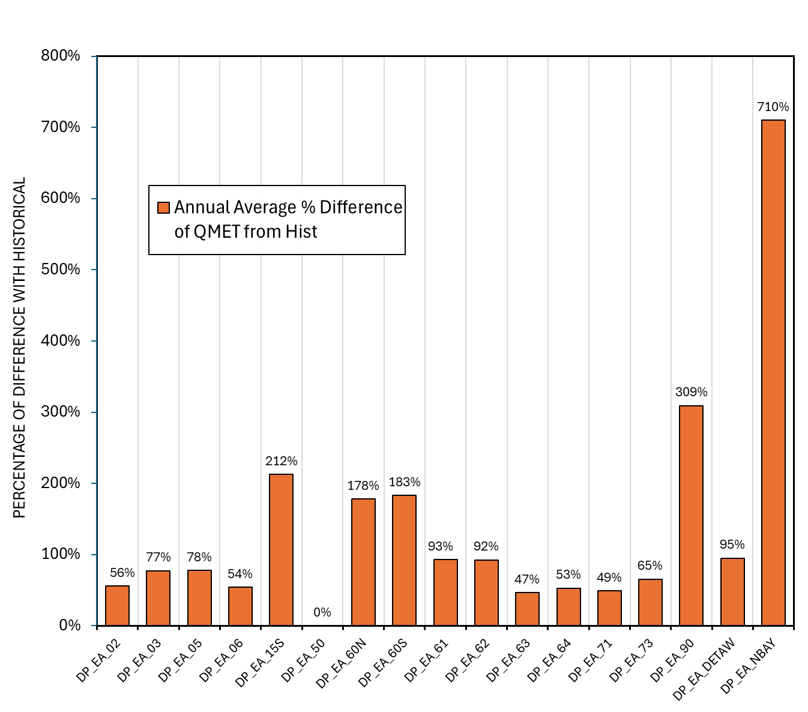

# mod_hydrology/calsimhydro_ee

```{admonition} Repository Module
:class: tip

**Module:** `mod_hydrology/calsimhydro_ee/`  
External Elements boundary condition processing
```


**External Elements**

The External Elements (EE) module generates deep percolation outputs for boundary areas outside the main CalSimHydro domain, including the Mono Lake basin and other peripheral Central Valley watersheds. These provide groundwater recharge boundary conditions for the integrated groundwater-surface water modeling framework.

## Methodology

The External Elements module uses evapotranspiration quantile mapped from VIC outputs combined with precipitation taken directly from WGEN data. This approach mirrors the CalSimHydro methodology but applies to boundary regions where less detailed calibration data is available. The module generates exactly 17 deep percolation variables, each corresponding to an External Area (EA) recharge zone.

The EE model was successfully configured using historical WGEN Product A inputs, with scripts requiring modification of hard-coded paths for the project directory structure. Unlike CalSimHydro which uses ET with interannual variation, the EE module employs a simpler input structure reflecting the data-sparse nature of these boundary areas.

## Results

The analysis showed maximum differences of approximately +100% for some exterior areas, a statistic that requires careful interpretation. The extreme percentage reflects the small baseline values in these boundary regions--often fractions of a TAF per year--which amplify relative differences even when absolute differences are minimal. The median absolute difference was less than 1 TAF/yr, and the median percentage difference is manageable when viewed in context of the overall system water balance.

The ET-driven and precipitation-driven effects mirror CalSimHydro's patterns at smaller magnitudes. Quantile-mapped ET produces the maximum +100% deep percolation difference, while slightly lower WGEN precipitation leads to correspondingly lower deep percolation. The dominant signal in EE output is the ET change rather than precipitation, consistent with CalSimHydro findings where ET changes proved more influential than precipitation changes.

::::{tab-set}
:::{tab-item} Overview

*Monthly deep percolation (TAF/month) summed across all External Areas, with annual totals as box plots (right). QM-ET (blue) approximately doubles the winter peak relative to Historical (black), reaching approximately 13 TAF/month in March vs approximately 7.5 for Historical. Deep percolation drops to zero from June through September across all scenarios. Precip (red) tracks slightly below Historical. Annual box plots show QM-ET median approximately 40 TAF/yr with high-year outliers exceeding 300 TAF.*
:::
:::{tab-item} Absolute Differences

*Annual average deep percolation difference from historical (TAF) for the WGEN precipitation scenario across all 17 External Areas. All differences are less than 1 TAF in magnitude. DP_EA_06 shows the largest negative difference at -0.65 TAF; DP_EA_63 (+0.23) and DP_EA_73 (+0.22) are the largest positive differences. Several areas (DP_EA_15S, DP_EA_50) show effectively zero change.*
:::
:::{tab-item} Absolute Differences (Detail)

*Annual average deep percolation difference from historical (TAF) for the QM-ET scenario across all 17 External Areas. All differences are positive, reflecting increased percolation from reduced ET. DP_EA_02 (+3.78 TAF), DP_EA_06 (+3.70), and DP_EA_NBAY (+3.64) show the largest increases. QM-ET differences are an order of magnitude larger than the Precip scenario, confirming ET as the dominant driver of EE output changes.*
:::
:::{tab-item} Percent Differences

*Percent difference from historical for the QM-ET scenario across all 17 External Areas. DP_EA_NBAY shows the largest percent change at +710%, followed by DP_EA_90 (+309%) and DP_EA_15S (+212%). Most areas fall in the +47% to +95% range. The extreme percentages at NBAY and EA_90 reflect very small historical baseline values (fractions of a TAF/yr) where even modest absolute increases produce outsized relative differences.*
:::
:::{tab-item} Percent Differences (Detail)

*Percent difference from historical for the WGEN precipitation scenario across all 17 External Areas. Most areas fall within -13% to +18%. DP_EA_15S is a positive outlier at +96% (reflecting a near-zero historical baseline of 0.01 TAF); DP_EA_NBAY is the largest negative at -45%. The mixed positive and negative signs contrast with the uniformly positive QM-ET scenario, reflecting the spatially variable influence of WGEN precipitation bias across the domain.*
:::
::::

These boundary condition changes should have relatively minor effects on overall CalSim 3 results since the External Elements represent a small fraction of total system water balance. However, they ensure consistency between the stochastic inputs and the boundary conditions used in the groundwater modeling components. Maintaining this consistency avoids introducing artificial discontinuities at the boundary of the primary CalSim domain.
