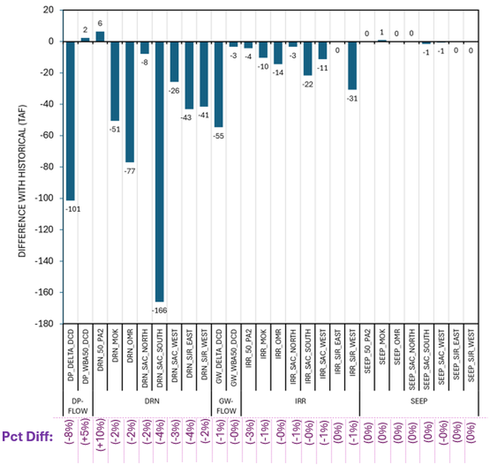

# mod_hydrology/delta_channel_depletion

```{admonition} Repository Module
:class: tip

**Module:** `mod_hydrology/delta_channel_depletion/`  
Delta consumptive use and seepage (DCD/DETAW)
```


Delta Channel Depletion (DCD) represents consumptive use and seepage in the Sacramento-San Joaquin Delta. The model operates on a "planning study" configuration (as opposed to "historical study") to align with CalSim 3 DCR 2023. Each DCD run requires approximately 3 hours of processing time.

## Methodology

Temperature and precipitation data come directly from WGEN without additional processing. The DETAW component computes crop water demands from temperature and precipitation, which then feed into the DCD model to simulate agricultural water use, seepage, and return flows across Delta islands. The DCD version 2.1 was downloaded for this project, with key inputs including groundwater contribution rate (held constant at 0.4 for the planning study configuration), irrigation efficiency parameters, and land use classifications.

The distinction between "planning study" and "historical study" configurations is important: the planning study configuration assumes equilibrium groundwater and land use conditions appropriate for long-term planning, matching the DCR 2023 baseline. Using the historical configuration would inject year-specific calibration adjustments that are not reproducible from synthetic climate alone.

The master inventory requires 28 DCD variables, but direct model output contains only 24. Four additional aggregated variables--Delta_DP, Delta_GW, DPWA_50, and DPWA_60--are generated through post-processing that combines island-level outputs into larger spatial units. Mohammad Hasan at MSO provided the weighted aggregation scheme: a two-column weight matrix where columns sum to 1.0, enabling proper spatial averaging from island-scale DCD results to the aggregated zones CalSim expects. The aggregation produces 2 groundwater flow variables and 2 deep percolation variables, completing the 28-variable inventory.

Input labeling follows an important naming convention: files are labeled "WGen precip" rather than "VIC precip" to accurately reflect the data lineage, since DCD receives WGEN climate directly without VIC intermediation.

## Results

The changes in Delta Channel Depletion (DCD) variables under the WGEN precipitation scenario relative to historical conditions are summarized in the following figure .The comparison highlights how reduced precipitation affects multiple hydrologic components, including drainage, deep percolation, groundwater flow, irrigation demand, and seepage throughout the Delta system.



*Annual average difference from historical (TAF) for all 28 DCD variables, grouped by type: deep percolation flow (DP-FLOW), drainage (DRN), groundwater flow (GW-FLOW), irrigation (IRR), and seepage (SEEP). Percentage differences (purple, bottom) range from -8% to +10%. Drainage variables show the largest absolute differences, with DRN_SIR_EAST at -166 TAF and DP_DELTA_DCD at -101 TAF. Seepage variables are effectively unchanged (0%). All differences are driven by lower WGEN precipitation.*


The maximum differences ranged from -166 TAF/yr to +6 TAF/yr across the suite of DCD variables. Percentage differences spanned -8% to +10%, with overall changes driven by lower WGEN precipitation relative to the historical baseline. The largest absolute difference (-166 TAF/yr) occurs in the deep percolation variable, reflecting the reduced precipitation available for recharge.

The pattern of differences across variable types reveals a coherent physical story. Drainage (DRN) variables tend to have larger negative differences, reflecting reduced surface runoff and subsurface drainage from lower precipitation. Groundwater and seepage flows show more modest changes, consistent with their deeper hydrologic pathways that buffer rapid precipitation changes. Irrigation variables track agricultural demands which depend on both precipitation (reducing demand when higher) and evapotranspiration (increasing demand when higher), producing a mixed signal.

Running DCD for Product B's 1,000-year simulation required careful attention to computational logistics. Each DCD run takes approximately 3 hours, and the Product B sequence is divided into 10 chunks of 100 water years. The DETAW climate compilation step prepares temperature and precipitation input files for each chunk before launching the DCD executable. Total processing time for the full Product B suite approached 30 hours, making it one of the more computationally intensive input generation modules alongside VIC.

An important DCD limitation emerged during testing: a DSS writing bug involving mixed string/numeric handling for certain Delta island identifiers (particularly WBA 73, which appears as both numeric 73 and string "73" in different contexts). This required a targeted fix in the post-processing scripts to ensure consistent data type handling when writing final DSS files.
