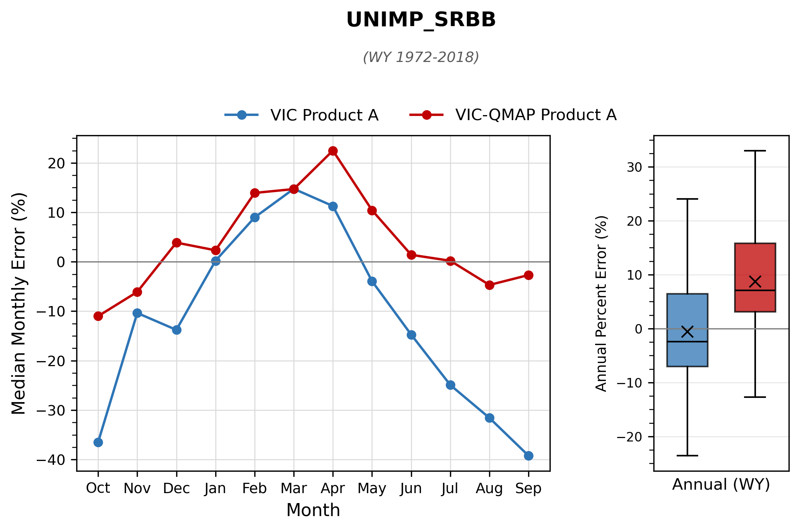
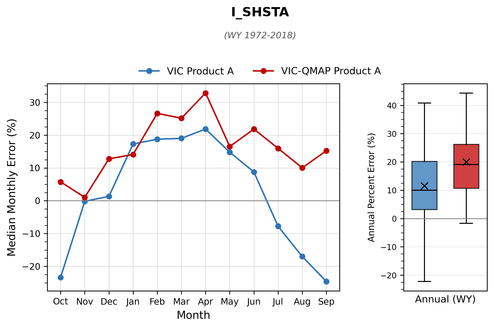
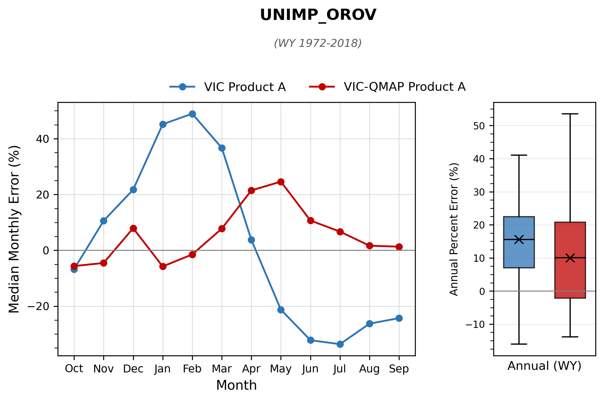
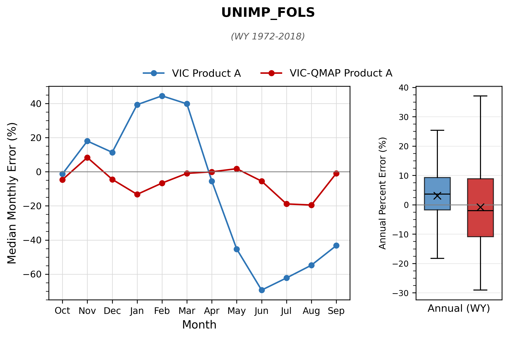
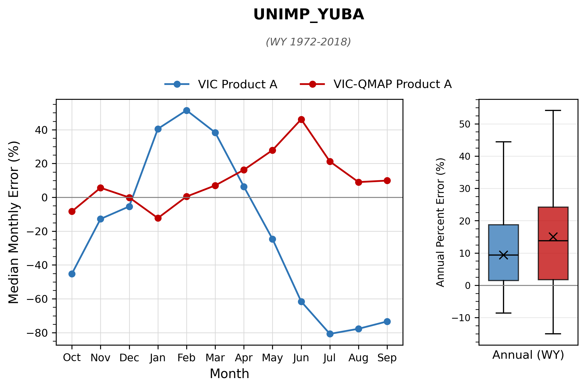
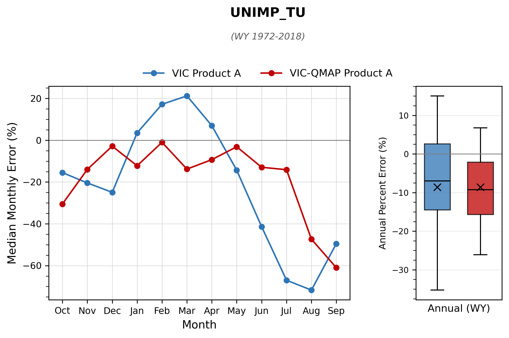
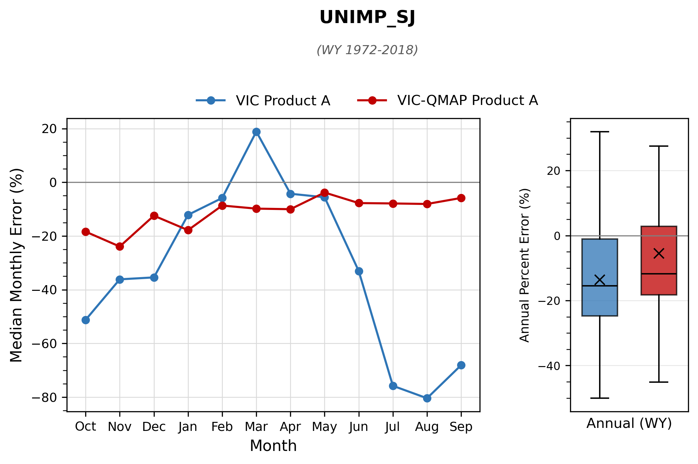
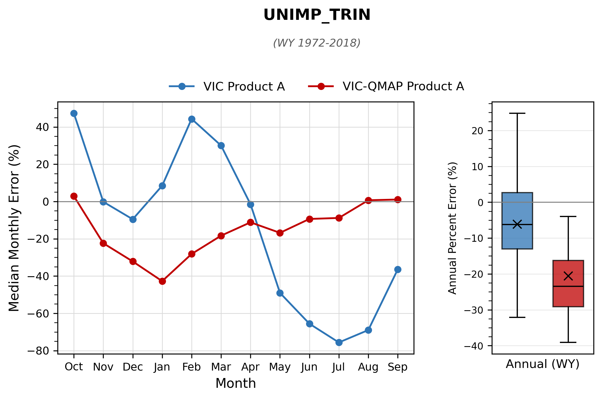
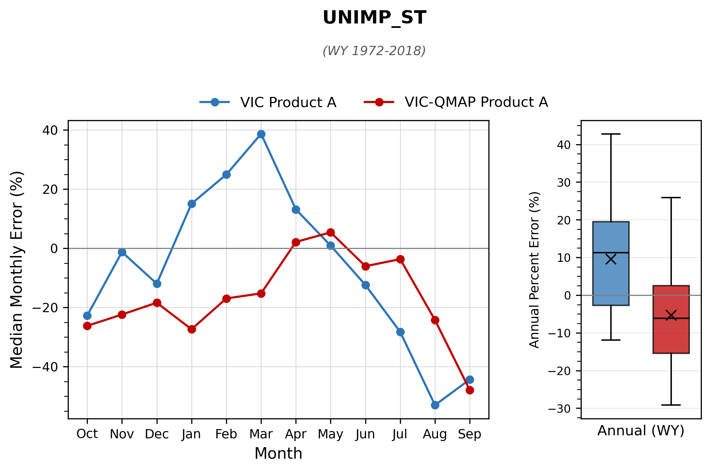
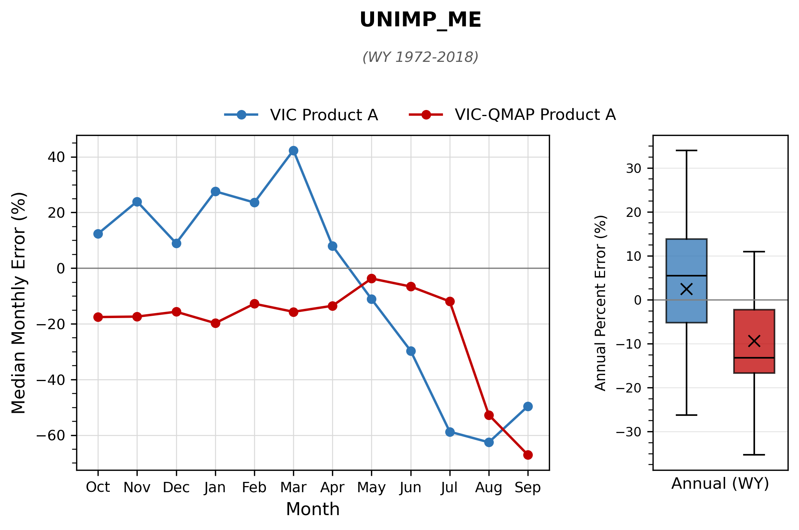

# mod_hydrology/rim_inflow

```{admonition} Repository Module
:class: tip

**Module:** `mod_hydrology/rim_inflow/`  
Quantile mapping of VIC inflows to CalSim rim inflow series
```


Rim inflows represent streamflow entering the CalSim 3 model domain from surrounding watersheds. They are the primary hydrologic drivers of reservoir inflows and river flows throughout the Central Valley, and their accurate reconstruction is arguably the single most consequential component of the stochastic generation effort. Of the 241 total rim inflow variables, 227 require stochastic generation (13 have missing historical data and 1 is unused). Rim inflows are first simulated by the VIC hydrologic model driven by WGEN generated stochastic meteorological forcings. The workflow then applies monthly quantile mapping to correct distributional bias relative to the historical CalSim 3 inputs, followed by basin level anchor adjustments that enforce mass balance between tributary inflows and their downstream aggregate watershed inflow.

## Methodology

### Correlation Analysis and VIC Selection

The methodology development began with a systematic correlation analysis, matching each of the approximately 227 CalSim rim inflow variables against modeled streamflow locations from both SAC-SMA and VIC hydrologic models to identify the strongest statistical predictors. Of the 227 variables requiring stochastic generation, every one had a corresponding VIC simulated streamflow location available as the quantile mapping basis, with 80% showing correlations exceeding 0.6 and approximately 50% exceeding 0.7.

An early methodological choice involved selecting between SAC-SMA and VIC as the source model for quantile mapping. SAC-SMA produced higher average $R^2$ values against historical CalSim inputs, attributed to SAC-SMA's superior watershed level calibration, whereas VIC is calibrated more broadly across the gridded domain. However, the team elected to maintain VIC as the basis model for consistency with the CalSim 3 framework and to avoid the complexity of managing multiple hydrologic models within the generation pipeline. Raw VIC streamflow tends to be wetter than CalSim 3 historical inputs (approximately 25-30% positive bias), but quantile mapping is designed to correct such distributional mismatches, so the magnitude of raw bias matters less than the strength of the underlying correlation.

### Quantile Mapping Procedure

The procedure follows the framework described in [Quantile Mapping](../methods.md#quantile-mapping): monthly stratification with Gamma-distribution tail extrapolation, trained on WY 1922--1971 and tested on WY 1972--2018. For rim inflows specifically, the highest correlated VIC streamflow serves as the basis series and the historical CalSim 3 rim inflows (e.g., I_FOLSM, UNIMP_OROV) serve as the target series. Negative flows are clipped to zero, since Gamma tail extrapolation can extend below zero for months with near-zero distributions.

### Anchor Watershed Mass Balance

To ensure mass balance consistency across river basins after quantile mapping, an anchor watershed adjustment methodology is applied. The approach recognizes that VIC model outputs are more reliable at integrated watershed scales than for individual small tributaries. Major downstream locations, represented by quantile-mapped unimpaired watershed flows (e.g., UNIMP_FOLS), serve as "anchor" control points, and upstream tributary flows (e.g., I_ALD002) are adjusted to ensure they sum correctly to the anchor totals.

Ten anchor watersheds are defined in total, six of which require tributary adjustment: Folsom (FOLS), the largest with 46 tributaries, followed by Oroville (OROV), Sacramento River at Bend Bridge (SRBB), Yuba (YUBA), Stanislaus (ST), and Tuolumne (TU). Together these six basins account for 116 of the 227 generated rim inflows. The remaining four anchors (Shasta, Trinity, Merced, and San Joaquin) have no assigned subtributaries, so their quantile-mapped flows are used directly without adjustment.

The Bend Bridge anchor (UNIMP_SRBB) is quantile-mapped against a composite VIC routing rather than the Shasta-inflow routing it previously borrowed. The Shasta routing stops at the dam and omits the drainage between Shasta and the Bend Bridge gauge (CalSim node SAC257), under-representing the anchor by roughly 30 percent. The composite (`CS3_8RI_SRBB`) is routed directly by `mod_forcing/vic/_2_compile_rim_inflows.py` from a merged grid-weight file (`reference/GridInfo/CS3_8RI_SRBB_GridInfo.txt`) that combines the Shasta drainage with the seven tributaries the CalSim 3 domain GIS tags as draining above SAC257: Cow, Battle, Bear, Clear (and Clear inflow to Whiskeytown), Cottonwood, and South Fork Cottonwood creeks. Routing the merged cells as a single basin produces the Bend Bridge inflow the same way every other rim point is computed. The Merced (Lake McClure) and San Joaquin (Millerton) anchors already coincide with their index gauges and need no such composite.

The adjustment formula distributes any discrepancy proportionally among tributaries based on their contribution to the total:

$$\text{Trib}_{\text{adjust}} = \left(\text{Anchor}_{\text{QM}} - \sum \text{Tribs}_{\text{QM}}\right) \times \frac{\text{Trib}_{\text{QM}}}{\sum \text{Tribs}_{\text{QM}}}$$

$$\text{Final Flow} = \text{Trib}_{\text{QM}} + \text{Trib}_{\text{adjust}}$$

This ensures that the downstream anchor flow equals the sum of all upstream tributary contributions, maintaining hydrologic mass balance while allowing individual tributary flows to reflect their quantile-mapped distributions.

```{mermaid}
flowchart TD
    VIC["VIC Streamflow Outputs"] --> QM_ANC["Quantile Map\nAnchor Watershed\n(e.g., UNIMP_FOLS)"]
    VIC --> QM_T1["Quantile Map\nTributary 1"]
    VIC --> QM_T2["Quantile Map\nTributary 2"]
    VIC --> QM_TN["Quantile Map\nTributary N"]

    QM_ANC --> COMPARE{"Anchor QM =\nSum of Tribs QM?"}
    QM_T1 --> SUM["Sum Tributary QMs"]
    QM_T2 --> SUM
    QM_TN --> SUM
    SUM --> COMPARE

    COMPARE -->|Yes| DONE["No Adjustment Needed"]
    COMPARE -->|No| RESIDUAL["Compute Residual\nAnchor_QM - Sum_Tribs_QM"]
    RESIDUAL --> DIST["Distribute Proportionally\nby Tributary Share"]
    DIST --> ADJ1["Trib 1 Final =\nTrib 1 QM + Adjustment"]
    DIST --> ADJ2["Trib 2 Final =\nTrib 2 QM + Adjustment"]
    DIST --> ADJN["Trib N Final =\nTrib N QM + Adjustment"]

    style QM_ANC fill:#264653,color:#fff
    style DONE fill:#2d6a4f,color:#fff
    style ADJ1 fill:#2d6a4f,color:#fff
    style ADJ2 fill:#2d6a4f,color:#fff
    style ADJN fill:#2d6a4f,color:#fff
```

_Anchor watershed mass balance adjustment. After independent quantile mapping, tributary flows are proportionally adjusted so their sum matches the anchor watershed total._

## Results

The quantile mapping methodology achieved substantial improvements across the rim inflow network. The average NSE improved by 0.10 points compared to raw VIC flows, and approximately 80% of total CalSim 3 rim inflow volume achieved NSE of 0.78 or better after quantile mapping. The minimum NSE was raised from 0.3 to 0.6 for the poorest performing locations. Monthly bias was reduced by approximately 50% at major anchor watersheds, with Shasta's annual error declining from 750 TAF to 375 TAF. Trinity's enormous negative bias in raw VIC was nearly eliminated through quantile mapping.

The figure below summarizes this improvement across the full network. Skill is expressed as normalized NSE, $1/(2-\text{NSE})$, which maps NSE onto the 0--1 range (0.5 corresponds to NSE = 0 and 1.0 to a perfect score). Quantile mapping improves skill at nearly every location, with the largest gains in the low-skill tail, where the poorest performing raw VIC locations are lifted from near zero to above 0.4.

```{image} figures/s3-inputs_rim-inflow-skill-normalized-nse.png
:alt: Rim Inflow Skill (Normalized NSE)
:width: 60%
:align: center
```

_Monthly skill (normalized NSE) across all CalSim 3 rim inflow locations, sorted lowest to highest, for raw VIC (blue) and quantile-mapped (VIC-QMAP, red) flows._

These results were first presented at Progress Meeting 2, where the validation demonstrated that seasonal patterns were successfully restored and bias in monthly exceedance was reduced across the board. The NSE improvements reflect not just distributional correction but genuine restoration of the relationship between synthetic and historical flows at monthly timesteps.

Several challenges were identified during the validation process. Spring bias during April through June remains the most persistent issue for Shasta, Oroville, and Yuba, where VIC tends to overestimate spring snowmelt contributions even after quantile mapping corrects distributional characteristics. Folsom showed unexpected negative bias after mapping due to VIC's drying trend over the simulation period--a clear example of the trend inheritance limitation discussed in the quantile mapping methodology section. Millerton shows persistent dry bias in May and June despite overall improvements, likely reflecting VIC's difficulty in capturing the San Joaquin's snowmelt timing.

```{image} figures/s3-inputs_rim-inflow-monthly-error-anchors.png
:alt: Average Monthly Error at Anchor Watersheds
:width: 100%
:align: center
```

_Average monthly error relative to CalSim 3 (TAF/month) at the anchor watersheds, WY 1972--2018, for raw VIC (left) and quantile-mapped (right) flows. Quantile mapping substantially reduces the winter--spring errors, while residual spring snowmelt bias remains at locations such as Bend Bridge, Oroville, and Yuba._

```{image} figures/s3-inputs_rim-inflow-annual-error-anchors.png
:alt: Average Annual Error at Anchor Watersheds
:width: 70%
:align: center
```

_Average annual error relative to CalSim 3 (TAF/year) at the anchor watersheds, WY 1972--2018, for raw VIC (blue) and quantile-mapped (VIC-QMAP, red) flows. Annual errors shrink markedly at some anchors (e.g., Oroville) but grow or change sign at others (e.g., Bend Bridge, Folsom, Trinity), reflecting that monthly quantile mapping does not directly constrain annual totals._

The percentage error metric showed that 50% of locations fell within the -15% to +18% range. Extreme percentage errors (up to 79,000% at one location) occur exclusively at near-zero baseline values where even modest absolute differences produce outsized percentages. These extreme percentages do not indicate meaningful reconstruction failure; the underlying absolute errors remain small.

```{image} figures/s3-inputs_rim-inflow-qm-folsom-detail.png
:alt: QM Example -- Folsom Inflow Detail
:width: 100%
:align: center
```

_Quantile mapping validation for Folsom inflow (FOLSM_INFLOW), WY 1972--2018. Left: monthly average flow, where quantile mapping (VIC-QMAP, red) corrects raw VIC's (blue) overestimated spring peak and missing summer baseflow to match the CalSim 3 historical target (black). Right: box plots of annual water-year totals, showing the quantile-mapped distribution reproduces the historical median, spread, and extremes._

### Monthly Average Flow at Rim Inflow Anchors

The panels below extend the Folsom example to all ten rim inflow anchors over the validation
period (WY 1972--2018). For each anchor, the upper panel shows the average monthly flow for the
CalSim 3 historical target (black), raw VIC (blue), and quantile-mapped VIC (VIC-QMAP, red),
with box plots of annual water-year totals at right. The lower panel shows the median monthly
percent error of raw VIC and VIC-QMAP relative to CalSim 3, with the annual percent error
distribution at right.

::::{tab-set}
:::{tab-item} Bend Bridge


:::
:::{tab-item} Shasta


:::
:::{tab-item} Oroville


:::
:::{tab-item} Folsom


:::
:::{tab-item} Yuba


:::
:::{tab-item} Tuolumne


:::
:::{tab-item} San Joaquin


:::
:::{tab-item} Trinity


:::
:::{tab-item} Stanislaus


:::
:::{tab-item} Merced


:::
::::

### Annual Time Series at Rim Inflow Anchors

The panels below show the annual (water-year total) flow and its 5-year mean at each of the ten
anchor watersheds, comparing the CalSim 3 historical target (black), raw VIC (blue), and
quantile-mapped VIC (VIC-QMAP, red) flows. Quantile mapping is trained on WY 1922--1971 and
applied over the shaded validation period (WY 1972--2018), so the VIC-QMAP trace begins in
WY 1972. The annual series shows how well year-to-year variability and extremes are reproduced,
while the 5-year mean (labeled by middle water year) shows the persistence of multi-year wet and
dry periods such as the 1976--77 and 1987--92 droughts.

::::{tab-set}
:::{tab-item} Bend Bridge


:::
:::{tab-item} Shasta


:::
:::{tab-item} Oroville


:::
:::{tab-item} Folsom


:::
:::{tab-item} Yuba


:::
:::{tab-item} Tuolumne


:::
:::{tab-item} San Joaquin


:::
:::{tab-item} Trinity


:::
:::{tab-item} Stanislaus


:::
:::{tab-item} Merced


:::
::::
