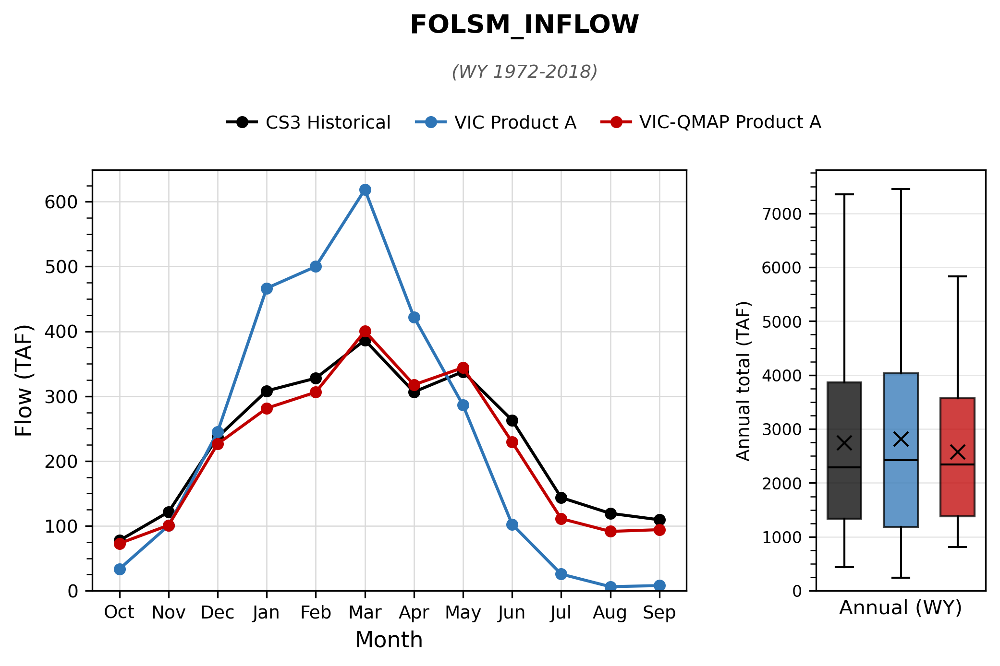

# mod_hydrology/rim_inflow

```{admonition} Repository Module
:class: tip

**Module:** `mod_hydrology/rim_inflow/`  
Quantile mapping of VIC inflows to CalSim rim inflow series
```


Rim inflows represent streamflow entering the CalSim 3 model domain from surrounding watersheds. They are the primary hydrologic drivers of reservoir inflows and river flows throughout the Central Valley, and their accurate reconstruction is arguably the single most consequential component of the stochastic generation effort. Of the 241 total rim inflow variables, 227 require stochastic generation (13 have missing historical data and 1 is unused). All 227 generated rim inflow locations have been processed through the quantile mapping methodology with comprehensive validation.

## Methodology

### Correlation Analysis and VIC Selection

The methodology development began with a systematic correlation analysis, matching each of the approximately 252 CalSim inflow variables against 32 modeled streamflow locations from both SAC-SMA and VIC hydrologic models to identify the strongest statistical predictors. Of the 227 generated variables, all had direct VIC counterparts, with 80% showing correlations exceeding 0.6 and approximately 50% exceeding 0.7.

An important early decision point arose when SAC-SMA showed higher average R^2 values than VIC, attributed to SAC-SMA's superior watershed-level calibration. However, the team elected to maintain VIC as the basis model for consistency with the CalSim 3 framework and to avoid the complexity of managing multiple hydrologic models within the generation pipeline. VIC-modeled flows carry an approximately 25-30% positive bias compared to CalSim 3 historical inputs, but quantile mapping is specifically designed to correct such distributional mismatches, making the magnitude of raw bias less important than the strength of the underlying correlation.

Variable naming was verified against the WRESL codebase to ensure correct variable identification. For example, the Folsom watershed uses the naming convention I_FOLSM rather than FOLSM_INFLOW or FOLSOM_INFLOW--a distinction confirmed by searching the WRESL code for active variable references.

### Quantile Mapping Procedure

VIC model streamflow serves as the basis for quantile mapping to CalSim 3 historical rim inflows. The procedure uses monthly stratification to preserve seasonal patterns, with Gamma distribution tail extrapolation for extreme values. Zero-clipping was added to the quantile mapping function to prevent negative flows, which can occur when Gamma tail extrapolation extends below zero for months with near-zero distributions.

### Anchor Watershed Mass Balance

To ensure mass balance consistency across river basins after quantile mapping, an anchor watershed adjustment methodology is applied. The approach recognizes that VIC model outputs are more reliable at integrated watershed scales than for individual small tributaries. Major downstream locations serve as "anchor" control points--quantile-mapped unimpaired watershed flows (e.g., UNIMP_FOLS)--and upstream tributary flows (e.g., I_ALD002) are adjusted to ensure they sum correctly to the anchor totals.

Six major anchor watersheds require adjustment: Folsom (FOLS, 46 tributaries--the largest), Oroville (OROV), Sacramento River at Bend Bridge (SRBB), Yuba (YUBA), Stanislaus (ST), and Tuolumne (TU). A total of 116 of the 227 tributary flows are adjusted through this process. Four additional anchor watersheds--Shasta, Trinity, Merced, and San Joaquin--have no assigned sub-tributaries and require no adjustment.

The Bend Bridge anchor (UNIMP_SRBB) is quantile-mapped against a composite VIC routing rather than the Shasta-inflow routing it previously borrowed. The Shasta routing stops at the dam and omits the drainage between Shasta and the Bend Bridge gauge (CalSim node SAC257), under-representing the anchor by roughly 30 percent. The composite (`CS3_SRBB`, built by `mod_forcing/vic/_3_aggregate_routings.py`) sums the Shasta inflow with the seven tributaries the CalSim 3 domain GIS tags as draining above SAC257: Cow, Battle, Bear, Clear (and Clear inflow to Whiskeytown), Cottonwood, and South Fork Cottonwood creeks. The Merced (Lake McClure) and San Joaquin (Millerton) anchors already coincide with their index gauges and need no such composite.

The adjustment formula distributes any discrepancy proportionally among tributaries based on their contribution to the total:

$$\text{Trib}{\text{adjust}} = \left(\text{Anchor}{\text{QM}} - \sum \text{Tribs}_{\text{QM}}\right) \times \frac{\text{Trib}_{\text{QM}}}{\sum \text{Tribs}_{\text{QM}}}$$

$$\text{Final Flow} = \text{Trib}_{\text{QM}} + \text{Trib}_{\text{adjust}}$$

This ensures that the downstream anchor flow equals the sum of all upstream tributary contributions, maintaining hydrologic mass balance while allowing individual tributary flows to reflect their quantile-mapped distributions.

```{mermaid}
flowchart TD
    VIC["VIC Streamflow Outputs"] --> QM_ANC["Quantile Map\nAnchor Watershed\n(e.g., UNIMP_FOLS)"]
    VIC --> QM_T1["Quantile Map\nTributary 1"]
    VIC --> QM_T2["Quantile Map\nTributary 2"]
    VIC --> QM_TN["Quantile Map\nTributary N"]

    QM_ANC --> COMPARE{"Anchor QM =\nSum of Tribs QM?"}
    QM_T1 --> SUM["Sum Tributary QMs"]
    QM_T2 --> SUM
    QM_TN --> SUM
    SUM --> COMPARE

    COMPARE -->|Yes| DONE["No Adjustment Needed"]
    COMPARE -->|No| RESIDUAL["Compute Residual\nAnchor_QM - Sum_Tribs_QM"]
    RESIDUAL --> DIST["Distribute Proportionally\nby Tributary Share"]
    DIST --> ADJ1["Trib 1 Final =\nTrib 1 QM + Adjustment"]
    DIST --> ADJ2["Trib 2 Final =\nTrib 2 QM + Adjustment"]
    DIST --> ADJN["Trib N Final =\nTrib N QM + Adjustment"]

    style QM_ANC fill:#264653,color:#fff
    style DONE fill:#2d6a4f,color:#fff
    style ADJ1 fill:#2d6a4f,color:#fff
    style ADJ2 fill:#2d6a4f,color:#fff
    style ADJN fill:#2d6a4f,color:#fff
```

_Anchor watershed mass balance adjustment. After independent quantile mapping, tributary flows are proportionally adjusted so their sum matches the anchor watershed total._

## Results

The quantile mapping methodology achieved substantial improvements across the rim inflow network. The average NSE improved by 0.10 points compared to raw VIC flows, and approximately 80% of total CalSim 3 rim inflow volume achieved NSE of 0.78 or better after quantile mapping. The minimum NSE was raised from 0.3 to 0.6 for the poorest performing locations. Monthly bias was reduced by approximately 50% at major anchor watersheds, with Shasta's annual error declining from 750 TAF to 375 TAF. Trinity's enormous negative bias in raw VIC was nearly eliminated through quantile mapping.

These results were first presented at Progress Meeting 2, where the validation demonstrated that seasonal patterns were successfully restored and bias in monthly exceedance was reduced across the board. The NSE improvements reflect not just distributional correction but genuine restoration of the relationship between synthetic and historical flows at monthly timesteps.

Several challenges were identified during the validation process. Spring bias during April through June remains the most persistent issue for Shasta, Oroville, and Yuba, where VIC tends to overestimate spring snowmelt contributions even after quantile mapping corrects distributional characteristics. Folsom showed unexpected negative bias after mapping due to VIC's drying trend over the simulation period--a clear example of the trend inheritance limitation discussed in the quantile mapping methodology section. Millerton shows persistent dry bias in May and June despite overall improvements, likely reflecting VIC's difficulty in capturing the San Joaquin's snowmelt timing.

The percentage error metric showed that 50% of locations fell within the -15% to +18% range. Extreme percentage errors (up to 79,000% at one location) occur exclusively at near-zero baseline values where even modest absolute differences produce outsized percentages. These extreme percentages do not indicate meaningful reconstruction failure; the underlying absolute errors remain small.


_Quantile mapping validation for Folsom inflow (FOLSM_INFLOW), WY 1972--2018. Left: monthly average flow, where quantile mapping (VIC-QMAP, red) corrects raw VIC's (blue) overestimated spring peak and missing summer baseflow to match the CalSim 3 historical target (black). Right: box plots of annual water-year totals, showing the quantile-mapped distribution reproduces the historical median, spread, and extremes._
