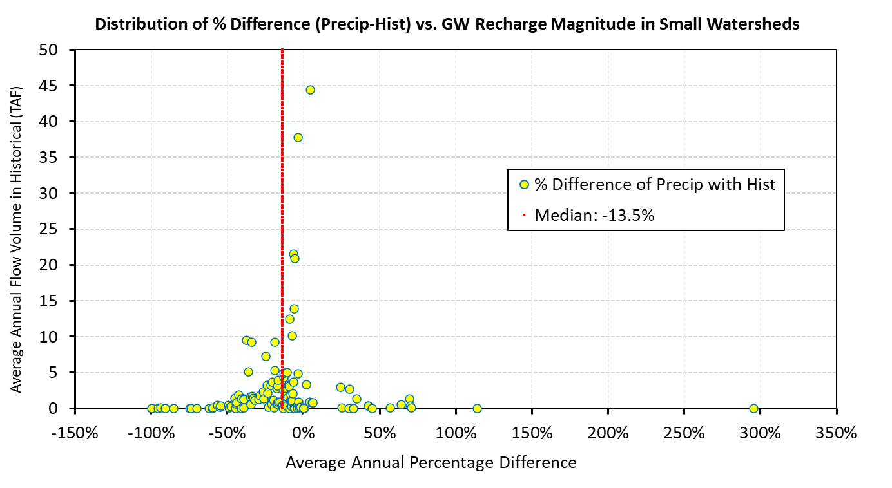

# mod_hydrology/small_watersheds

```{admonition} Repository Module
:class: tip

**Module:** `mod_hydrology/small_watersheds/`  
Small tributary groundwater recharge processing
```


The Small Watersheds module generates groundwater recharge estimates for 210 small watershed areas throughout the Central Valley. Unlike CalSimHydro, this module uses a repeating 12-month ET pattern with no interannual variation and directly input precipitation. This design makes results primarily sensitive to precipitation differences rather than evapotranspiration variations.

## Methodology

The Small Watersheds executable operates similarly to CalSimHydro, accepting climate inputs and computing groundwater recharge through a water budget calculation. However, the module takes ET as a repeating 12-month seasonal pattern without interannual variation, meaning precipitation drives all year-to-year variability in results. Precipitation comes directly from WGEN data without bias correction or VIC intermediation.

Initial setup required locating the correct executable, which was not immediately available from MSO. Coordination over several weeks eventually produced the proper `smwshed_compiler.exe` and associated configuration files. The model reads precipitation from a CSV with 1,602 columns representing spatial grid cells across the small watershed domains--each column corresponding to a specific latitude-longitude precipitation point compiled from WGEN output. The precipitation compilation script aggregates WGEN station data into this wide-format CSV that the executable consumes directly.

This relatively simple modeling approach reflects both the limited calibration data available for small watershed recharge estimates and the secondary importance of these terms in overall CalSim water balance. The fixed ET pattern means results are purely precipitation-driven, making Small Watersheds a direct test of WGEN precipitation fidelity without the confounding effects of VIC ET bias seen in CalSimHydro.

## Results

The analysis showed maximum differences ranging from -4 to +2 TAF/yr in absolute terms. Percentage differences ranged widely, from approximately -100% to +100%, though this reflects the small baseline values for many watersheds. The median absolute difference was less than 1 TAF/yr, with a median percentage difference of -13.5%.


*Percent difference (Precip vs Historical) plotted against historical groundwater recharge magnitude (TAF/yr) for all 210 small watersheds. Red dashed line marks the median at -13.5%. Larger watersheds (>10 TAF/yr) cluster tightly near the median; smaller watersheds scatter widely from -100% to +300%, where near-zero baseline values amplify even modest absolute differences.*

The scatter plot reveals an important pattern: smaller watersheds with lower baseline flow volumes show proportionally larger percentage differences, while larger watersheds cluster near the median. This behavior is expected since small absolute changes produce large percentage changes when the baseline is small. The -13.5% median difference provides a useful system-level summary, indicating that the WGEN precipitation deficit translates into a roughly proportional groundwater recharge reduction across the domain.

The differences across all watersheds are driven primarily by lower WGEN precipitation compared to the historical baseline. Since ET is held constant as a repeating pattern, there is no VIC-derived ET bias to offset or amplify the precipitation signal--unlike CalSimHydro where ET and precipitation changes interact. This makes Small Watersheds a clean diagnostic of WGEN precipitation bias: the -13.5% median recharge reduction is a direct expression of how much less precipitation WGEN produces relative to historical records across the Central Valley.
