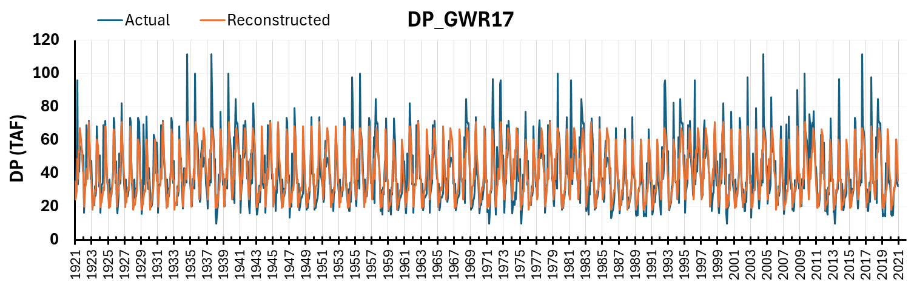

# mod_hydrology/tulare_gw_terms

```{admonition} Repository Module
:class: tip

**Module:** `mod_hydrology/tulare_gw_terms/`  
Tulare Basin groundwater terms via WYT averaging
```


Groundwater pumping (`GP_GWR15`–`GP_GWR21`) and deep percolation (`DP_GWR15`–`DP_GWR21`) are 14 Tulare Basin groundwater stress terms: seven pumping terms and seven deep percolation terms. CalSim 3 documentation describes Tulare region groundwater pumping and deep percolation as region indexed inputs passed to the groundwater DLL, and identifies seven Tulare Basin subregions in the groundwater DLL configuration ([CalSim 3 Hydrology Report (DCR 2023)](https://data.cnra.ca.gov/dataset/a3bb1ddd-624b-4c3d-95e7-2aa6b3bf2b5b/resource/6ba59600-d562-44da-a267-a6a50dff3f0d/download/final_cs3_hydrologyreport_v2.pdf), Fig. 15-9, p. 15-21). These terms are reconstructed using WYT based monthly averaging rather than a full Tulare Basin C2VSim simulation, which is outside Phase I scope.

## Methodology

The Tulare groundwater terms are reconstructed using San Joaquin Water Year Type (WYT) monthly averaging. For each calendar month and San Joaquin WYT category (Wet, Above Normal, Below Normal, Dry, Critical), historical values are averaged to produce representative monthly patterns. These WYT month patterns are then applied to the synthetic sequences using the reconstructed San Joaquin WYT classification.

Quantile mapping was evaluated but not adopted for this term group. Screening against candidate rim inflow predictors produced weak to moderate relationships, with correlations below 0.8 for all 14 terms. So WYT averaging was selected as the more stable approach.

This approach does not attempt to dynamically simulate Tulare Basin groundwater conditions. Running C2VSim for 1,000 years would require land use projections, agricultural demand assumptions, and computational resources beyond Phase I scope. These terms function as placeholders that keep groundwater within a reasonable range rather than fully simulated quantities. The current CalSim 3 model domain covers the Sacramento River and San Joaquin River Hydrologic Regions and the Delta, but only a northwest part of the Tulare Lake Hydrologic Region, where a complete Tulare Lake module is still under development [CalSim 3 Hydrology Report (DCR 2023)](https://data.cnra.ca.gov/dataset/a3bb1ddd-624b-4c3d-95e7-2aa6b3bf2b5b/resource/6ba59600-d562-44da-a267-a6a50dff3f0d/download/final_cs3_hydrologyreport_v2.pdf).

WYT averaging is accepted despite its limitations: because these terms serve as approximate placeholders, more sophisticated reconstruction methods are not warranted within Phase I scope.

## Results

### Groundwater Pumping Terms

Groundwater pumping variables show acceptable NSE values ranging from moderate to strong correspondence. The highest agreement examples demonstrate good overall fit with realistic seasonal patterns. The lowest agreement pumping term (`GP_GWR19`) still achieves acceptable results despite showing less variation than historical values, reflecting the inherent averaging effect of the WYT methodology. Drought period Product A values show less volatility than historical values, which is expected when using categorical averaging rather than continuous predictors. Given the lack of better predictive methods, this smoothing effect represents an acceptable tradeoff.

::::{tab-set}
:::{tab-item} Highest Agreement

*`GP_GWR15` groundwater pumping reconstruction (WY 1972 to 2018), the GP term with the highest agreement (NSE = 0.96, PBIAS = 1.1%). Left: monthly time series cycling between approximately 0 TAF in winter and 300 to 400 TAF during summer irrigation season; Product A (orange) closely tracks historical (blue), capturing both seasonal amplitude and yearly variations in peak pumping. Right: non-exceedance CDF showing the Product A distribution closely matching the historical distribution.*
:::
:::{tab-item} Lowest Agreement

*`GP_GWR19` groundwater pumping reconstruction (WY 1972 to 2018), the GP term with the lowest agreement (NSE = 0.76, PBIAS = 4.0%). Left: summer peaks in historical data reach approximately 150 to 175 TAF while Product A values plateau lower, illustrating the WYT averaging smoothing effect; the Product A series captures seasonal timing but compresses the range of peak values. Right: non-exceedance CDF showing Product A values underestimating the upper tail of the distribution.*
:::
::::

### Deep Percolation Terms

Deep percolation variables exhibit lower NSE values and reduced ability to capture signal variability compared to groundwater pumping. The highest and lowest agreement examples spanning areas 15 to 21 illustrate a range of performance, with `DP_GWR17` showing the strongest reconstruction while `DP_GWR21` shows the weakest, unable to reproduce the episodic high percolation events that dominate its variability. A consistent pattern of underestimation appears in deep percolation Product A values, suggesting potential mass balance considerations merit investigation.

::::{tab-set}
:::{tab-item} Highest Agreement

*`DP_GWR17` deep percolation reconstruction (WY 1972 to 2018), the DP term with the highest agreement (NSE = 0.62, PBIAS = -2.1%). Left: historical values (blue) range from approximately 15 to 115 TAF with frequent spikes in wet months, while Product A values (orange) are compressed, capturing the general seasonal pattern but underestimating peaks in wet months. Right: non-exceedance CDF showing close agreement through the middle range with divergence in the upper tail.*
:::
:::{tab-item} Lowest Agreement

*`DP_GWR21` deep percolation reconstruction (WY 1972 to 2018), the term with the lowest agreement overall (NSE = 0.38, PBIAS = -5.7%). Left: historical values (blue) show dramatic spikes in wet years reaching approximately 220 TAF, while Product A values (orange) remain much lower; the WYT averaging approach captures the baseline level but cannot reproduce the episodic high percolation events that dominate variability in this area. Right: non-exceedance CDF showing the Product A distribution falling well below the historical distribution at the upper tail, where the largest percolation events are not reproduced.*
:::
::::

The documented limitations are acceptable within Phase I constraints. Groundwater pumping terms reproduce historical seasonal patterns well, while deep percolation terms show reduced variability and some negative bias that should be tracked in aggregate recharge volume checks. For long term stochastic planning focused on core system performance, WYT averaging provides plausible legacy Tulare groundwater boundary behavior while clearly documenting its limitations.

## References

California Department of Water Resources (DWR). 2023. *Final CalSim 3 Hydrology Report*. Companion technical document to the *Final State Water Project Delivery Capability Report 2023* (DCR 2023). <https://data.cnra.ca.gov/dataset/a3bb1ddd-624b-4c3d-95e7-2aa6b3bf2b5b/resource/6ba59600-d562-44da-a267-a6a50dff3f0d/download/final_cs3_hydrologyreport_v2.pdf>
