# mod_hydrology/tulare_gw_terms

```{admonition} Repository Module
:class: tip

**Module:** `mod_hydrology/tulare_gw_terms/`  
Tulare Basin groundwater terms via WYT averaging
```


Groundwater pumping (`GP_GWR15`–`GP_GWR21`) and deep percolation (`DP_GWR15`–`DP_GWR21`) are 14 Tulare Basin groundwater stress terms: seven pumping terms and seven deep percolation terms. CalSim 3 documentation describes Tulare region groundwater pumping and deep percolation as region indexed inputs passed to the groundwater DLL, and identifies seven Tulare Basin subregions in the groundwater DLL configuration ([CalSim 3 Hydrology Report (DCR 2023)](https://data.cnra.ca.gov/dataset/a3bb1ddd-624b-4c3d-95e7-2aa6b3bf2b5b/resource/6ba59600-d562-44da-a267-a6a50dff3f0d/download/final_cs3_hydrologyreport_v2.pdf), Fig. 15-9, p. 15-21). These terms are reconstructed using WYT based monthly averaging rather than a full Tulare Basin C2VSim simulation.

## Methodology

The Tulare groundwater terms are reconstructed using San Joaquin Water Year Type (WYT) monthly averaging. For each calendar month and San Joaquin WYT category (Wet, Above Normal, Below Normal, Dry, Critical), historical values are averaged to produce representative monthly patterns. These WYT month patterns are then applied to the synthetic sequences using their reconstructed San Joaquin WYT classification.

Quantile mapping was evaluated but not adopted for this term group. Screening against candidate rim inflow predictors produced weak to moderate relationships, with correlations below 0.8 for all 14 terms. So WYT averaging was selected as the more stable approach.

This approach does not attempt to dynamically simulate Tulare Basin groundwater conditions. Running C2VSim for 1,000 years would require land use projections, agricultural demand assumptions, and computational resources beyond Phase I scope. These terms function as placeholders that keep groundwater within a reasonable range rather than simulated quantities. The current CalSim 3 model domain covers the Sacramento River and San Joaquin River Hydrologic Regions and the Delta, but only a northwest part of the Tulare Lake Hydrologic Region, where a complete Tulare Lake module is still under development [CalSim 3 Hydrology Report (DCR 2023)](https://data.cnra.ca.gov/dataset/a3bb1ddd-624b-4c3d-95e7-2aa6b3bf2b5b/resource/6ba59600-d562-44da-a267-a6a50dff3f0d/download/final_cs3_hydrologyreport_v2.pdf).

## Results

Reconstruction quality is assessed over the WY 1972-2018 validation period. Although Product A spans the full historical period (WY 1915-2018), this window keeps the evaluation consistent with the quantile-mapped terms (see {doc}`Methods </source/methods>` for Product A). For both groundwater pumping and deep percolation, all seven terms are shown below; in each figure the left panel compares the reconstructed Product A series with the historical CalSim 3 State Variable (SV) inputs from the DCR 2023 baseline, and the right compares their non-exceedance distributions.

### Groundwater Pumping Terms

Groundwater pumping variables show acceptable to strong NSE values. The highest agreement terms fit well and reproduce realistic seasonal patterns. The lowest agreement pumping term (`GP_GWR19`) remains acceptable (NSE = 0.76) but compresses the range of peak values relative to historical, reflecting the averaging effect of the WYT methodology rather than continuous predictors.

::::{tab-set}
:::{tab-item} GP_GWR15
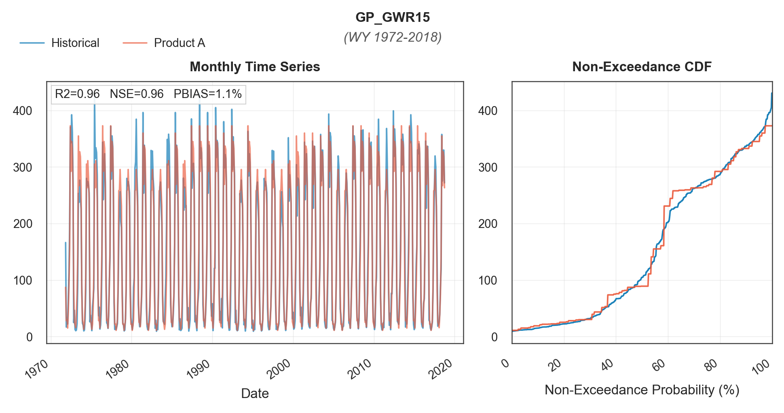
*`GP_GWR15` groundwater pumping reconstruction (WY 1972-2018), the GP term with the highest agreement. NSE = 0.96, PBIAS = 1.1%; Product A (orange) vs historical (blue).*
:::
:::{tab-item} GP_GWR16
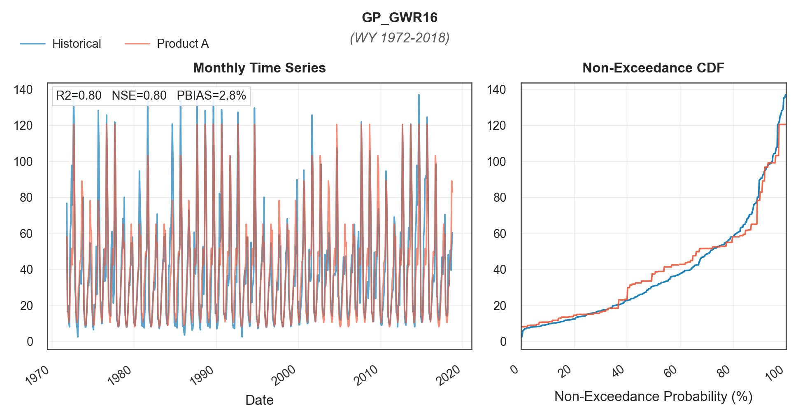
*`GP_GWR16` groundwater pumping reconstruction (WY 1972-2018). NSE = 0.80, PBIAS = 2.8%; Product A (orange) vs historical (blue).*
:::
:::{tab-item} GP_GWR17
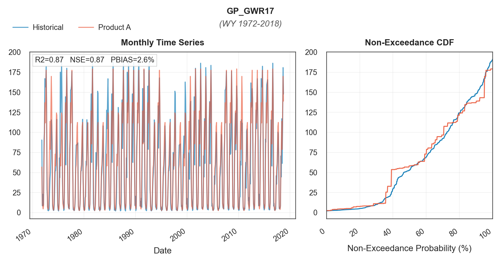
*`GP_GWR17` groundwater pumping reconstruction (WY 1972-2018). NSE = 0.87, PBIAS = 2.6%; Product A (orange) vs historical (blue).*
:::
:::{tab-item} GP_GWR18
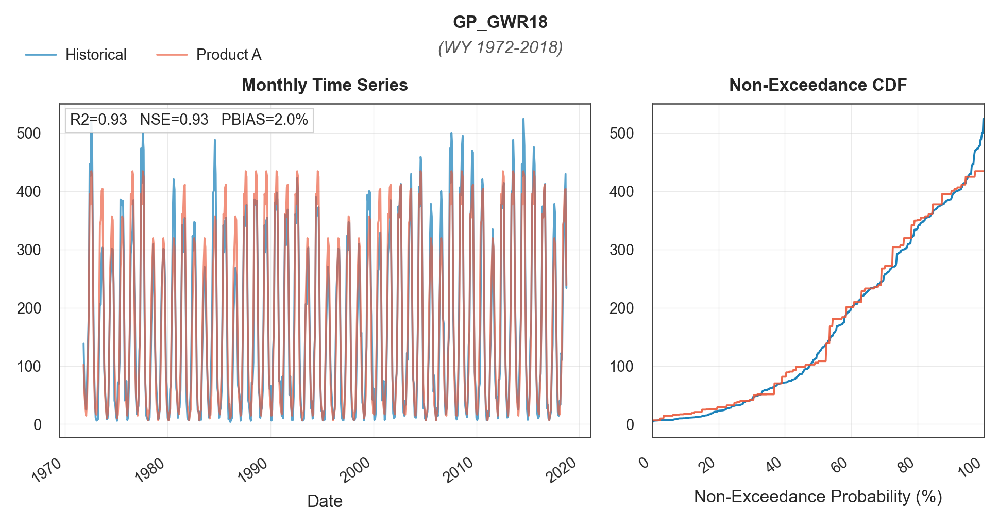
*`GP_GWR18` groundwater pumping reconstruction (WY 1972-2018). NSE = 0.93, PBIAS = 2.0%; Product A (orange) vs historical (blue).*
:::
:::{tab-item} GP_GWR19
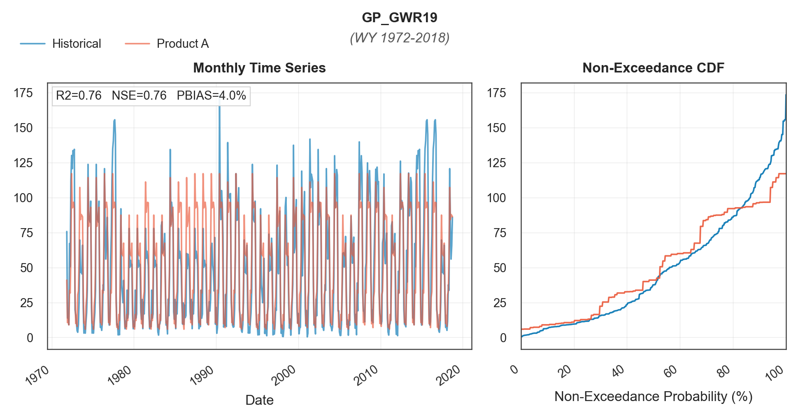
*`GP_GWR19` groundwater pumping reconstruction (WY 1972-2018), the GP term with the lowest agreement. NSE = 0.76, PBIAS = 4.0%; Product A (orange) vs historical (blue).*
:::
:::{tab-item} GP_GWR20
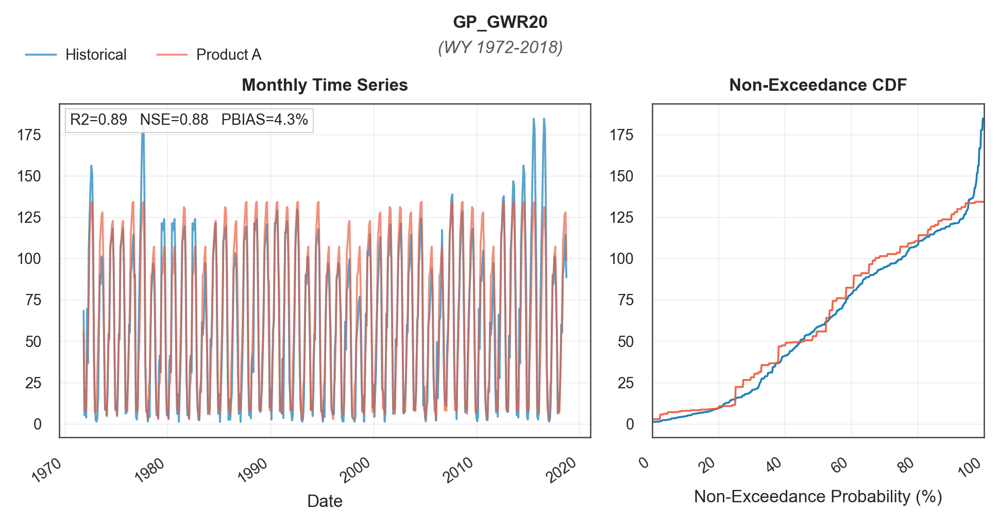
*`GP_GWR20` groundwater pumping reconstruction (WY 1972-2018). NSE = 0.88, PBIAS = 4.3%; Product A (orange) vs historical (blue).*
:::
:::{tab-item} GP_GWR21
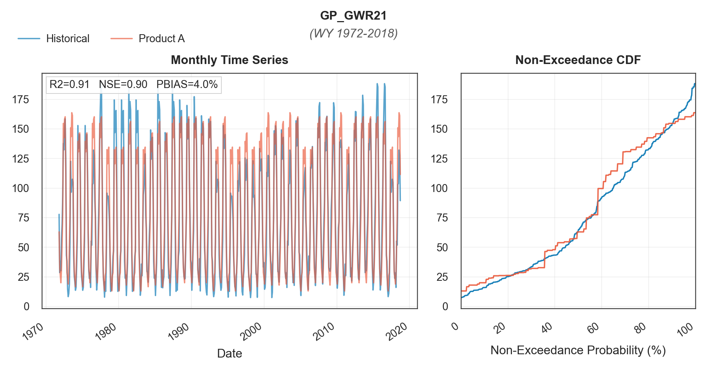
*`GP_GWR21` groundwater pumping reconstruction (WY 1972-2018). NSE = 0.90, PBIAS = 4.0%; Product A (orange) vs historical (blue).*
:::
::::

### Deep Percolation Terms

Deep percolation variables show lower NSE values and capture less variability than groundwater pumping. Even `DP_GWR17`, the DP term with the highest agreement, reaches only NSE = 0.62, and the lowest term (`DP_GWR21`) falls to NSE = 0.38. A pattern of underestimation appears across most deep percolation Product A values, consistent with the predominantly negative PBIAS values reported in the figures (`DP_GWR19` is the exception, at +1.8%).

::::{tab-set}
:::{tab-item} DP_GWR15
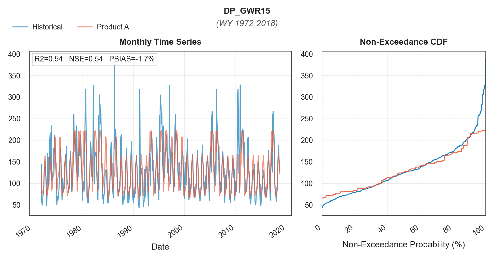
*`DP_GWR15` deep percolation reconstruction (WY 1972-2018). NSE = 0.54, PBIAS = -1.7%; Product A (orange) vs historical (blue).*
:::
:::{tab-item} DP_GWR16
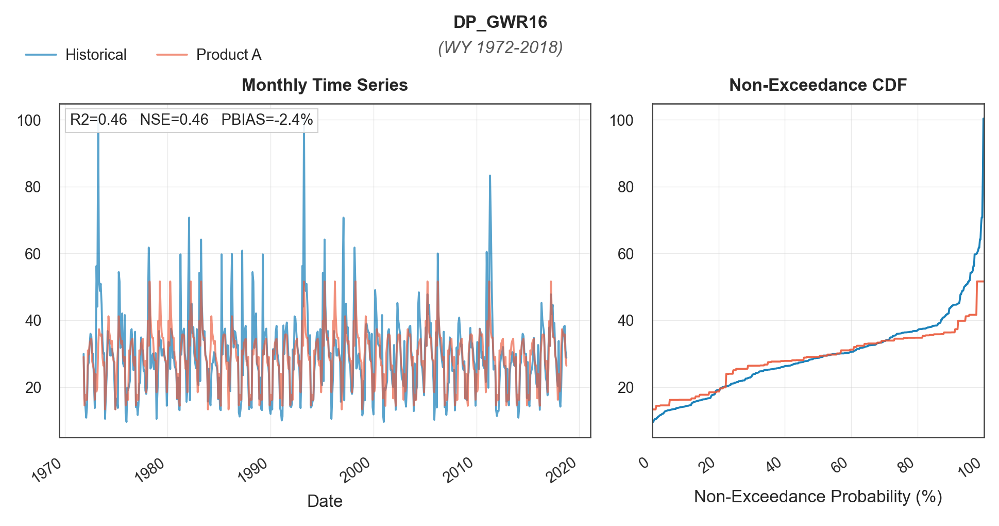
*`DP_GWR16` deep percolation reconstruction (WY 1972-2018). NSE = 0.46, PBIAS = -2.4%; Product A (orange) vs historical (blue).*
:::
:::{tab-item} DP_GWR17
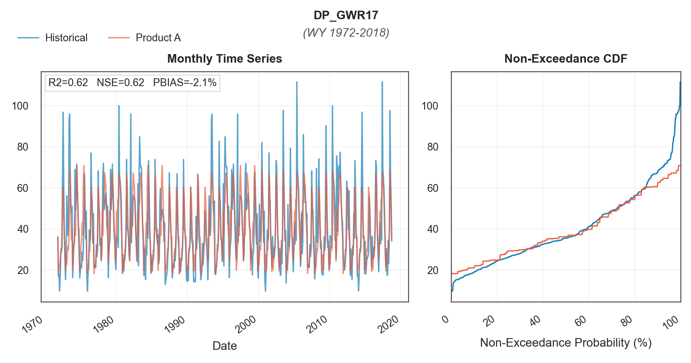
*`DP_GWR17` deep percolation reconstruction (WY 1972-2018), the DP term with the highest agreement. NSE = 0.62, PBIAS = -2.1%; Product A (orange) vs historical (blue).*
:::
:::{tab-item} DP_GWR18
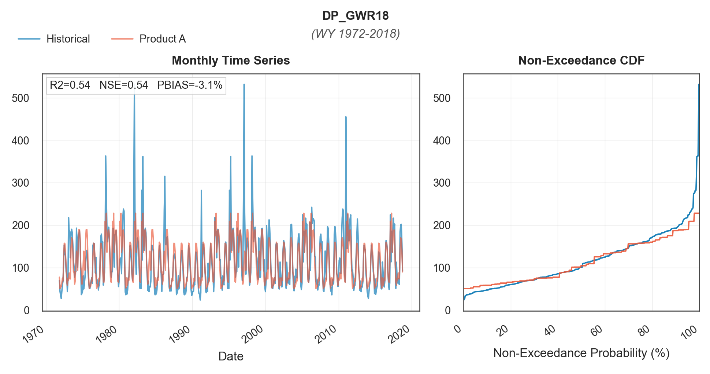
*`DP_GWR18` deep percolation reconstruction (WY 1972-2018). NSE = 0.54, PBIAS = -3.1%; Product A (orange) vs historical (blue).*
:::
:::{tab-item} DP_GWR19
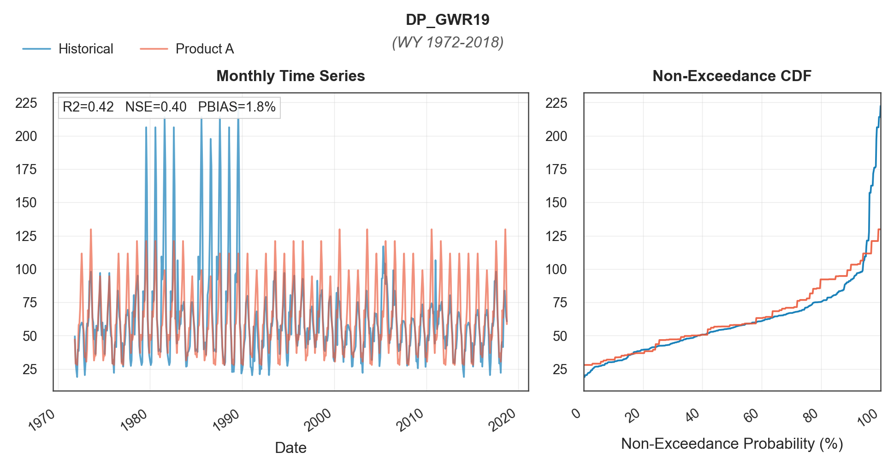
*`DP_GWR19` deep percolation reconstruction (WY 1972-2018). NSE = 0.40, PBIAS = 1.8%; Product A (orange) vs historical (blue).*
:::
:::{tab-item} DP_GWR20
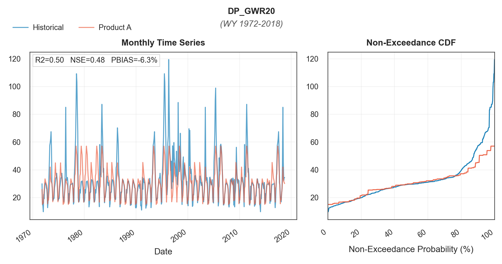
*`DP_GWR20` deep percolation reconstruction (WY 1972-2018). NSE = 0.48, PBIAS = -6.3%; Product A (orange) vs historical (blue).*
:::
:::{tab-item} DP_GWR21
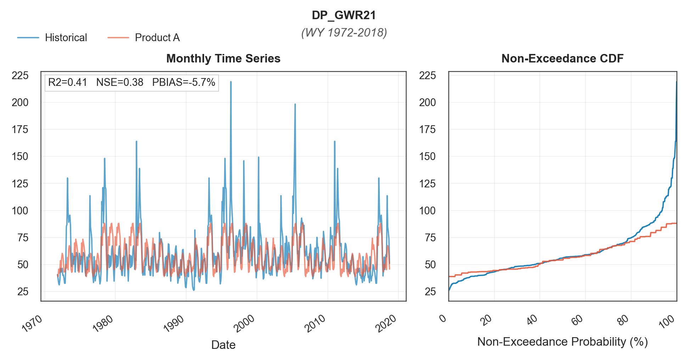
*`DP_GWR21` deep percolation reconstruction (WY 1972-2018), the term with the lowest agreement overall. NSE = 0.38, PBIAS = -5.7%; Product A (orange) vs historical (blue).*
:::
::::

Groundwater pumping terms reproduce historical seasonal patterns well, while deep percolation terms capture less variability and tend to underestimate.

## References

California Department of Water Resources (DWR). 2023. *Final CalSim 3 Hydrology Report*. Companion technical document to the *Final State Water Project Delivery Capability Report 2023* (DCR 2023). <https://data.cnra.ca.gov/dataset/a3bb1ddd-624b-4c3d-95e7-2aa6b3bf2b5b/resource/6ba59600-d562-44da-a267-a6a50dff3f0d/download/final_cs3_hydrologyreport_v2.pdf>
