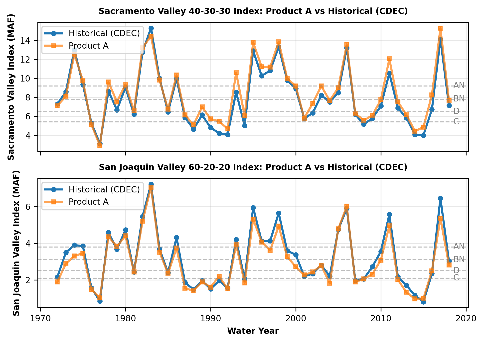
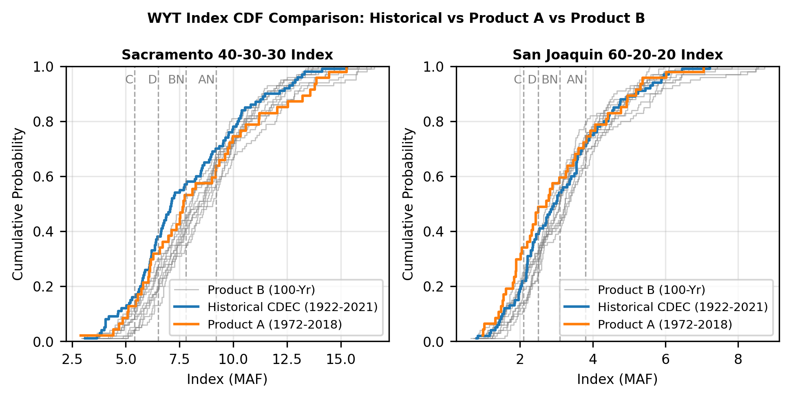

# mod_hydrology/water_year_types

```{admonition} Repository Module
:class: tip

**Module:** `mod_hydrology/water_year_types/`  
Sacramento 40-30-30 and San Joaquin 60-20-20 index classification
```

Water year types (WYTs) are computed from rim inflows produced by the quantile mapping module and consumed by several downstream modules including Reservoir Storage Curves, Tulare Groundwater Terms, Upper Watershed, and Other/Miscellaneous variables.

## Methodology

Two independent indices are calculated from the quantile-mapped rim inflows:

**Sacramento Valley 40-30-30 Index** aggregates unimpaired flows from four rim watersheds (SRBB, OROV, YUBA, FOLS). The index is computed recursively, where each year's value depends on the prior year:

$$\text{SacIndex}_i = 0.4 \cdot \text{AprJul}_i + 0.3 \cdot \text{OctMar}_i + 0.3 \cdot \min(\text{SacIndex}_{i-1},\, 10.0)$$

**San Joaquin Valley 60-20-20 Index** aggregates unimpaired flows from four SJ tributaries (ST, TU, ME, SJ) with a heavier weight on the April--July snowmelt period:

$$\text{SJIndex}_i = 0.6 \cdot \text{AprJul}_i + 0.2 \cdot \text{OctMar}_i + 0.2 \cdot \min(\text{SJIndex}_{i-1},\, 4.5)$$

Each index value maps to one of five WYT classes (Wet (W), Above Normal (AN), Below Normal (BN), Dry (D), Critical (C)) using fixed thresholds (MAF):

| Index | Critical | Dry | Below Normal | Above Normal / Wet |
|-------|:--------:|:---:|:------------:|:------------------:|
| Sacramento | < 5.4 | < 6.5 | < 7.8 | < 9.2 / >= 9.2 |
| San Joaquin | < 2.1 | < 2.5 | < 3.1 | < 3.8 / >= 3.8 |

The recursion is seeded with the prior water year's index. Product A begins at WY1972 using CDEC's 1971 values (Sac 10.37, SJ 2.89). For Product B, indices are computed independently for each of the 10 chunks; because every chunk is an independent sequence mapped to a WY1922 start, each is seeded identically from CDEC's 1921 values (Sac 9.20, SJ 3.23), the year preceding WY1922. The script (`_1_calc_WYTs.py`) accepts a `--product {A, B}` flag; a companion `_2_compare_wyts.py` produces the validation figures below.

## Results

Product A index values track CDEC historical values for both Sacramento and San Joaquin indices across the 1972--2018 validation period. WYT classification matches CDEC in most years, and diverges in years where the index falls near a threshold boundary.

The CDF comparison reveals distinct behavior between the two indices. For Sacramento, Product A is noticeably wetter and this wet bias propagates into all 10 Product B stochastic traces: every 100-year chunk CDF sits to the right of the historical CDF. This systematic wet shift originates from the underlying VIC hydrology and WGEN wet bias for the Sacramento hydrologic region (SRBB, OROV, YUBA, FOLS). For San Joaquin, the pattern differs: Product A is somewhat drier than historical, but the dry bias does not persist into Product B. Instead, the 10 stochastic chunk CDFs spread around the historical 100-year CDF, with some chunks wetter and some drier.

::::{tab-set}
:::{tab-item} Product A Validation

*Sacramento 40-30-30 (top) and San Joaquin 60-20-20 (bottom) index values for Product A (orange) vs CDEC historical (blue). Dashed lines mark WYT class thresholds (C, D, BN, AN). Divergences in WYT occur near threshold boundaries where small index differences can shift classification by one category.*
:::
:::{tab-item} CDF Comparison

*Cumulative distribution of index values for Sacramento (left) and San Joaquin (right). Historical CDEC (blue), Product A (orange), and Product B 100-year chunks (gray).*
:::
::::

