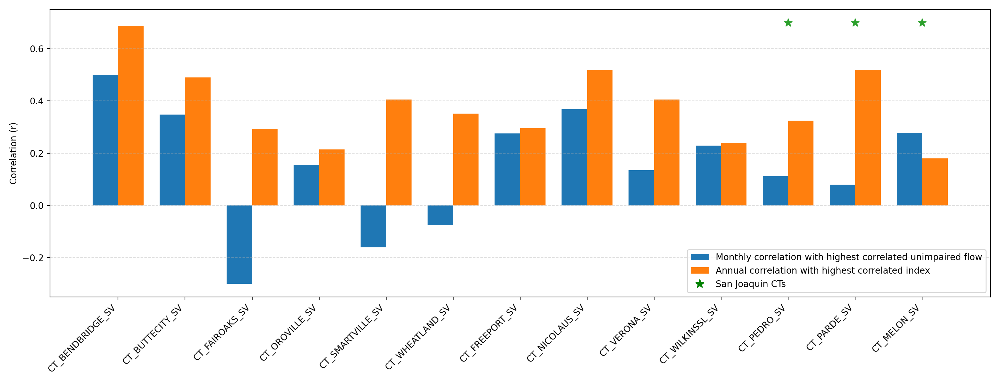
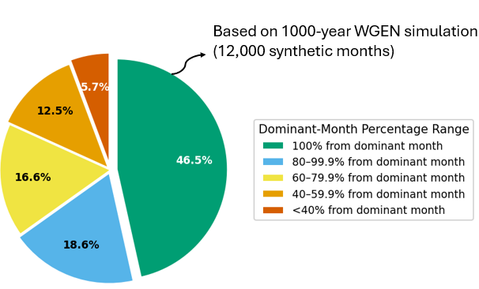
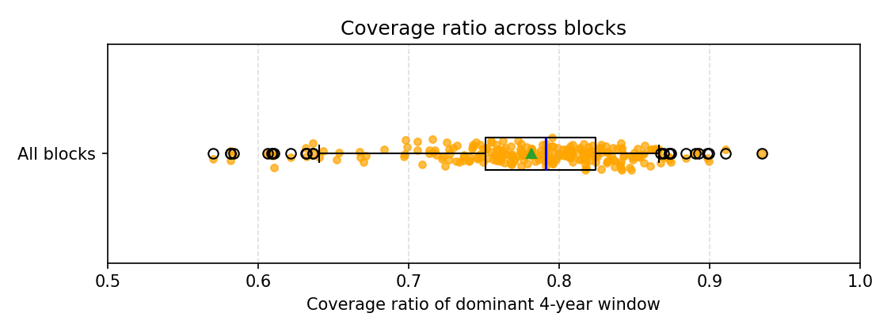
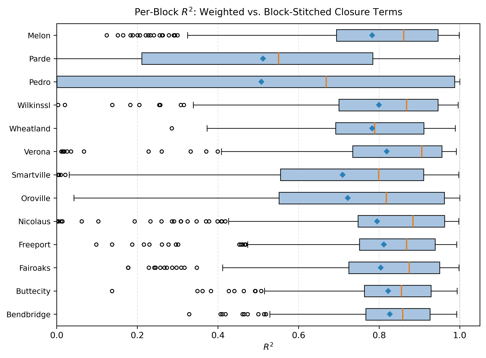

# mod_other/closure_terms

```{admonition} Repository Module
:class: tip

**Module:** `mod_other/closure_terms/`  
Water balance closure adjustments
```


Closure terms are monthly stream-inflow adjustments derived from historical reach water balances. They reconcile calculated water-balance components with observed flows at control gauges and are used in CalSim 3 primarily to correct errors in exogenous rim inflows and valley-floor surface runoff (DCR 2023 CalSim 3 Hydrology Report). Because they are calculated directly from historical flow-balance data rather than from a governing physical model, this project can only transfer historical associations between synthetic and historical periods.

For the DCR 2023-based inventory screened for this project, 26 closure-term inputs were identified: five are zero throughout the historical period and require no generation, eight San Joaquin Valley terms use repeating monthly patterns, and 13 have nonrepeating historical sequences. The WGEN date-weighted method is applied to these 13 Product B terms.

## Methodology

Initial investigation attempted to correlate closure terms with nearest upstream unimpaired flow predictors and water year type (WYT) indices. Monthly Pearson correlations were generally weak, with Bend Bridge showing the strongest relationship at approximately r=0.50. These relationships were not considered sufficient to support quantile mapping or index-based monthly generation. Annual sum correlation was higher, but the annual signal is too coarse to use directly because of strong month to month variation, for example, January can be highly positive while February may be negative, and the annual signal cannot capture these monthly fluctuations.

::::{tab-set}
:::{tab-item} Location Map
`````{grid} 3
:gutter: 2
:margin: 0

````{grid-item}
:columns: 8


````
````{grid-item}
:columns: 4

- **Bend Bridge, Butte City, Wilkins Slough**: Shasta
- **Oroville**: Oroville
- **Smartville, Wheatland**: Yuba
- **Fair Oaks**: Folsom
- **Freeport**: Shasta + Oroville
- **Nicolaus, Verona**: Oroville + Yuba
````
`````
*Sacramento Valley closure term drainage areas and their control gauges, from CalSim 3 Hydrology Report (DCR 2023); the San Joaquin closure terms (Pedro, Pardee, Melon) are not shown here.*
:::
:::{tab-item} Correlation Analysis

*Blue bars show the best monthly correlation between each closure term and its nearest upstream unimpaired flow (sometimes a combination of two upstream flows). Orange bars show the best annual correlation between the water year sum of the closure term and a water year type (WYT) index. Green stars mark the San Joaquin closure terms (Pedro, Pardee, Melon). Monthly correlation is generally too low for quantile mapping, only Bend Bridge approaches 0.5 while annual correlation is higher for several terms.*
:::
::::

Given the limitations of correlation-based approaches, the team developed a novel weighted-average methodology using WGEN sampling dates. The approach extracts WGEN sampled dates for each synthetic month, calculates the percentage of days sampled from each historical month/year combination, extracts closure term values for each contributing historical period, and weights closure term values by sampling percentage to create the weighted average for each WGEN month.

The methodology leverages a key insight: since WGEN constructs each synthetic month by sampling from historical days, and those sampling dates are recorded, the closure terms can be reconstructed by applying the same temporal mixing. For example, WGEN's synthetic May of simulation year 2036 draws 21 of its 31 days from historical May 1972, 6 days from historical May 1957, and the remaining 4 days from historical June 1952, a donor period can come from a different calendar month entirely, not just a different year. Weighting Bend Bridge's historical closure term by these day counts (5.44, -2.57, and 18.55 TAF for May 1972, May 1957, and June 1952) gives (21/31)(5.44) + (6/31)(-2.57) + (4/31)(18.55) = 5.58 TAF for the synthetic month. This approach preserves the temporal association between WGEN donor dates and historical closure-term values; it does not explicitly identify or simulate the physical, operational, or data-related causes of the residuals.

```{mermaid}
flowchart TD
    WGEN_MONTH["Synthetic WGEN Month<br/>(May, Year 2036)"] --> DATES["Extract Sampled<br/>Historical Dates"]
    DATES --> PCT["Calculate % of Days<br/>from Each Historical Month/Year"]

    PCT --> H1["Historical May 1972<br/>(21 of 31 days, 68%)"]
    PCT --> H2["Historical May 1957<br/>(6 of 31 days, 19%)"]
    PCT --> H3["Historical June 1952<br/>(4 of 31 days, 13%)"]

    H1 --> CT1["Bend Bridge CT<br/>May 1972: 5.44 TAF"]
    H2 --> CT2["Bend Bridge CT<br/>May 1957: -2.57 TAF"]
    H3 --> CT3["Bend Bridge CT<br/>June 1952: 18.55 TAF"]

    CT1 --> WAVG["Weighted Average<br/>(21/31)(5.44)<br/>+ (6/31)(-2.57)<br/>+ (4/31)(18.55)<br/>= 5.58 TAF"]
    CT2 --> WAVG
    CT3 --> WAVG

    WAVG --> OUTPUT["Synthetic Bend Bridge CT<br/>for May, Year 2036"]

    style WGEN_MONTH fill:#264653,color:#fff
    style OUTPUT fill:#2d6a4f,color:#fff
```

_WGEN date-weighted closure term reconstruction, using an actual WGEN month. Each synthetic month's closure term is a weighted average of historical values, with weights determined by the fraction of days sampled from each historical period._

Closure term retirement has precedent: DCR 2023 reports that since the previous CalSim 3 documentation, four closure terms were removed and two were combined, following model improvements that reduced the need for these empirical corrections (DCR 2023 CalSim 3 Hydrology Report, p. 16-37). We expect a similar improvement in future CalSim versions, potentially including the current DCR 2025 draft, which would ease both the CalSim model and this stochastic generation framework.

## Results

Across the 1,000-year simulation, most synthetic WGEN months draw from a single dominant historical source rather than blending several periods together:

- 46.5% come entirely from one historical month/year--a perfect match, where the weighted average equals the actual historical value.
- 18.6% draw 80-99.9% of their days from the dominant month.
- 16.6% draw 60-79.9%.
- Only 5.7% draw less than 40%, making them true blends of multiple historical periods.

::::{tab-set}
:::{tab-item} WGEN Sampling Distribution

*Distribution of dominant-month contribution to each WGEN month. Fully 46.5% of WGEN months are sampled entirely from a single historical month/year (perfect mapping), while only 5.7% have less than 40% from the dominant month.*
:::
:::{tab-item} WGEN Source Analysis

*Distribution of distinct historical (month, year) pairs contributing to each WGEN month. About 46.5% come from a single pair, another 45% from 2--4 pairs, and about 8% involve 5 or more distinct source periods.*
:::
::::

Since there are no reference series against which the stochastic closure terms can be validated, the analysis instead compares how well the date-weighted closure terms follow the dominant 4-year historical sequence embedded in WGEN sampling. WGEN itself resamples historical weather regimes in 4-year segments to preserve realistic multi-year drought and pluvial persistence (WGEN California Final Report, Najibi et al., 2023); therefore, for each 4-year WGEN block, the dominant historical 4-year window is identified, and CalSim 3's closure terms for those years are stitched together into a continuous sequence. It is worth mentioning that the WGEN sequence doesn't always come entirely from that same 4-year block, but these four years remain the dominant source. We define coverage as the percentage of a block's days that actually come from that same dominant 4-year period; most blocks show a coverage ratio between 70-85%.


*Coverage ratio distribution for dominant 4-year blocks. Most blocks show 70-85% coverage from the same historical 4-year period, reflecting substantial temporal coherence in WGEN sampling.*

Overall, the weighted series follows the block-stitched patterns reasonably well. Across the full record, the average R² for the 13 generated closure terms is 0.80. For individual four-year blocks, the mean R² is 0.75 and the median is 0.85, although performance varies among terms from a median of 0.55 for Pardee to 0.91 for Verona. These results show that the weighted method generally transfers the temporal structure of historical closure terms into the WGEN sequence, while recognizing that this comparison evaluates consistency between two constructed series rather than real-world predictive accuracy.


*Per-block R² between WGEN-weighted and block-stitched closure terms across all 4-year blocks. Term-level medians range from 0.55 (Pardee) to 0.91 (Verona); most terms cluster from 0.85-0.91, while Pardee, Pedro, Wheatland, Smartville, and Oroville show lower medians and wider spread, reflecting weaker or more random signal patterns at those locations.*

## References

- Najibi, N., and S. Steinschneider (2023). [*A Process-Based Approach to Bottom-Up Climate Risk Assessments: Developing a Statewide, Weather-Regime Based Stochastic Weather Generator for California.*](https://water.ca.gov/-/media/DWR-Website/Web-Pages/Programs/All-Programs/Climate-Change-Program/Resources-for-Water-Managers/Files/WGENCalifornia_Final_Report_final_20230808.pdf) Final Report, Cornell University, prepared for the California Department of Water Resources.
- California Department of Water Resources (2024). [*CalSim 3 Hydrology Report*](https://data.cnra.ca.gov/dataset/finaldcr2023/resource/6ba59600-d562-44da-a267-a6a50dff3f0d), Final State Water Project Delivery Capability Report 2023 (DCR 2023).
