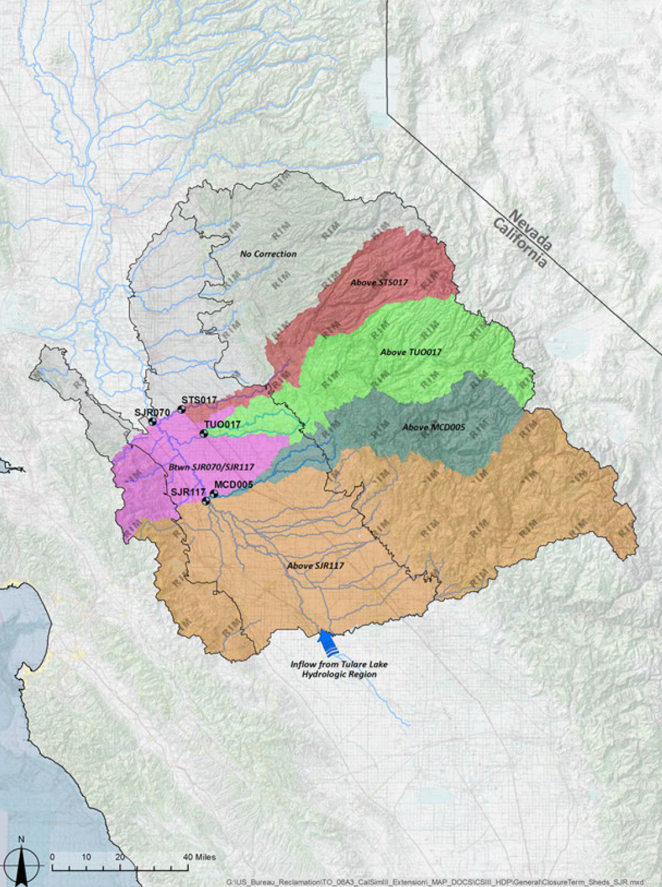

# mod_other/closure_terms

```{admonition} Repository Module
:class: tip

**Module:** `mod_other/closure_terms/`  
Water balance closure adjustments
```


Closure terms are monthly stream-inflow adjustments derived from historical reach water balances. They reconcile calculated water-balance components with observed flows at control gauges and are used in CalSim 3 primarily to correct errors in exogenous rim inflows and valley-floor surface runoff (DCR 2023 CalSim 3 Hydrology Report). Because they are calculated directly from historical flow-balance data rather than from a governing physical model, this project can only transfer historical associations between synthetic and historical periods.

For the DCR 2023-based inventory screened for this project, 26 closure-term inputs were identified: five are zero throughout the historical period and require no generation, eight San Joaquin Valley terms use repeating monthly patterns, and 13 have nonrepeating historical sequences. The WGEN date-weighted method is applied to these 13 Product B terms.

## Methodology

Initial investigation attempted to correlate closure terms with nearest upstream unimpaired flow predictors and water year type (WYT) indices. Monthly Pearson correlations were generally weak, with Bend Bridge showing the strongest relationship at approximately r=0.50. These relationships were not considered sufficient to support quantile mapping. Annual sum correlation was higher, but the annual signal is too coarse to use directly because of strong month to month variation, for example, January can be highly positive while February may be negative, and the annual signal cannot capture these monthly fluctuations.

::::{tab-set}
:::{tab-item} Sacramento Valley Map
`````{grid} 3
:gutter: 2
:margin: 0

````{grid-item}
:columns: 8


````
````{grid-item}
:columns: 4

- **Bend Bridge, Butte City, Wilkins Slough**: Shasta
- **Oroville**: Oroville
- **Smartville, Wheatland**: Yuba
- **Fair Oaks**: Folsom
- **Freeport**: Shasta + Oroville
- **Nicolaus, Verona**: Oroville + Yuba
````
`````
*Sacramento Valley closure term drainage areas and their control gauges, from CalSim 3 Hydrology Report (DCR 2023). The list gives the candidate upstream unimpaired flows evaluated for each term in the correlation analysis.*
:::
:::{tab-item} San Joaquin Valley Map
`````{grid} 3
:gutter: 2
:margin: 0

````{grid-item}
:columns: 8


````
````{grid-item}
:columns: 4

- **Pedro**: Tuolumne
- **Pardee**: Pardee inflow
- **Melon**: Stanislaus
````
`````
*San Joaquin Valley closure term drainage areas and their control gauges, from CalSim 3 Hydrology Report (DCR 2023). The list gives the candidate upstream flows evaluated for each generated term in the correlation analysis.*
:::
:::{tab-item} Correlation Analysis

*Blue bars show the best monthly correlation between each closure term and its nearest upstream unimpaired flow (sometimes a combination of two upstream flows). Orange bars show the best annual correlation between the water year sum of the closure term and a water year type (WYT) index. Green stars mark the San Joaquin closure terms (Pedro, Pardee, Melon). Monthly correlation is generally too low for quantile mapping, only Bend Bridge approaches 0.5 while annual correlation is higher for several terms.*
:::
::::

Given these limitations, a weighted average methodology based on WGEN sampling dates was adopted to generate the 13 nonrepeating closure terms. For each synthetic month, the method extracts the WGEN sampled dates, calculates the percentage of days drawn from each historical month and year combination, retrieves the historical closure term values for those contributing periods, and combines them into a weighted average using the sampling percentages as weights.

WGEN constructs each synthetic month by sampling historical days, and those sampling dates are recorded, the closure terms can be reconstructed by applying the same temporal mixing. For example, synthetic May of simulation year 2036 draws 21 of its 31 days from historical May 1972, 6 days from May 1957, and the remaining 4 days from June 1952. As this example shows, donor periods can sometimes differ from the synthetic month in calendar month. The figure below illustrates the resulting weighted average using the Bend Bridge closure term values for these donor periods. This reconstruction preserves the temporal association between WGEN donor dates and historical closure term values; it does not identify or simulate the physical, operational, or data related causes of the residuals.

```{mermaid}
flowchart LR
    WGEN_MONTH["Synthetic WGEN Month<br/>(May, Year 2036)"] --> DATES["Extract Sampled<br/>Historical Dates"]
    DATES --> PCT["Calculate % of Days per<br/>Historical Month/Year"]

    PCT --> H1["May 1972<br/>21 of 31 days (68%)<br/>CT: 5.44 TAF"]
    PCT --> H2["May 1957<br/>6 of 31 days (19%)<br/>CT: -2.57 TAF"]
    PCT --> H3["June 1952<br/>4 of 31 days (13%)<br/>CT: 18.55 TAF"]

    H1 --> WAVG["Weighted Average<br/>0.68(5.44)<br/>+ 0.19(-2.57)<br/>+ 0.13(18.55)<br/>= 5.58 TAF"]
    H2 --> WAVG
    H3 --> WAVG

    WAVG --> OUTPUT["Synthetic Closure Term<br/>for May, Year 2036"]

    style WGEN_MONTH fill:#264653,color:#fff
    style OUTPUT fill:#2d6a4f,color:#fff
```

_WGEN date-weighted closure term reconstruction, illustrated with an example month from the WGEN output and historical closure term values for Bend Bridge. Each synthetic month's closure term is a weighted average of historical values, with weights determined by the fraction of days sampled from each historical period._

Since the previous CalSim 3 documentation, four closure terms have been removed and two combined, following model improvements that reduced the need for these empirical corrections (DCR 2023 CalSim 3 Hydrology Report, p. 16-37). Further retirements are expected in future CalSim versions.

## Results

Across the 1,000-year simulation, most synthetic WGEN months draw from a single dominant historical source rather than blending several periods together:

- 46.5% come entirely from one historical month/year.
- 18.6% draw 80-99.9% of their days from the dominant month.
- 16.6% draw 60-79.9%.
- 12.5% draw 40-59.9%.
- Only 5.7% draw less than 40%, making them true blends of multiple historical periods.

::::{tab-set}
:::{tab-item} WGEN Sampling Distribution


*Distribution of dominant-month contribution to each WGEN month. 46.5% of WGEN months are sampled entirely from a single historical month/year, while only 5.7% have less than 40% from the dominant month.*
:::
:::{tab-item} WGEN Source Analysis


*Distribution of distinct historical (month, year) pairs contributing to each WGEN month. About 46.5% come from a single pair, another 45% from 2--4 pairs, and about 8% involve 5 or more distinct source periods.*
:::
::::

Since there are no reference series against which the stochastic closure terms can be validated, the analysis instead compares how well the date-weighted closure terms follow the dominant 4-year historical sequence embedded in WGEN sampling. WGEN itself resamples historical weather regimes in 4-year segments to preserve realistic multi-year drought and pluvial persistence (WGEN California Final Report, Najibi et al., 2023); therefore, for each 4-year WGEN block, the dominant historical 4-year window is identified, and CalSim 3's closure terms for those years are stitched together into a continuous sequence. The WGEN sequence does not always come entirely from that 4-year block, but those four years remain the dominant source. Coverage is defined as the percentage of a block's days drawn from its dominant 4-year period; as shown in the figure below, most blocks have coverage between 70% and 85%.


*Coverage ratio distribution for dominant 4-year blocks. The concentration between 70% and 85% reflects that WGEN largely samples contiguous stretches of the historical record.*

Overall, the weighted series follows the block-stitched patterns reasonably well. Across the full record, the average R² for the 13 generated closure terms is 0.80. For individual four-year blocks, the mean R² is 0.75 and the median is 0.85, although performance varies among terms from a median of 0.55 for Pardee to 0.91 for Verona, as shown in the box plots below. These results show that the weighted method generally transfers the temporal structure of historical closure terms into the WGEN sequence, while recognizing that this comparison evaluates consistency between two constructed series rather than real-world predictive accuracy.


*Per-block R² between WGEN-weighted and block-stitched closure terms across all 4-year blocks. Medians range from 0.55 (Pardee) to 0.91 (Verona); most terms cluster from 0.85-0.91, while Pardee, Pedro, Wheatland, Smartville, and Oroville show lower medians, with especially wide spread for Pardee and Pedro. These lower correlations are largely because of the very small magnitudes of the closure terms at those locations, most of which are zero in the majority of months, making the per-block R² sensitive to a few nonzero values.*

## References

California Department of Water Resources (DWR). 2023. *Final CalSim 3 Hydrology Report*. Companion technical document to the *Final State Water Project Delivery Capability Report 2023* (DCR 2023). <https://data.cnra.ca.gov/dataset/a3bb1ddd-624b-4c3d-95e7-2aa6b3bf2b5b/resource/6ba59600-d562-44da-a267-a6a50dff3f0d/download/final_cs3_hydrologyreport_v2.pdf>

Najibi, N., and S. Steinschneider. 2023. *A Process-Based Approach to Bottom-Up Climate Risk Assessments: Developing a Statewide, Weather-Regime Based Stochastic Weather Generator for California*. Final Report, Cornell University, prepared for the California Department of Water Resources. <https://water.ca.gov/-/media/DWR-Website/Web-Pages/Programs/All-Programs/Climate-Change-Program/Resources-for-Water-Managers/Files/WGENCalifornia_Final_Report_final_20230808.pdf>
