# mod_other/day_volume_fractions

```{admonition} Repository Module
:class: tip

**Module:** `mod_other/day_volume_fractions/`  
Monthly to daily disaggregation fractions
```


Daily disaggregation factors that convert CalSim monthly volumes into daily flow patterns while preserving each monthly volume.

## Methodology

Day volume fractions provide the temporal disaggregation necessary to represent within-month flow variations in a model that operates on monthly timesteps. CalSim calculates monthly water balances and operations, but many regulatory requirements, hydropower scheduling decisions, and water quality considerations require sub-monthly resolution. The day volume fractions act as shape factors that distribute monthly totals across 28-31 daily bins while preserving monthly sums.

The day volume fraction methodology follows the donor year convention documented in the DCR2023 CalSim 3 WRESL implementation. Comments in that code describe two rules: daily flows follow patterns defined as volume fraction time series from 1955-2003 historical Sacramento River flows at Freeport, and each water year from 1921 to 1954 borrows the pattern of a 1955-2003 year with similar total unimpaired Delta Inflow volume. The record extends through 2021, with the post-2003 years carried forward as observation based patterns. This structure reflects data availability, where pre-1955 daily records required reconstruction while 1955 onward benefited from gauge observations.

The series provides up to 31 daily bins (Day 1 through Day 31) whose fractions sum to 1.0 across each month's actual days. The disaggregation applies after CalSim monthly operations determine total monthly volumes, with day fractions distributing that total across daily timesteps for sub-monthly analysis. This maintains consistency between monthly water balance calculations and daily operational simulations.

### Reverse Engineering the Bootstrapping

The WRESL code documents the donor year convention but not the exact flow index used to choose donor years. Reconstruction proceeded in two parts: recover the donor years CalSim actually assigned, then find the index that reproduces those donor year pairings.

**Step 1: Recover the assigned donor years.** Each pre-1955 year's daily pattern was compared against every 1955-2003 year, using root mean squared error (RMSE). When the RMSE is in the millionths, the two patterns are the same, which reveals the donor year CalSim borrowed from. The day volume fractions for water year 1922, for example, were borrowed from 1975. Exact donors were found for every year from water year 1922 to 1948 (27 years in total). Years 1949 to 1954 had no exact match in the pool, suggesting these years may have been built by a different method or from different source records.

**Step 2: Characterize 2003-2021 Extension.** Comparing 1955-2003 patterns against 2004-2021 found no exact matches, confirming that the post-2003 years are an observation based continuation rather than borrowed. All of 1955-2021 can therefore serve as donor candidates, expanding the pool beyond the documented 1955-2003 window for generating the synthetic (Product B) sequences

**Step 3: Reconstruct the matching index.** Related documentation, including the WRESL note (DWR 2023) and the WaterFix Biological Assessment (DWR and Reclamation 2016), describes the rule: each pre-1955 year takes its daily pattern from a 1955-2003 year of similar total annual unimpaired Delta inflow. To test this, each candidate index was used to pair every pre-1949 year with its closest 1955-2003 year, and that pick was checked against the donor CalSim 3 actually used. The counts below are how many of the 27 known donors each index reproduced:

- Four river Sacramento index (Folsom, Oroville, Sacramento River at Bend Bridge, Yuba): 7 of 27.
- Eight river index (the four Sacramento rivers plus Stanislaus, Tuolumne, Merced, and San Joaquin): 16 of 27.
- Eight river index plus selected local inflows: up to 17 of 27.
- Eight river index plus a bootstrapped best subset of extra inflows: 20 of 27 at best, leaving seven unmatched. **This study adopts this index** (defined below).

Freeport lies upstream of the San Joaquin confluence, so a Sacramento index alone might be expected to suffice; yet adding the San Joaquin rivers more than doubled the matches (7 to 16). That adopted index is a water year (Oct-Sep) sum of the eight unimpaired rivers (Eight river index) plus six extra inflows (`I_LJC022`, `I_CLV026`, `I_SFM005`, `I_MOK079`, `I_CMCHE`, `I_PTH070`). These six were selected by bootstrapping candidate local inflows, with the eight rivers held fixed, to find the subset that reproduces the most known donor years. 

### Stochastic Application

For stochastic Product B generation, the expanded observation pool from 1955-2021 provides bootstrap candidates. Each synthetic water year gets matched to the historical year with the closest value of the adopted index, then borrows that year's day volume fraction pattern. 


```{mermaid}
flowchart TD
    SYN["Synthetic Water Year<br/>(Product B)"] --> CALC_IDX["Calculate Adopted Flow Index"]
    CALC_IDX --> MATCH["Find Nearest Historical Year<br/>by Adopted Flow Index"]

    subgraph POOL["Historical Observation Pool (1955-2021)"]
        direction LR
        Y55["1955"] ~~~ Y70["1970"] ~~~ Y90["1990"] ~~~ Y21["2021"]
    end

    MATCH --> POOL
    POOL --> BEST["Best Match Historical Year"]
    BEST --> BORROW["Borrow Day Volume<br/>Fraction Pattern<br/>(28-31 days per month)"]
    BORROW --> OUTPUT["Synthetic DVF<br/>(fractions sum to 1.0<br/>per month)"]

    style SYN fill:#264653,color:#fff
    style OUTPUT fill:#2d6a4f,color:#fff
    style POOL fill:#f0f4f8,stroke:#264653
```

_Day volume fraction bootstrap methodology. Each synthetic year is matched to the historical year with the nearest adopted flow index, then borrows that year's daily disaggregation pattern._

## Results

The results first confirm that the reconstruction reproduces the historical donor assignments, then examine how strongly hydrology relates to the day volume fractions.

### Reconstruction validation

The first reverse engineering step recovered the historical donor assignments by comparing each water year 1922-1954 `VOL-FRACTION` pattern against the 1955-2003 candidate pool. Exact matches were found for water year 1922 to 1948 (27 years), confirming that the pre-1949 reconstructed day volume fraction records are copies of existing 1955-2003 donor year values. The second step then searches candidate flow indices for the one that best reproduces those donor choices, approximating the total unimpaired Delta inflow criterion. The adopted index, which extends the standard eight river index with six local inflows, reproduces 20 of those 27 donors, and this study adopts that index.

### Hydrologic signal in the daily pattern

The figure below is a diagnostic check on the day volume fractions, shown for February as an example. It tests whether the shape of the daily pattern depends on unimpaired flow, measured either by water year type or by eight river inflow. On the left, the average February fraction is grouped by water year type over 1955-2021. The curves overlap a lot, so there is no strong or consistent water year type signal in how the February volume falls across the days. On the right, each line is one historical water year, colored by that year's February eight river inflow. If same month inflow strongly controlled the daily pattern, low inflow and high inflow years would cluster into distinct shapes or peak timing. That does not happen: wet and dry Februarys can produce very similar daily patterns, and peak timing is highly scattered. So monthly unimpaired inflow does not carry a strong signal for how the volume is spread across the days. This is expected, because the daily fractions describe impaired, operated flow at Freeport, while the eight river index is computed from unimpaired flow. The pattern looks noisy and operations driven. This study still follows the existing convention for generating Product B volume fractions; however, the figure acknowledges that the hydrologic signal behind the daily pattern is weak.


_February day volume fractions, water years 1955-2021. Left: average pattern by water year type. Right: individual water years colored by February eight river inflow._

:::{dropdown} All months, water years 1955-2021 (left: average Day Volume Fraction by water year type; right: individual years colored by that month's eight river inflow)

The same weak signal holds in every month: the average curves overlap across water year types, and individual years do not separate by that month's eight river inflow.

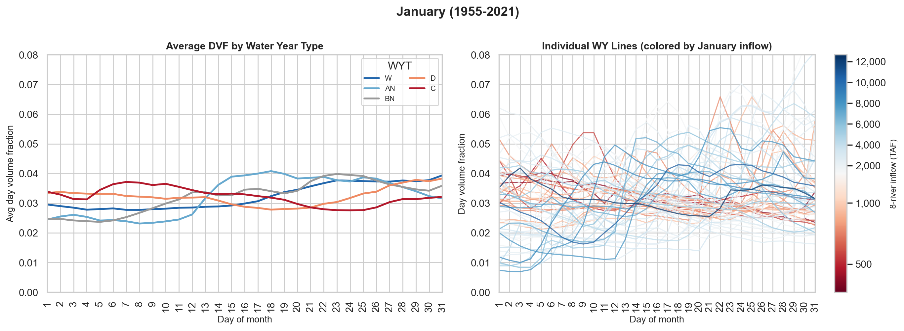

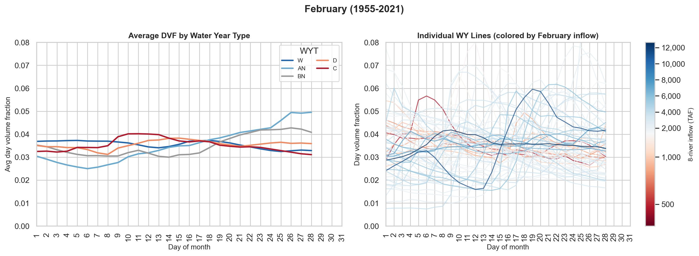

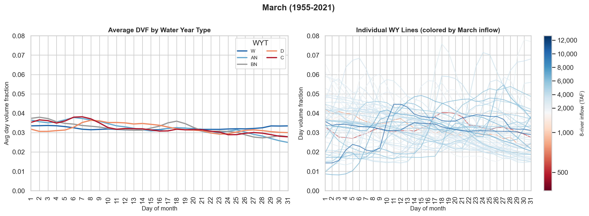

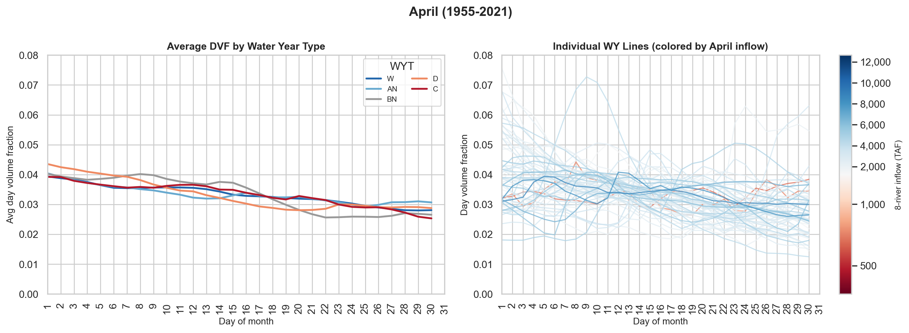

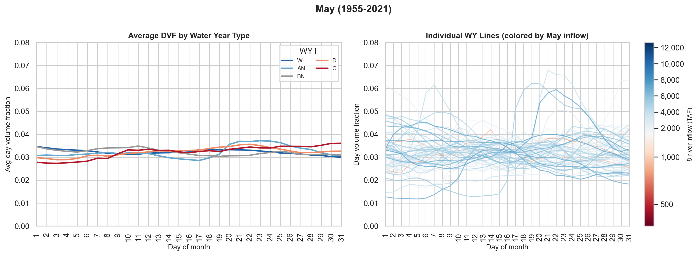

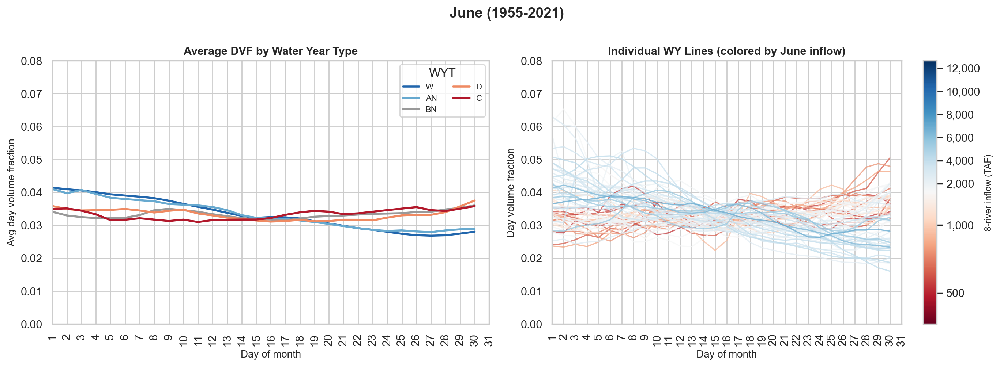

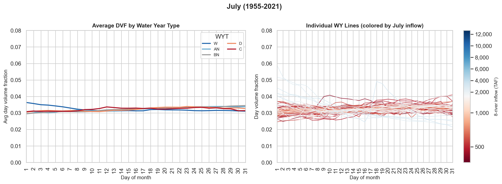

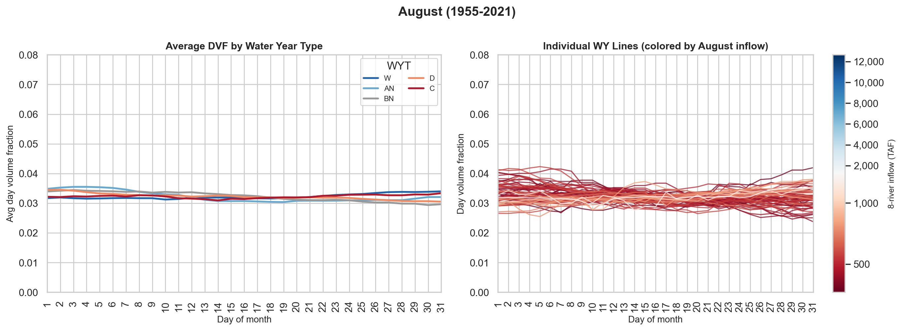

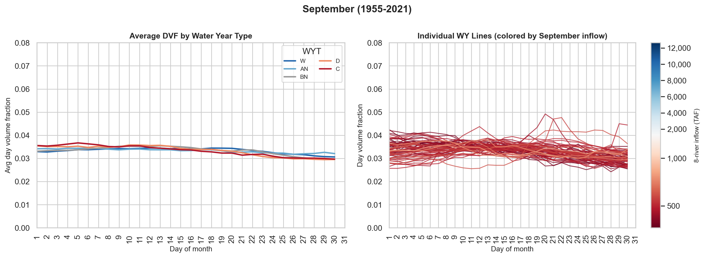

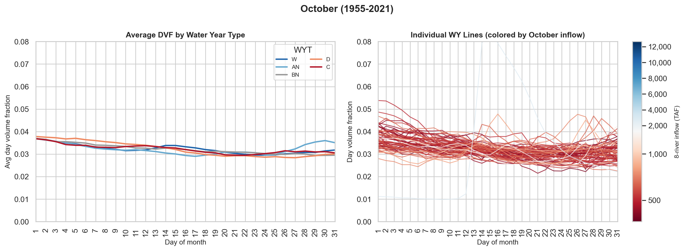

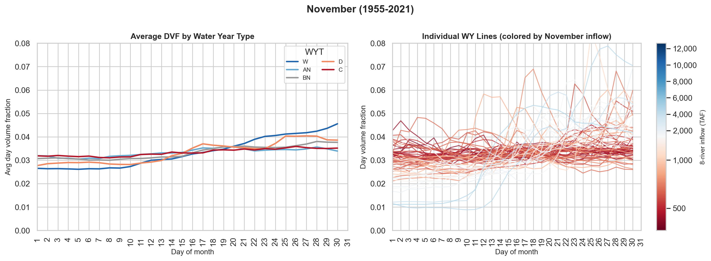

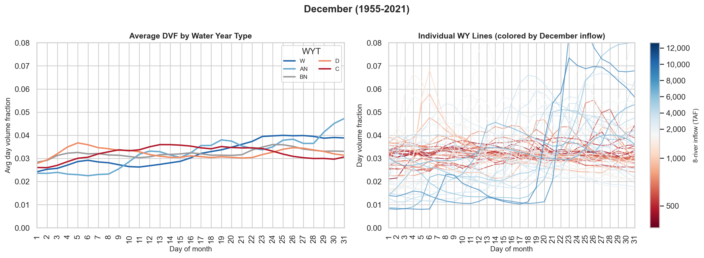
:::


## References

California Department of Water Resources (DWR). 2023. *Final DCR 2023 CalSim 3 Models*. CalSim 3 model package (WRESL source code) for the 2023 State Water Project Delivery Capability Report (DCR 2023). <https://lab.data.ca.gov/dataset/final-dcr-2023-calsim3-models>

California Department of Water Resources (DWR) and U.S. Bureau of Reclamation. 2016. *Incorporation of Daily Variability in the CalSim II and DSM2 Modeling*. Biological Assessment for the California WaterFix, Appendix 5B, Attachment 5, Section 5.B.A.5.2.1 (Observed Daily Patterns). <https://www.waterboards.ca.gov/waterrights/water_issues/programs/bay_delta/california_waterfix/exhibits/exhibit104/docs/App_5.B_DSM2_Att5_RevisedDraftBA.pdf>
