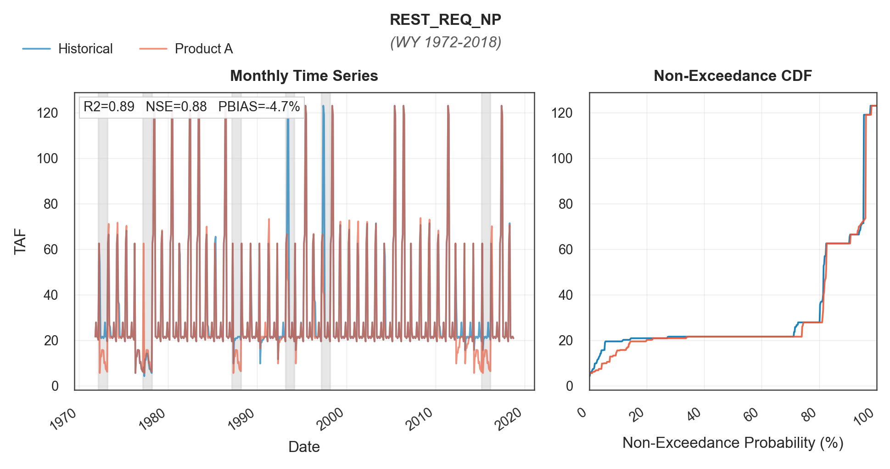
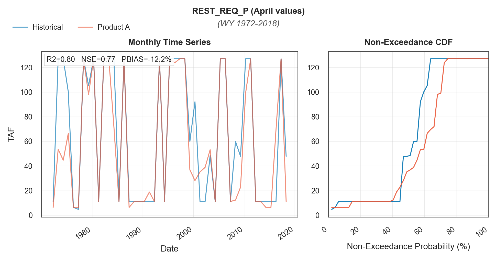
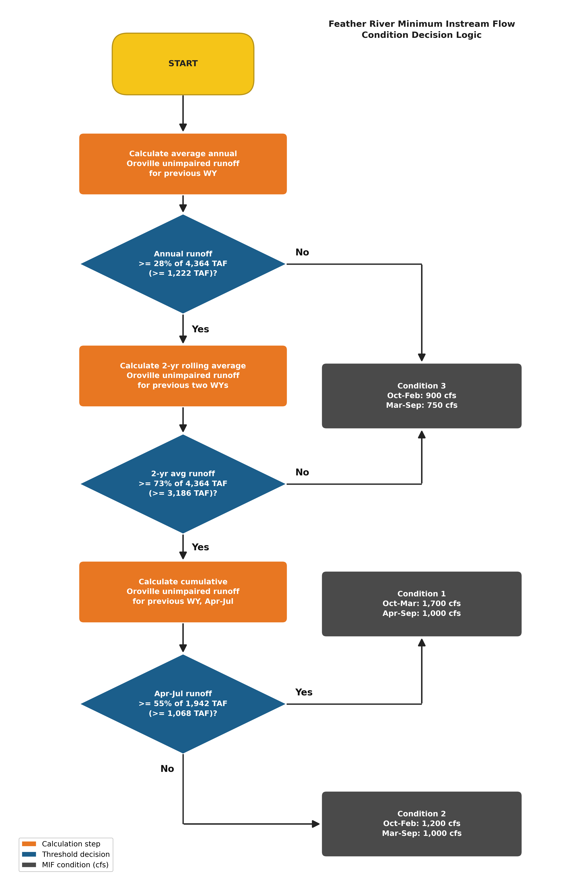
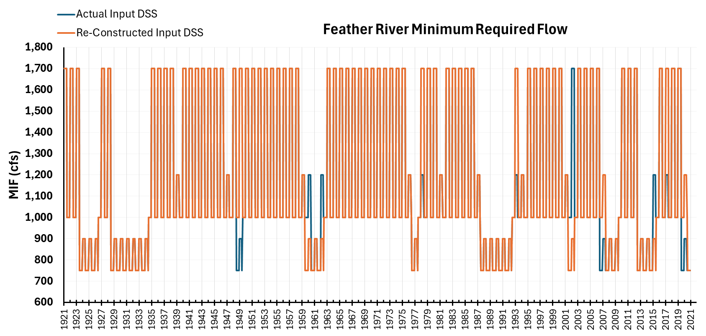

# mod_other/instream_flows

```{admonition} Repository Module
:class: tip

**Module:** `mod_other/instream_flows/`  
Instream flow and restoration release requirements
```


Instream flow and restoration release requirements for regulated rivers based on biological opinions, settlement agreements, and operational constraints. The two primary reconstructions cover San Joaquin River Restoration flows below Friant Dam and Feather River minimum flows below Oroville. Both implementations translate original agreement methodologies into algorithms applicable to synthetic unimpaired flow sequences.

## San Joaquin River Restoration Flows

### Methodology

The San Joaquin River restoration release requirements are determined from annual unimpaired runoff into Millerton Lake, which classifies each year into one of six restoration year types and establishes the corresponding release schedule. Wetter year types generally require larger releases. This framework was established by the 2006 San Joaquin River Restoration Settlement and documented in the 2017 Restoration Flows Guidelines, Version 2.0 (SJRRP 2017). The implementation is based on the original Excel workbook used to develop the CalSim 3 input series. CalSim 3 represents the requirements using two inputs: REST_REQ_NP, which contains the non-pulse requirements, and REST_REQ_P, which contains the requirement applied during the April pulse period. 

The workbook encodes the release schedules in conditional lookup tables covering the six principal restoration year types, from Critical-Low to Wet, together with transitional schedules between them. Because the relationship includes discontinuities at selected runoff thresholds, relatively small runoff differences near these thresholds can produce substantial changes in the resulting release schedule.

San Joaquin River unimpaired runoff into Millerton Lake is the sole hydrologic input to the reconstruction, the method maps the October–September water-year runoff total to monthly release requirements in two stages. First, the water year (October through September) runoff total sets an annual release allocation by restoration year type:


| Water year runoff (TAF) | Restoration year type | Annual release allocation (TAF) |
|---|---|---|
| below 400 | Critical-Low | 116.9 |
| 400 to 670 | Critical-High | 187.8 |
| 670 to 930 | Dry | 272.3 to 330.3, interpolated |
| 930 to 1,450 | Normal-Dry | 330.3 to 400.3, interpolated |
| 1,450 to 2,500 | Normal-Wet | 400.3 to 547.4, interpolated |
| 2,500 and above | Wet | 673.5 |

The allocation is discontinuous at the 400 TAF, 670 TAF, and 2.5 MAF thresholds, so small runoff differences near these values can shift the schedule between year types.

Second, the annual allocation is converted into a release schedule. The workbook defines twelve reference schedules, matching the Friant Dam default restoration flow schedules. Each carries a fixed annual release total and prescribes a release rate for each of twelve sub-annual blocks (Mar 1-15, Mar 16-31, Apr 1-15, Apr 16-30, May-Jun, Jul-Aug, Sep, Oct, Nov 1-6, Nov 7-10, Nov 11-Dec 31, Jan-Feb):

| Reference schedule (driest to wettest) | Schedule annual total (TAF) |
|---|---|
| Critical-Low | 116.9 |
| Critical-High | 187.8 |
| Critical-High to Dry 1 | 196.7 |
| Critical-High to Dry 2 | 218.1 |
| Critical-High to Dry 3 | 238.8 |
| Critical-High to Dry 4 | 266.9 |
| Critical-High to Dry 5 | 294.9 |
| Dry | 301.3 |
| Normal-Dry | 365.3 |
| Normal-Wet | 473.9 |
| Normal-Wet (+) | 563.0 |
| Wet | 673.5 |

For a given year, the two reference schedules whose annual totals bracket the year's allocation are selected, and each sub-annual block rate is linearly interpolated according to the allocation's position between them. Because the allocation steps from 187.8 to 272.3 TAF at the 670 TAF threshold, no allocation falls between these values, so the first three transitional schedules are never selected; they are listed to document the full set from the source workbook.

The resulting schedule applies over a restoration year running from March through February, keyed to the corresponding water year runoff total. Monthly CalSim inputs are obtained by weighting the block release rates by their number of days in each month and rounding to whole CFS. In April, the pulse rate is applied over the final 16 days and the non-pulse series receives the remaining volume, a convention adopted from the source workbook.


### Results

The reconstruction was evaluated with two comparisons that separate reproduction of the workbook logic from the effects of substituting the Product A hydrology. The first comparison drives the reconstruction with the same historical UNIMP_SJ series used to develop the CalSim 3 reference inputs (the DCR 2023 baseline), so remaining differences reflect the algorithm alone. Over WY 1922-2021 the reconstruction achieves NSE = 0.99 against the reference inputs for both the monthly non-pulse series and the April pulse values.

The second comparison drives the reconstruction with the Product A UNIMP_SJ series, produced by running the VIC hydrologic model on WGEN generated weather and quantile mapping the simulated flows to the CalSim rim inflow series ({doc}`mod-hydrology-rim-inflow`), and compares the result with the same CalSim 3 reference inputs. In each figure below the left panel shows the series and the right panel their non-exceedance distributions. Over WY 1972-2018 the monthly non-pulse series achieves $R^2$ = 0.89, NSE = 0.88, and PBIAS = -4.7%; the April pulse values achieve $R^2$ = 0.80, NSE = 0.77, and PBIAS = -12.2%. Because the first comparison establishes near exact reproduction of the workbook logic, these differences primarily reflect differences between the Product A and historical San Joaquin River unimpaired runoff into Millerton Lake. Larger discrepancies concentrate in years where the two runoff estimates fall on opposite sides of a discontinuous threshold (400 TAF, 670 TAF, or 2.5 MAF). For the pulse requirement, the April 16-30 rate rises from 350 CFS in the Normal-Dry schedule to 4,000 CFS in the Normal-Wet schedule, so two runoff estimates that differ within this range map to substantially different pulse rates.

::::{tab-set}
:::{tab-item} REST_REQ_NP

*`REST_REQ_NP` non-pulse restoration requirement reconstruction (WY 1972-2018). NSE = 0.88, PBIAS = -4.7%; Product A (orange) vs historical (blue). Statistics are computed from monthly values.*
:::
:::{tab-item} REST_REQ_P

*`REST_REQ_P` pulse restoration requirement reconstruction, April values (WY 1972-2018; pulse flows apply only during April). NSE = 0.77, PBIAS = -12.2%; Product A (orange) vs historical (blue). Differences track runoff disagreement across the steep April ramp of the release schedules.*
:::
::::


## Feather River Minimum Flows

### Methodology

Feather River minimum instream flows implement the 1983 agreement between DWR and the Department of Fish and Game. The agreement specifies four conditions with criteria determining minimum required flows ranging from 750 to 2,500 CFS depending on water availability indicators. The reconstruction implements Conditions 1 through 3 (750--1,700 CFS); Condition 4 (2,500 CFS) was excluded as it was never triggered in the historical record. The reconstruction translates this reference table structure into algorithmic threshold logic using Oroville unimpaired runoff as the primary predictor.


*Minimum flow requirements for the Feather River from the 1983 DWR--DFG agreement. Conditions 1--3 are implemented in the reconstruction; Condition 4 was excluded as it was never triggered in the historical record.*

#### Threshold Logic

The flowchart logic begins with Condition 3, calculating average annual Oroville unimpaired runoff for the previous water year. If runoff falls below 28% of 4.4 MAF (approximately 1.23 MAF), Condition 3 applies with 900 CFS October through February and 750 CFS March through September. If above this threshold, the algorithm calculates a two-year rolling average. Two-year average runoff below 73% of 4.4 MAF (approximately 3.21 MAF) maintains Condition 3. Above this threshold, the logic transitions to Conditions 1 and 2, distinguished by an April-July cumulative runoff threshold at 55% of 1.9 MAF (approximately 1.05 MAF). This creates a hierarchical decision structure with increasingly restrictive conditions as water availability declines.

Developing this flowchart required careful interpretation of the 1983 agreement language, which describes conditions in legal prose rather than algorithmic notation. The translation from agreement text to threshold logic was discussed extensively during the November and December progress meetings, with particular attention to whether the rolling average should be computed on a water year or calendar year basis (water year was selected as more hydrologically meaningful) and how to handle the first year of simulation where no prior-year data exists.


*Feather River minimum instream flow decision logic based on the 1983 DWR--DFG agreement. Orange boxes are calculation steps; teal diamonds are threshold decisions; gray boxes are the resulting minimum flow conditions for the current water year.*

#### Threshold Optimization

Original agreement language referenced Oroville storage (preprocessed), but the reconstruction uses Oroville unimpaired runoff as a more direct hydrologic indicator applicable to synthetic sequences. The three key thresholds (28% of 4.4 MAF annual, 73% of 4.4 MAF two-year rolling, 55% of 1.9 MAF April-July cumulative) were optimized to maximize correspondence with actual CalSim inputs. Condition 4, representing an upper cap never exceeded in historical MIF values (which never exceeded 1,700 CFS), was excluded from the reconstruction logic.

#### Condition 4 Decision

Condition 4 from the original 1983 agreement was deliberately excluded from the reconstruction. Historical analysis showed that actual minimum instream flow values never exceeded 1,700 CFS, well below Condition 4 thresholds that would require 2,500 CFS. Including rarely or never-triggered conditions in the logic introduces unnecessary complexity and potential for spurious activations in synthetic sequences. The three-condition framework (Conditions 1, 2, 3) captures the full range of historical behavior while maintaining defensible thresholds grounded in observed operations.

### Results

The reconstructed Feather River minimum flows achieve $R^2$ = 0.89 over the validation period, indicating strong replication of historical patterns. The threshold-based approach successfully captures the discrete operational rules while remaining applicable to novel hydrologic sequences not present in the training data.


*Feather River minimum required flow (CFS) validation, 1921--2021. Actual CalSim input DSS (blue) is available from approximately 1950 onward; reconstructed values (orange) cover the full period. Flow values step between discrete threshold levels (750, 800, 900, 1,000, 1,200, and 1,700 CFS) determined by the three-condition logic based on annual Oroville inflow. Strong agreement in the overlap period ($R^2$ = 0.89).*

## References

San Joaquin River Restoration Program (SJRRP). 2017. *Restoration Flows Guidelines*, Version 2.0. February 2017. <https://restoresjr.net/>
