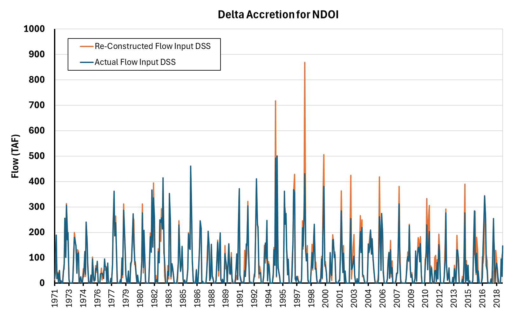
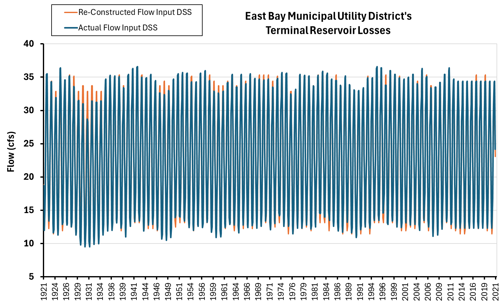

# Other Modules (mod_other)

Supplementary terms including instream flows, upper watershed modules, day volume fractions, closure terms, miscellaneous operational variables, and salinity boundary conditions.

---

## Instream Flows (6 Variables)

```{admonition} Repository Module
:class: tip

**Module:** `mod_other/instream_flows/`  
Minimum instream flow requirements
```


Minimum instream flow requirements for regulated rivers based on biological opinions, settlement agreements, and operational constraints. The two primary reconstructions cover San Joaquin River Restoration flows below Friant Dam and Feather River minimum flows below Oroville. Both implementations translate original agreement methodologies into algorithms applicable to synthetic unimpaired flow sequences.

### Methodology

#### San Joaquin Restoration Flows

The San Joaquin River Restoration minimum instream flows follow the 2009 restoration settlement agreement, with implementation based on the original Excel workbook calculation methodology. The restoration releases divide into two components: non-pulse base flows providing year-round minimum requirements, and pulse flows adding elevated requirements during specific April periods. Monthly timestep calculations use weighted averages of both components.

Reverse-engineering the original Excel workbook proved essential for understanding the conditional logic governing release schedules. The workbook embeds extensive nested IF statements with threshold-dependent lookup tables that differ between normal and restoration year types. Converting this logic to algorithmic form required carefully tracing cell references through multiple worksheets, with particular attention to edge cases near threshold boundaries where small differences in annual runoff can trigger substantially different release schedules.

Unimpaired runoff into Lake Millerton serves as the sole input variable, with threshold logic determining release requirements. Below 400 TAF annual runoff, minimum base flow requirements apply. Above 2.5 MAF annual runoff, the restoration schedule reaches maximum flow levels. Between these thresholds, linear interpolation provides intermediate flow requirements. The non-pulse component covers the first 14-15 days of April, while pulse flows apply to remaining days, with monthly values computed as day-weighted averages.

#### Feather River Minimum Flows

Feather River minimum instream flows implement the 1983 agreement between DWR and the Department of Fish and Game. The agreement specifies four conditions with criteria determining minimum required flows ranging from 750 to 2,500 CFS depending on water availability indicators. The reconstruction implements Conditions 1 through 3 (750--1,700 CFS); Condition 4 (2,500 CFS) was excluded as it was never triggered in the historical record. The reconstruction translates this reference table structure into algorithmic threshold logic using Oroville unimpaired runoff as the primary predictor.

##### Threshold Logic

The flowchart logic begins with Condition 3, calculating average annual Oroville unimpaired runoff for the previous water year. If runoff falls below 28% of 4.4 MAF (approximately 1.23 MAF), Condition 3 applies with 900 CFS October through February and 750 CFS March through September. If above this threshold, the algorithm calculates a two-year rolling average. Two-year average runoff below 73% of 4.4 MAF (approximately 3.21 MAF) maintains Condition 3. Above this threshold, the logic transitions to Conditions 1 and 2, distinguished by an April-July cumulative runoff threshold at 55% of 1.9 MAF (approximately 1.05 MAF). This creates a hierarchical decision structure with increasingly restrictive conditions as water availability declines.

Developing this flowchart required careful interpretation of the 1983 agreement language, which describes conditions in legal prose rather than algorithmic notation. The translation from agreement text to threshold logic was discussed extensively during the November and December progress meetings, with particular attention to whether the rolling average should be computed on a water year or calendar year basis (water year was selected as more hydrologically meaningful) and how to handle the first year of simulation where no prior-year data exists.

:::note Suggested Plot
Flowchart diagram visualizing the Condition 3 -> Condition 1/2 decision logic with threshold values annotated. Include example water years showing how annual runoff and rolling averages trigger different conditions. Optionally overlay historical frequency of each condition occurring.
:::

##### Threshold Optimization

Original agreement language referenced Oroville storage (preprocessed), but the reconstruction uses Oroville unimpaired runoff as a more direct hydrologic indicator applicable to synthetic sequences. The three key thresholds (28% of 4.4 MAF annual, 73% of 4.4 MAF two-year rolling, 55% of 1.9 MAF April-July cumulative) were optimized to maximize correspondence with actual CalSim inputs. Condition 4, representing an upper cap never exceeded in historical MIF values (which never exceeded 1,700 CFS), was excluded from the reconstruction logic.

##### Condition 4 Decision

Condition 4 from the original 1983 agreement was deliberately excluded from the reconstruction. Historical analysis showed that actual minimum instream flow values never exceeded 1,700 CFS, well below Condition 4 thresholds that would require 2,500 CFS. Including rarely or never-triggered conditions in the logic introduces unnecessary complexity and potential for spurious activations in synthetic sequences. The three-condition framework (Conditions 1, 2, 3) captures the full range of historical behavior while maintaining defensible thresholds grounded in observed operations.

### Results

#### San Joaquin Restoration Flows

Validation over WY 1972-2018 achieves R^2 values between 0.85 and 0.90, demonstrating strong performance. Observed differences stem from differences in unimpaired inflow projections between CalSim baseline inputs and reconstructed VIC-based values. Years showing spikes in residuals correspond to cases where CalSim input annual runoff exceeded the 2.5 MAF threshold while reconstructed values remained below, or vice versa for low flow conditions. These threshold crossings create discrete step changes that explain apparent discrepancies while validating correct algorithm implementation.

:::note Suggested Plot
Dual panels showing: (1) Time series of San Joaquin Restoration flows WY 1972-2018 with actual (gray) and reconstructed (blue) values, highlighting years where threshold crossings explain differences. (2) Scatter plot of actual vs reconstructed colored by WYT, with 1:1 line and 2.5 MAF / 0.4 MAF threshold regions annotated.
:::

#### Feather River Minimum Flows

The reconstructed Feather River minimum flows achieve R^2 = 0.89 over the validation period, indicating strong replication of historical patterns. The threshold-based approach successfully captures the discrete operational rules while remaining applicable to novel hydrologic sequences not present in the training data.


*Feather River minimum required flow (CFS) validation, 1921--2021. Actual CalSim input DSS (blue) is available from approximately 1950 onward; reconstructed values (orange) cover the full period. Flow values step between discrete threshold levels (750, 800, 900, 1,000, 1,200, and 1,700 CFS) determined by the three-condition logic based on annual Oroville inflow. Strong agreement in the overlap period (R^2 = 0.89).*

---

## Upper Watershed Modules (104 Variables)

```{admonition} Repository Module
:class: tip

**Module:** `mod_other/upper_watershed/`  
Upper watershed module preprocessing (Yuba, Don Pedro, etc.)
```


Inputs for seven CalSim 3 upper watershed sub-models that run prior to main model execution. These modules include Yuba, American (two modules), Feather, Bear, McCloud, and Stanislaus/Don Pedro, each representing detailed operations for specific river systems. The modules execute first with outputs feeding into the main CalSim run, enabling more sophisticated representation of upstream reservoir management and hydropower operations.

### Methodology

#### Scope Analysis

Comprehensive analysis of all seven module DSS files identified 104 total terms across the modules. However, most of these terms already appear in the main CalSim inventory, having been generated through other input categories such as CalSimHydro demands, rim inflows, or external elements. After filtering for monthly repeating patterns, zero-value terms, and matches to existing inventory, only 12 terms from 2 modules require new generation: Lower Yuba and Don Pedro/Stanislaus. The other five modules (both American modules, Feather, Bear, McCloud) are fully covered by existing inventory.

This finding significantly reduces upper watershed module workload compared to initial expectations. The 13 remaining terms employ diverse methodologies spanning quantile mapping, water year type averaging, threshold optimization, direct calculation, and change-in-storage approaches.

:::note Suggested Plot
Stacked bar chart showing term counts by module with three segments: (1) matched to existing inventory (gray), (2) filtered out as repeating/constant (light gray), (3) requiring new generation (blue). Annotate total counts and highlight that only Lower Yuba and Don Pedro require new work.
:::

#### Lower Yuba Module Terms

##### Channel Diversion and MFY-44

Channel diversion exhibits clear hydrologic pattern making quantile mapping the primary approach. The term shows correlation with Yuba River flows, enabling standard QM methodology with VIC output as basis. MFY-44 minimum flow shows unusual peak patterns suggesting either quantile mapping or water year type averaging may be appropriate. Validation will determine which approach best captures the operational logic driving these peaks.

##### Diversion Schedule

Diversion schedule follows regular seasonal patterns without strong correlation to individual flow years, making water year type averaging the natural methodology choice. The approach calculates monthly average diversions conditional on water year type, capturing seasonal demand patterns that vary with overall water availability without requiring year-to-year flow matching.

#### American River Module Terms

##### Storage Forecast (Three Terms)

Three American River storage forecast terms (likely P184, P185, P186) exhibit unique seasonal patterns ranging from -15 to +150 TAF with positive values after July and negative values starting January. These represent upstream flow regulation signals: reservoirs hold water in winter (negative, indicating reduced releases) and release in summer (positive, indicating augmented flows above natural patterns).

The forecast release terms feed into Folsom envelope calculations where Folsom full natural flow combines with forecast release adjustments. Initial approach attempts quantile mapping using American River unimpaired flow or temperature as basis. If correlation proves weak, fallback to water year type averaging will preserve seasonal regulation patterns conditional on overall water availability classification.

:::note Suggested Plot
Seasonal pattern visualization showing monthly distributions for the three storage forecast terms across water year types. Include separate panels for each term with box plots by month colored by WYT, illustrating the winter reduction/summer augmentation pattern and WYT-dependent magnitude.
:::

#### Don Pedro / Stanislaus Module Terms

##### E_PEDRO (Evaporation)

Don Pedro evaporation exists in reservoir evaporation module output but requires unit conversion as the module term is expressed in CFS (flow rate) rather than depth or volume. The conversion depends on pre-processed storage time series to determine surface area, then translate evaporation depth to volumetric rate. If storage varies significantly, water year type average storage may serve as basis for area calculation, followed by evaporation depth computation and CFS conversion.

##### S_PEDRO (Storage)

Don Pedro storage reconstruction addresses pre-processed storage values used in State and Federal Project (SFP) sharing account calculations. Direct quantile mapping of storage levels creates potential water year boundary discontinuities where one year ends at high storage while the next synthetic year (from different historical analogue) starts at low storage.

The change-in-storage approach resolves this issue by quantile mapping monthly change in storage (delta-S) rather than absolute storage levels. Tuolumne River unimpaired flow serves as the basis for QM, establishing relationship between monthly runoff and storage change. Synthetic sequence storage is then computed by accumulating mapped delta-S values with appropriate initial conditions, producing continuous storage trajectories without year-boundary artifacts.

##### PG&E Water Year Allocation

PG&E Water Year Allocation (described in detail in the Other Variables section below) determines hydropower generation water rights as function of Folsom unimpaired flow thresholds. The five-level threshold logic was initially developed through manual trial-and-error (achieving $R^2 = 0.75$) and then refined using Excel Solver's GRG Nonlinear algorithm, which optimized the four threshold boundaries simultaneously to maximize $R^2$. The optimized thresholds achieved $R^2 = 0.90$, a substantial improvement that demonstrates the value of systematic optimization for threshold-based reconstruction. The logic applies from May of the triggering water year through the following April, representing annual allocation decisions that persist through the contract year. The term appears in Don Pedro module as it affects Stanislaus River system operations through PG&E facilities.

The Solver optimization approach was developed during the January progress meetings as a generalizable technique for any threshold-based CalSim input. By parameterizing the threshold boundaries and using a nonlinear solver to maximize correlation with historical values, the team established a repeatable workflow that avoids subjective manual threshold selection.

### Results

The S_PEDRO change-in-storage methodology was successfully applied and validated, demonstrating that change-based QM avoids discontinuities while capturing storage dynamics responsive to runoff patterns.

:::note Suggested Plot
Three-panel comparison: (1) Time series showing reconstructed S_PEDRO storage with water year boundaries marked, demonstrating smooth transitions without discontinuities. (2) Monthly delta-S scatter plot (Tuolumne runoff vs storage change) with QM relationship overlaid showing training and validation periods. (3) Storage trajectory for a multi-year drought sequence demonstrating continuous drawdown/recovery.
:::

Several cross-cutting patterns emerge across upper watershed module terms. Forecast and regulation terms (American storage forecasts, various minimum flows) represent operational decisions that respond to water availability through threshold or seasonal logic. Reservoir-dependent terms (E_PEDRO, S_PEDRO) require careful handling of storage-elevation-area relationships and temporal continuity. Demand and allocation terms (diversions, PG&E allocation) follow either seasonal patterns or threshold-triggered ratios based on annual hydrology assessment.

The diversity of methodologies applied to these 13 terms illustrates the flexibility required for comprehensive input reconstruction. No single approach suffices, but the toolkit of quantile mapping, water year type averaging, threshold logic, direct calculation, and change-in-storage QM provides appropriate methods for each variable's characteristics.

---

## Day Volume Fractions (31 Variables)

```{admonition} Repository Module
:class: tip

**Module:** `mod_other/day_volume_fractions/`  
Monthly-to-daily disaggregation fractions
```


Daily disaggregation factors converting monthly CalSim values to daily timesteps for within-month operational analysis.

### Methodology

Day volume fractions provide the temporal disaggregation necessary to represent within-month flow variations in a model that operates on monthly timesteps. CalSim calculates monthly water balances and operations, but many regulatory requirements, hydropower scheduling decisions, and water quality considerations require sub-monthly resolution. The day volume fractions act as shape factors that distribute monthly totals across 30 daily bins while preserving monthly sums.

The original methodology documented in project files establishes three distinct periods: 1921-1954 employs bootstrapping from 1955-2003 observations based on hydrologic similarity, 1955-2003 uses observation-based patterns from Freeport flows, and 2003-2021 extends the series using matching approaches. This structure reflects data availability, where pre-1955 daily records required reconstruction while post-1955 benefited from gauge observations.

Day 1 through Day 30 values represent fractions summing to 1.0 for each month, not a single monthly value repeated 30 times. The disaggregation applies after CalSim monthly operations determine total monthly volumes, with day fractions distributing that total across daily timesteps for sub-monthly analysis. This maintains consistency between monthly water balance calculations and daily operational simulations.

#### Reverse Engineering the Bootstrapping

The reconstruction required reverse-engineering the bootstrapping methodology from incomplete documentation and partial descriptions. A four-step validation process systematically confirmed the approach and identified key matching criteria.

**Step 1: Confirm 1921-1948 Bootstrapping.** Initial analysis compared day volume fraction patterns for 1921-1954 to the 1955-2003 observation pool, calculating root mean squared error between each pre-1955 year and all post-1955 candidates. Results through 1948 showed RMSE values in the millionths, indicating essentially perfect matches and confirming successful bootstrapping. However, 1948 onwards showed matches diverging significantly, suggesting either different methodology or data transition issues in that period.

**Step 2: Characterize 2003-2021 Extension.** Comparison of 1955-2003 patterns to 2003-2021 extension found no exact matches. This confirms that the extension period uses observation-based methodology continuing the post-2003 record rather than bootstrapping from earlier years. For stochastic run generation, this implies all years 1955-2021 can potentially serve as bootstrap sources, expanding the sampling pool beyond just 1955-2003.

**Step 3: Test Four-River Index Matching.** Documentation indicated matching should use "total unimpaired delta inflow," suggesting Sacramento River as primary control. Testing employed the four-river index consisting of Folsom, Oroville, Shasta (or SRBB), and Yuba unimpaired runoff summed annually. Matching synthetic years to historical years by nearest annual four-river sum produced perfect agreement for 7 years with Step 1 results. However, substantial scatter remained for other years, indicating the four-river index alone does not fully explain matching logic.

**Step 4: Investigate Eight-River Index and Calendar Year.** Sacramento River at Freeport location examination on maps shows purely Sacramento basin influence, with San Joaquin joining the system downstream. This suggests Sacramento-only indices should suffice. However, testing expanded to eight-river index adding Stanislaus, Tuolumne, Merced, and San Joaquin to capture total Central Valley unimpaired runoff. Both annual aggregation bases were tested: water year (Oct-Sep) and calendar year (Jan-Dec). The October progress meeting discussions explored whether calendar year aggregation might better align with the DWR fiscal year or federal water year planning conventions used when the original methodology was developed in the early 2000s.

Additional refinements under consideration include substituting SRBB (Shasta River Bend Bridge) for Shasta reservoir inflow to better represent valley floor conditions, and potentially adding Whiskey Town flows. Trinity River is unlikely to contribute since it drains to the Pacific with CVP diversions via tunnel to Whiskey Town rather than direct Sacramento contribution. The January progress meetings confirmed that RMSE validation against known matches provides the definitive test for selecting among these index variants.

#### Sacramento vs Total Delta Inflow

The tension between Sacramento-specific indicators (Freeport location, four-river Sacramento index) and total Delta inflow (eight-river including San Joaquin) reflects uncertainty about which hydrologic region dominates day volume fraction patterns. Physically, Freeport captures Sacramento contributions before San Joaquin confluence, suggesting Sacramento indices should suffice. However, if downstream operations or Delta position influences the Freeport observation patterns, total inflow may provide better matching. Validation testing will resolve this question by identifying which index produces superior reconstruction of 1921-1948 patterns.

#### Stochastic Application

For stochastic Product B generation, the expanded observation pool from 1955-2021 (or potentially 1955-2003 depending on extension assessment) provides bootstrap candidates. Each synthetic water year gets matched to the historical year with nearest flow index match, then borrows that year's day volume fraction pattern. This preserves realistic within-month flow distributions while allowing the monthly totals to follow synthetic hydrology.

The matching process emphasizes annual unimpaired flow sums as the primary similarity metric, capturing overall wetness conditions that correlate with runoff timing patterns. Wet years tend to have earlier snowmelt and storm-driven peaks, while dry years show constrained, late-season patterns. Matching on annual sum preserves these relationships even though specific storm timing differs between synthetic and historical sequences.

```{mermaid}
flowchart TD
    SYN["Synthetic Water Year<br/>(Product B)"] --> CALC_IDX["Calculate Flow Index<br/>(8-river annual sum)"]
    CALC_IDX --> MATCH["Find Nearest Historical Year<br/>by Flow Index Distance"]

    subgraph POOL["Historical Observation Pool (1955-2021)"]
        direction LR
        Y55["1955"] ~~~ Y70["1970"] ~~~ Y90["1990"] ~~~ Y21["2021"]
    end

    MATCH --> POOL
    POOL --> BEST["Best-Match Historical Year"]
    BEST --> BORROW["Borrow Day Volume<br/>Fraction Pattern<br/>(Days 1-30 per month)"]
    BORROW --> OUTPUT["Synthetic DVF<br/>(fractions sum to 1.0<br/>per month)"]

    style SYN fill:#264653,color:#fff
    style OUTPUT fill:#2d6a4f,color:#fff
    style POOL fill:#f0f4f8,stroke:#264653
```

_Day volume fraction bootstrap methodology. Each synthetic year is matched to the historical year with the nearest flow index, then borrows that year's within-month disaggregation pattern._

### Results

#### Validation

Primary validation metric focuses on exact water year matches where possible, since perfect replication of assigned year indicates correct methodology application. For years without exact matches, secondary metrics include R^2 or Nash-Sutcliffe Efficiency of monthly volume fractions, assessing how well the borrowed pattern reproduces the target distribution.

The 1921-1948 validation period provides critical ground truth since exact matching demonstrates methodology success. Achieving perfect matches for majority of years in this period confirms the bootstrap approach works as documented. Remaining scatter for some years suggests potential refinements (calendar year aggregation, eight-river index, alternative Sacramento components) that warrant investigation.

:::note Suggested Plot
Comparison matrix showing RMSE heatmap between pre-1955 years (rows) and post-1955 candidates (columns), with cells colored by match quality (white = exact match, blue gradient = increasing RMSE). Overlay annotations indicating which years achieved perfect matches and highlighting the 1948 transition. Include marginal plots showing four-river and eight-river index values for pattern assessment.
:::

:::note Suggested Plot
Validation time series for 1921-1948 showing: (1) Four-river index for each year (bars), (2) matched historical year identifier (color-coded points), (3) perfect match indicator (star symbols), (4) R^2/NSE metric for imperfect matches (point size). This visualization demonstrates matching success rate and identifies years requiring either index refinement or acceptance of approximate matches.
:::

#### Alternative Continuous Approach

Discussion explored replacing discrete year-to-year stitching with continuous interpolation. Instead of selecting the single best-matching historical year for each synthetic year, a fitted relationship between flow index and day fraction patterns could enable interpolation. This would provide more variability in stochastic outputs rather than limiting to discrete historical patterns. However, the discrete bootstrap approach maintains physical realism by using only observed patterns, avoiding potential artifacts from interpolation between years with different storm structures. The discrete method was retained as primary approach with continuous interpolation remaining an alternative for future exploration.

---

## Closure Terms (26 Variables)

```{admonition} Repository Module
:class: tip

**Module:** `mod_other/closure_terms/`  
Water balance closure adjustments
```


Closure terms represent model error corrections that reconcile differences between modeled and observed flows in CalSim 3. They have no direct physical basis and cannot be recreated from first principles, presenting a unique challenge for stochastic generation.

Of the 26 total closure terms in the CalSim 3 inventory, five terms are zero throughout the historical period and require no generation. Eight San Joaquin terms show repeating annual patterns and can be used directly. The remaining thirteen terms vary through time in non-repeating patterns and require a generation methodology.

### Methodology

Initial investigation attempted to correlate closure terms with upstream unimpaired flows and water year type indices. Monthly correlation with unimpaired flows proved too low for reliable quantile mapping. Only one location (Nicholas) showed correlation greater than 0.5. Annual sum correlation was higher for several terms--Ben Bridge at 0.69, Nicholas at 0.73, and Wilkins at 0.51--but this approach loses the monthly resolution needed for CalSim operations.

A key challenge is that closure terms can show extreme monthly variability within seasons. For example, a November-March sum might be near zero while containing +200 TAF in December and -180 TAF in January. Distributing predicted sums evenly would misrepresent actual operational patterns.

Given the limitations of correlation-based approaches, the team developed a novel weighted-average methodology using WGEN sampling dates. The approach extracts WGEN sampled dates for each synthetic month, calculates the percentage of days sampled from each historical month/year combination, extracts closure term values for each contributing historical period, and weights closure term values by sampling percentage to create the weighted average for each WGEN month.

The methodology leverages a key insight: since WGEN constructs each synthetic month by sampling from historical days, and those sampling dates are recorded, the closure terms can be reconstructed by applying the same temporal mixing. A WGEN month that draws 80% of its days from January 1987 and 20% from January 1992 would receive a closure term value that is 80% of the January 1987 historical closure term plus 20% of January 1992. This approach inherits whatever physical or operational processes originally generated the closure terms without requiring an independent physical model.

```{mermaid}
flowchart TD
    WGEN_MONTH["Synthetic WGEN Month<br/>(e.g., Jan Year 450)"] --> DATES["Extract Sampled<br/>Historical Dates"]
    DATES --> PCT["Calculate % of Days<br/>from Each Historical Month/Year"]

    PCT --> H1["Historical Jan 1987<br/>(80% of days)"]
    PCT --> H2["Historical Jan 1992<br/>(20% of days)"]

    H1 --> CT1["Closure Term Value<br/>Jan 1987"]
    H2 --> CT2["Closure Term Value<br/>Jan 1992"]

    CT1 --> WAVG["Weighted Average<br/>0.80 x CT_1987 + 0.20 x CT_1992"]
    CT2 --> WAVG

    WAVG --> OUTPUT["Synthetic Closure Term<br/>for Jan Year 450"]

    style WGEN_MONTH fill:#264653,color:#fff
    style OUTPUT fill:#2d6a4f,color:#fff
```

_WGEN date-weighted closure term reconstruction. Each synthetic month's closure term is a weighted average of historical values, with weights determined by the fraction of days sampled from each historical period._

It is worth noting that closure terms are being retired in future CalSim versions as model improvements reduce the need for empirical error corrections. Several closure terms were already retired in the DCR 2025 draft, simplifying both the CalSim model and this stochastic generation framework. This methodology may not require extensive refinement for Phase II.

### Results

Analysis of WGEN sampling patterns across the 1,000-year simulation (12,000 months) reveals favorable characteristics for the weighted-average approach. The pie chart shows that 46.5% of WGEN months come entirely from a single historical month/year, representing perfect mapping where the weighted average equals the actual historical value. An additional 18.6% have 80-99.9% from the dominant month, and 16.6% have 60-79.9%. Only 5.7% have less than 40% from the dominant month, meaning most synthetic months closely reflect actual historical closure term values rather than heavily blended averages.

Validation using 4-year block comparison shows mean correlation of approximately 0.8 between weighted-average closure terms and "perfect" block-stitched closure terms. The 4-year block analysis directly compares the WGEN-weighted approach against an idealized block-stitching approach that would assign each 4-year block the closure terms from its dominant historical 4-year source. Most blocks show 70-85% coverage from a dominant historical 4-year period, and blocks with lower coverage show correspondingly lower correlation. This relationship validates that the methodology performs best when WGEN sampling is most temporally coherent--precisely the condition that occurs most frequently in the 1,000-year stochastic sequence.

::::{tab-set}
:::{tab-item} Location Map

*Closure term locations and their associated upstream unimpaired flows, from CalSim 3 Hydrology Report (DCR 2023), Ch. 16, Fig. 16-4. Each closure term is matched to the nearest upstream gauging station(s).*
:::
:::{tab-item} Correlation Analysis

*Correlation analysis showing monthly correlation with highest-correlated unimpaired flow (blue) and annual correlation with highest-correlated index (orange) for each closure term. Green stars mark San Joaquin closure terms (Pedro, Pardee, Melon). Monthly correlations are generally too low for quantile mapping--only Bend Bridge approaches 0.5, while annual correlations are higher for several terms (Bend Bridge 0.69, Nicholas 0.52, Pardee 0.52).*
:::
:::{tab-item} WGEN Sampling Distribution

*Distribution of dominant-month contribution to each WGEN month. Fully 46.5% of WGEN months are sampled entirely from a single historical month/year (perfect mapping), while only 5.7% have less than 40% from the dominant month.*
:::
:::{tab-item} WGEN Source Analysis

*Distribution of distinct historical (month, year) pairs contributing to each WGEN month. About 46.5% come from a single pair, another 45% from 2--4 pairs, and about 8% involve 5 or more distinct source periods.*
:::
:::{tab-item} 4-Year Block Coverage

*Coverage ratio distribution for dominant 4-year blocks. Most blocks show 70-85% coverage from the same historical 4-year period, validating the temporal coherence of WGEN sampling.*
:::
:::{tab-item} Correlation Box Plots

*Per-block correlation between WGEN-weighted and block-stitched closure terms across all 4-year blocks. Correlation is generally high (median above 0.9 for most terms), with notably wider spread and lower correlations for Oroville and Smartville on the Sacramento side and Pedro and Pardee on the San Joaquin side, reflecting weaker or more random signal patterns at those locations.*
:::
::::

---

## Other Variables (143 Variables)

```{admonition} Repository Module
:class: tip

**Module:** `mod_other/miscellaneous/`  
Miscellaneous operational variables
```


Miscellaneous CalSim study variables spanning flow terms, return flows, allocations, and indices that don't fit established categories. The category illustrates the breadth of reconstruction approaches needed when standard quantile mapping proves unsuitable or when variables have unique governing logic.

:::note Archived Documentation
B120 Forecasts and Water Year Type Indexes were previously documented in separate files but are now consolidated here per the final CalSim SV inventory. See `__archive/` folder for historical documentation.
:::

### Methodology

The "Other" category encompasses 143 diverse variables requiring individualized methodologies. These include:

- **Water Year Type (WYT) Indexes**: Sacramento Valley Index (40-30-30) and San Joaquin Valley Index (60-20-20) classifications
- **B120 Forecasts**: Bulletin 120 seasonal runoff predictions (8 variables for Goodyear and Smartville)
- **Flow Terms**: NDOI accretion, Colusa Basin Drain, Knights Landing Ridge Cut
- **Allocations**: PG&E water year allocation ratios
- **Wetlands Indices**: Tule wetlands index for Tulare Basin

Methodologies range from straightforward water year type averaging (R^2 > 0.95) to complex threshold optimization for allocation ratios, to direct physical calculations for accretion terms.

#### TULE_WET_INDX (Tule Wetlands Index)

The Tule Wetlands Index represents wetland conditions in the Tulare Basin, reconstructed through quantile mapping from VIC I_PEDRO (Lake Millerton inflow) with correlation R^2 = 0.71. While this correlation sits at the lower threshold for effective quantile mapping, the approach preserves the statistical relationship between Millerton inflows and wetland conditions.

Output format follows standard naming convention: `_tule_wet_indx_friant-indx_productA_1915_2019.csv` with monthly values covering the full historical reconstruction period through water year 2018.

#### NDOI Precipitation Accretion

NDOI (Net Delta Outflow Index) precipitation accretion represents direct precipitation onto Delta water surfaces used in Dayflow calculations. The methodology evolved through multiple attempts, ultimately succeeding through direct calculation rather than statistical mapping.

The successful approach identifies correlation between Stockton gauge precipitation and Delta precipitation in source Excel files, then converts precipitation depth to volume with time-varying area adjustments. The formula computes monthly volume as precipitation depth (inches) divided by 12 and multiplied by Delta area with a watershed area ratio adjustment coefficient:

$$V_{precip} = \frac{P_{Stockton}}{12} \times A_{Delta} \times C_{ratio}$$

where $P_{Stockton}$ is monthly precipitation depth in inches, $A_{Delta}$ is the Delta water surface area in acres (which varies across three defined time periods covering 1930-2010 land use changes), and $C_{ratio}$ is a watershed area adjustment coefficient. Investigation into the original Dayflow calculation methodology revealed the term was extended approximately 3 years prior to this project, but complete documentation of the underlying calculation remained elusive. The December 2025 progress meeting confirmed the direct calculation approach as superior to statistical methods since it preserves the physical relationship between precipitation and accretion volume.

#### Colusa Basin Drain and Knights Landing Ridge Cut

These two return flow terms presented a significant reconstruction challenge due to weak initial correlations and problematic quantile mapping overshoots. Both terms are approximately 95% correlated with each other, enabling derivation of one from the other if needed. The terms represent combined USGS gauge flows through drainage channels returning agricultural and flood waters to the Sacramento River system, with annual peaks sometimes reaching 500 TAF.

VIC flow correlation testing across approximately 200 locations identified `IERC_003` as the best predictor, achieving $R^2 = 0.70$ for Colusa Basin Drain and $R^2 = 0.52$ for Knights Landing Ridge Cut. While CBD correlation approaches the 0.7 threshold for standard quantile mapping, KLR falls well below. More critically, quantile mapping for both terms produced extreme peak overshoots up to 900 TAF compared to actual maximum values around 500 TAF. These overshoots are physically unrealistic and would cause CalSim to simulate impossible drainage flows.

The hybrid quantile mapping approach proved highly effective, averaging quantile-mapped values with water year type monthly averages:

$$V_{hybrid} = \frac{V_{QM} + V_{WYT}}{2}$$

Standard WYT averaging alone produces overly smooth patterns that miss peaks entirely. Standard QM alone overshoots peaks unrealistically. The hybrid approach balances both limitations, bringing reconstructed values within historical ranges while maintaining appropriate variability. Progress Meeting 3 slides demonstrated this improvement visually, with time series comparisons showing QM-only overshoots eliminated while WYT-only flatness was enhanced with realistic peak structure. The justification emphasizes lack of confidence in QM extrapolation alone, using WYT averages as a "post-correction second-pass adjustment" to constrain values within historical norms.

#### PG&E Water Year Allocation

PG&E Water Year Allocation ratio determines contractual water allocation as a function of water availability, with values ranging from 0.40 (severe shortage) to 1.00 (full allocation). All allocation changes occur in May each year, with ratios transitioning from 1.0 down to some restricted level, then persisting through the following April before resetting.

Initial analysis extracted monthly data, identified five distinct ratio categories (1.00, 0.90, 0.80, 0.60, and 0.40), and sought relationships between annual Folsom unimpaired flow and allocation level. Trial-and-error threshold selection achieved R^2 = 0.75. Excel Solver optimization using GRG Nonlinear algorithm refined the four threshold boundaries simultaneously, improving to R^2 = 0.90:

| Annual Folsom Unimpaired (TAF) | Allocation Ratio |
|-------------------------------|------------------|
| <= 488 | 0.40 |
| 489--801 | 0.60 |
| 802--957 | 0.80 |
| 958--1146 | 0.90 |
| > 1146 | 1.00 |

The exact Solver-optimized boundaries are 488.24, 800.72, 957.08, and 1146.02 TAF. The logic has been transferred to Python (`_4_pge_wy_allocation.py`) for production runs, with application extending from May of the triggering water year through April of the following year.

#### San Joaquin River Return Flows

Two return flow terms represent agricultural and miscellaneous return flows to the San Joaquin River system, reconstructed using water year type averaging.

#### EBMUD Terminal Reservoir Loss

East Bay Municipal Utility District terminal reservoir loss could have used repeating pattern methodology since values post-2009 show consistent behavior. However, water year type averaging was selected for consistency with broader project framework.

#### Cross Valley Canal Capacity

Two Cross Valley Canal capacity terms employ repeating pattern methodology based on post-2009 values. These operational constraints do not vary with hydrology in historical record, suggesting fixed capacity based on infrastructure limits rather than dynamic allocation.

#### YBA Transfers

Yuba Accord transfers are flagged as dynamic within DCR CalSim WRESL scripts, enabling simulation-time calculation based on operational rules rather than pre-specified input time series. This flag allows CalSim to adapt transfers based on synthetic sequence conditions, maintaining operational realism without requiring pre-generation of transfer patterns. The dynamic flag was confirmed during inventory review with MSO staff, who verified that CalSim's WRESL logic computes Yuba Accord transfers endogenously based on Yuba water availability and downstream demand conditions--making pre-generation both unnecessary and potentially conflicting with the model's internal logic.

### Results

#### TULE_WET_INDX

Validation over 1,248 months (WY 1915-2018) achieved R = 0.86 with RMSE = 11.61 and mean difference of +0.30. The reconstructed time series maintains physical bounds, with bias differences comparable to other regional terms.

:::note Suggested Plot
Scatter plot of actual vs reconstructed TULE_WET_INDX colored by WYT, with 1:1 line, R^2 = 0.86 annotation, marginal histograms showing distribution alignment, and drought period highlighting (2012-2016) to assess whether extreme dry conditions are captured.
:::

#### NDOI Precipitation Accretion

The direct calculation approach achieved R^2 = 0.92. Mean actual value of 69.3 TAF compares to mean reconstructed value of 63.3 TAF, reflecting the slightly lower precipitation in Product A synthetic climate.


*NDOI precipitation accretion (Delta Accretion for NDOI) validation, WY 1971--2018. Actual CalSim input DSS (blue) compared against reconstructed values (orange). Overall agreement is strong, though reconstructed values spike above actuals in a few wet years (notably ~720 TAF in 1993 and ~870 TAF in 1998). The earlier QM approach achieved R^2 = 0.87; the final direct calculation method improves to R^2 = 0.92.*

This difference is consistent with known weather generator behavior and Stockton gauge data quality issues during 1922-1926 and 1997-2000. Maximum reconstructed value of 5,300 TAF remains below 5,500 TAF threshold flagged in original analysis, indicating acceptable behavior without extreme outliers.

Some reconstructed values spike higher than historical actuals, raising questions about whether capping at historical 90th percentile would be appropriate. However, this would artificially limit larger precipitation events that might plausibly occur in extended synthetic sequences. The current approach preserves the full range of statistically plausible events, which aligns with stochastic planning objectives to explore tails of distributions.

#### Colusa Basin Drain and Knights Landing Ridge Cut

Performance improvements from the hybrid approach are substantial: Colusa Basin Drain improved from R^2 = 0.70 (QM only) to R^2 = 0.78 (hybrid), while Knights Landing Ridge Cut improved from R^2 = 0.52 to R^2 = 0.66. Nash-Sutcliffe Efficiency showed even more dramatic improvement as the squared deviation penalty in NSE heavily weights the eliminated extreme overshoots. The hybrid method demonstrates clear utility for terms with moderate correlation where peak preservation is important.

:::note Suggested Plot
Three-row comparison for Colusa Basin Drain: (1) Time series showing actual, QM-only (with overshoots), WYT-only (too smooth), and hybrid (balanced), (2) Scatter plot actual vs reconstructed for all three methods with R^2 values, (3) Monthly box plots by method showing how hybrid eliminates extreme tails while preserving median patterns.
:::

#### PG&E Water Year Allocation

The Solver-optimized thresholds achieved R^2 = 0.90, representing a 23% improvement over initial manual threshold selection (R^2 = 0.75). Validation shows good alignment between actual and reconstructed allocation ratios, with occasional mismatches explained by near-threshold years where small runoff differences cause discrete category shifts.

:::note Suggested Plot
Dual panels: (1) Time series WY 1972-2018 showing actual allocation ratio (black step function) and reconstructed (blue step function) with Folsom runoff (gray area) on secondary axis demonstrating threshold crossings. (2) Scatter plot of annual Folsom runoff vs allocation ratio with actual (gray points), threshold boundaries (red vertical lines), and reconstructed (blue points) showing how optimization places boundaries to maximize agreement.
:::

#### San Joaquin River Return Flows

The irrigation district return flow (R_60N) achieves excellent R^2 = 0.97, demonstrating that seasonal patterns conditional on water year type capture the dominant behavior. The other return flow category (R_RFS71A) shows lower R^2 = 0.55, but this is considered acceptable given the relatively low volumes involved and absence of stronger predictive relationships.

::::{tab-set}
:::{tab-item} R_60N (R² = 0.97)

*SJR return flow in Woodbridge Irrigation District (R_60N_NA4_SJR022_SV) validation, 1921--2021 (R^2 = 0.97). WYT-based average flows closely reproduce the seasonal pattern of actual CalSim inputs, with values oscillating between 0 and approximately 0.7 TAF.*
:::
:::{tab-item} R_RFS71A (R² = 0.55)

*Westside SJR return flow in Byron Bethany ID (R_RFS71A_OMR039_SV) validation, 1921--2021 (R^2 = 0.55). WYT-based reconstruction (orange) captures the seasonal timing but underestimates peak magnitudes compared to actual CalSim inputs (blue), which reach approximately 0.20 TAF.*
:::
::::

#### EBMUD Terminal Reservoir Loss

Water year type averaging achieves R^2 = 0.99, providing excellent performance through established methodology.


*EBMUD Terminal Reservoir Loss validation, 1921--2021 (R^2 = 0.99). WYT-based reconstruction (orange) closely overlaps actual CalSim inputs (blue), with seasonal values oscillating between approximately 11 CFS in winter and 35 CFS in summer.*

This illustrates that multiple approaches may work for well-behaved variables, with WYT averaging selected for consistency with broader project framework.

---

## Salinity (5 Variables)

```{admonition} Repository Module
:class: tip

**Module:** `inventory/screening/salinity/`  
Delta salinity boundary conditions (constant/repeating)
```

Delta salinity boundary conditions used in CalSim 3 water quality modeling.

The 5 salinity variables represent constant or repeating boundary conditions for Delta salinity modeling. No scripting is required: these variables are held constant or follow predetermined repeating patterns directly from the CalSim 3 baseline DSS, and are copied without modification into stochastic runs. This approach reflects the decision that Delta salinity modeling in CalSim 3 does not require stochastically-varying boundary conditions, given the dominant role of operational rules and flow management in determining actual salinity outcomes.
