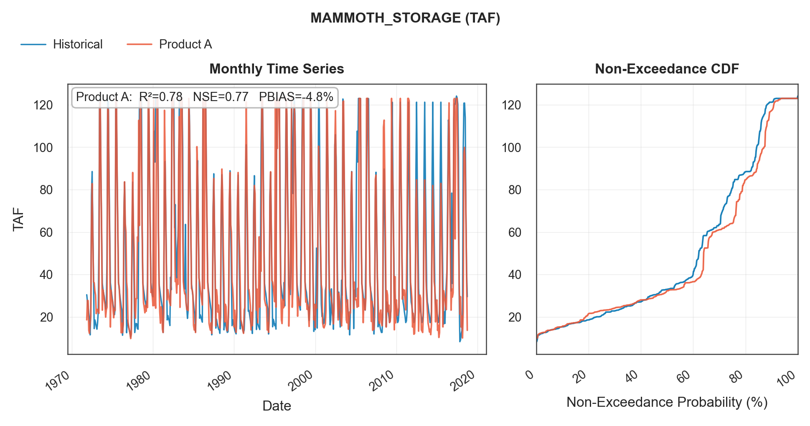
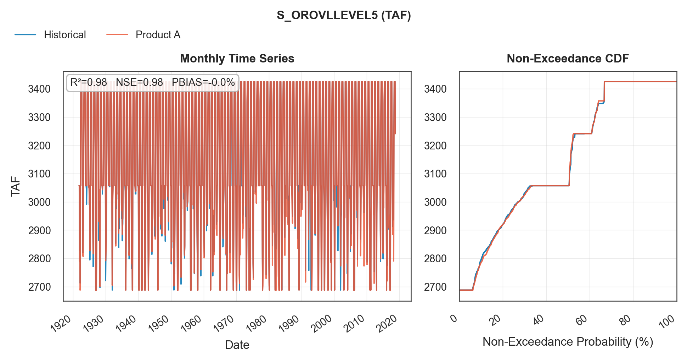
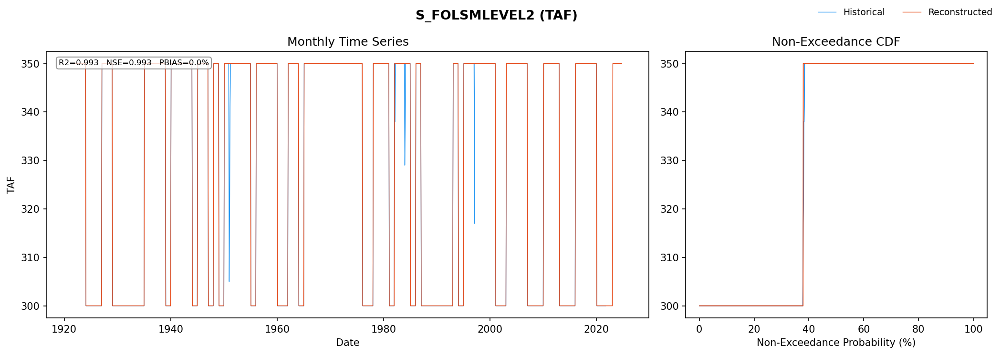
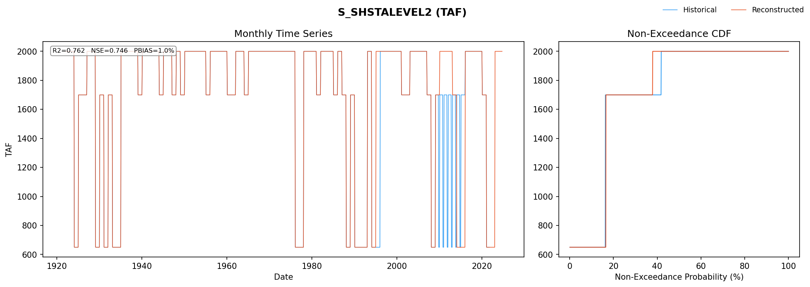
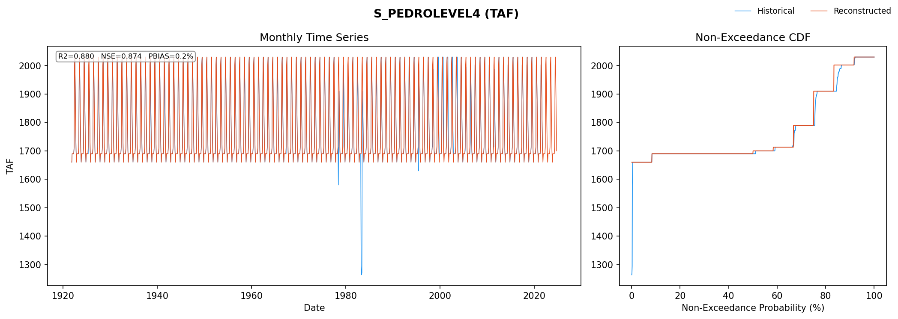

# mod_reservoir/storage_curves

```{admonition} Repository Module
:class: tip

**Module:** `mod_reservoir/storage_curves/`  
Reservoir storage reconstruction and rule curves
```
## Module Overview


Reservoir storage curves define operational "level" targets, flood control
reservation space, top of conservation, and minimum pool thresholds for
major California reservoirs in CalSim3.

Seven series are reconstructed and grouped by how they are generated:

1. **Mammoth Pool Quantile Mapping**: monthly-stratified empirical CDF
   mapping from a correlated unimpaired inflow basis (`MAMMOTH_STORAGE`)
2. **Oroville Level 5 Top of Conservation**: USACE wetness-index rule
   curve driven by basin precipitation (`S_OROVLLEVEL5`)
3. **WYT Based Storage levels**: constant per Sacramento Valley water year
   type class (`S_SHSTALEVEL2`, `S_TRNTYLEVEL2`, `S_TRNTYLEVEL3`,
   `S_FOLSMLEVEL2`)
4. **Monthly Schedule Levels**: fixed 12-month seasonal pattern. Only
   `S_PEDROLEVEL4` is regenerated; `S_FOLSMLEVEL4` and `S_FOLSMLEVEL5`
   are passed through directly from the DCR 2023 CalSim 3.


## Methodology

### Mammoth Pool Quantile Mapping

Mammoth Pool storage is reconstructed by quantile mapping from
Millerton unimpaired inflow, which serves as the hydrologic basis variable.
Millerton unimpaired inflow provides a representative runoff signal with
similar seasonal timing and a monthly historical correlation of
$R = 0.76$ with the Mammoth Pool storage target over WY 1922--2021
(Oct 1921 -- Sep 2021).

The quantile-mapping pair is `MAMMOTH_STORAGE / STORAGE` as the target and
`I_MLRTN / INFLOW` as the basis, with target values bounded between 0 and
123 TAF. The procedure follows the same monthly-stratified empirical CDF
mapping used elsewhere in the pipeline (`utils/quantile_mapping.py`),
preserving seasonal distributions. The mapping was trained on WY 1921--1971
using the CalSim 3 historical baseline from DCR 2023
(`CalSim3/__calsim_sv_default__.dss`) and validated on WY 1972--2018 using
the Product A quantile-mapped Millerton inflow.

#### Validation

Validation achieved $R^2 = 0.78$ with values predominantly aligned to actual inputs. Minor misalignments appear in two contexts: minimum storage values during September through February, and anomalous behavior during the 2012-2015 drought period where actual CalSim inputs maintain storage consistently higher than expected.



*Mammoth Pool storage quantile mapping validation, WY 1972--2018 ($R^2 = 0.78$). Millerton inflow serves as basis ($R = 0.76$). Mammoth storage shows a seasonal pattern, with low-storage periods generally around 10--30 TAF and high-storage peaks of roughly 120--124 TAF during the spring--summer refill period, with the highest sustained peaks in wetter years. The reconstructed series generally follows the timing and magnitude of the historical CalSim input series, although some mid to high storage values are underestimated. A distinct departure is evident during the 2012--2015 drought, when the historical CalSim input storage remains higher than the reconstructed in many months. The drought anomaly likely reflects maintenance or operational constraints where actual operations deviated from typical patterns. Attempting to replicate such anomalies through algorithms may be counterproductive, as the systematic reconstruction based on hydrologic relationships provides more defensible projections for synthetic sequences.*

:::{admonition} Suggested Plot
:class: note
Exceedance probability curves for Mammoth Pool flood space at end-of-September and end-of-February, comparing historical CalSim inputs (black line) against reconstructed values (blue line) for WY 1972-2018 validation period. Include confidence bands and highlight 10th, 50th, and 90th percentiles.
:::

### Oroville Level 5 Top of Conservation


Oroville Level 5 represents the reservoir top of conservation storage used
for flood-control operations. The rule curve follows the U.S. Army Corps of
Engineers Water Control Manual for Oroville Dam (USACE, 1970), in
which the allowable conservation storage varies seasonally and depends on
antecedent watershed wetness.

Daily precipitation is first converted to a Feather River basin
wetness index. The wetness index is then translated into a flood reservation
requirement and, finally, into a daily top of conservation storage target.
Monthly end of month values are written as the CalSim storage-level series
`S_OROVLLEVEL5`.

#### Storage-Capacity Adjustment

The USACE Oroville flood-control rule curve was originally based on a gross
pool capacity of approximately 3,538 TAF at elevation 900 feet, with
750 TAF allocated to flood-control storage. Recent DWR bathymetric mapping
using 2021 LiDAR and 2022 multibeam-sonar data revised Lake Oroville’s
capacity to 3,424,753 acre-feet, or approximately 3,424.8 TAF (DWR, 2024). This is about
113 TAF, or 3 percent, less than the original 1968 estimate.

The updated bathymetry requires an explicit elevation to volume translation in the reconstruction. The USACE Water Control Manual defines the flood-control requirement in terms of reservoir elevation and required flood-reservation space, and its listed storage volumes are tied to the manual’s historical area-capacity curve. CalSim `S_OROVLLEVEL5` input is expressed as a storage volume. Because of the revised bathymetry, the elevation that historically corresponded to 3,538 TAF of gross pool capacity now corresponds to only 3,424.8 TAF. The volume-based rule curve must therefore be rescaled so that flood-control allocations remain consistent with the operating elevations specified in the USACE Water Control Manual, even though the underlying storage volumes have changed.


#### Wetness-Index Method
The Oroville wetness-index method implements the Lake Oroville flood-control
rule-curve logic summarized by Knowles and Cronkite-Ratcliff (2018).

The wetness index is computed recursively from daily Feather River basin
precipitation:

$$
x_t = 0.97\, x_{t-1} + p_t
$$

where $x_t$ is the wetness index for day $t$, $x_{t-1}$ is the previous
day's wetness index, and $p_t$ is the basin-averaged daily precipitation.
The wetness index is bounded between 3.5 and 11.0. Lower wetness values
represent drier antecedent conditions and require less flood reservation
space; higher wetness values represent wetter antecedent conditions and
require more flood reservation space.

The flood reservation volume is interpolated between the adjusted endpoint
values:

$$
R(x) = \text{interp}(x;\ [3.5, 11.0],\ [368.2, 737.3])
$$

where $R(x)$ is the required flood reservation in TAF. The corresponding
minimum flood-season top-of-conservation storage is:

$$
S_{\min}(x) = S_{\max} - R(x)
$$

where $S_{\max}$ is the adjusted maximum storage capacity.

#### Seasonal Rule Curve Translation

The daily top-of-conservation target follows the seasonal structure of the
Lake Oroville flood-control rule curve:

- From September 15 to October 15, storage ramps down from the summer
  maximum storage to the wetness dependent flood season target.
- From October 15 through March 31, the target remains at the
  wetness dependent flood season storage level.
- After March 31, the target refills toward the summer maximum at the
  prescribed refill rate, capped at $S_{\max}$.


#### Synthetic Hydroclimate Implementation

For synthetic sequences, the same wetness index and rule curve calculation is applied to WGEN-derived daily Oroville basin precipitation. The resulting daily storage targets are aggregated to monthly end of month values compatible with Calsim monthly input.

#### Validation

Validation against historical CalSim inputs shows that the wetness index approach
captures the primary seasonal drawdown and refill behavior, with remaining
differences largely reflecting the method’s sensitivity to daily precipitation
timing and basin mean precipitation representation.




*Oroville Level 5 (top of conservation / flood-control) storage target reconstruction, shown as monthly time series and non-exceedance CDF. The historical CalSim input series is shown in blue and the Product A reconstruction is shown in orange. Product A closely reproduces the timing, magnitude, and distribution of the historical series, including the seasonal drawdown from the sedimentation-corrected maximum of approximately 3,425 TAF to winter flood-control levels of roughly 2,700--3,050 TAF. Agreement is strong across both the time series and distributional comparisons, with $R^2 = 0.98$, NSE = 0.98, and negligible bias (PBIAS approx. 0.0%). Remaining differences occur mainly during months when the rule curve transitions between conservation storage and flood-control drawdown, because the reconstruction estimates the required flood reservation from antecedent wetness derived from Product A precipitation over the Oroville/Feather River basin rather than reproducing the historical CalSim input series directly.*


### WYT Based Storage levels

For Shasta Level 2, Trinity Level 2, Trinity Level 3, and Folsom Level 2, the synthetic time series were generated by applying the fixed WYT dependent storage level targets from the DCR 2023 CalSim 3 benchmark to the synthetic Sacramento Valley WYT classifications. In DCR 2023, these four series are represented as fixed target storage schedules: each Sacramento Valley water year type (W/AN/BN/D/C) is assigned a constant target value.

Each series uses the Sacramento Valley WYT classification and is mapped on a calendar year basis rather than directly on a water year basis. Under this convention, January–September values use the current water year’s WYT classification, while October–December values retain the classification from the prior water year.

For example, if WY 1924 is classified as Critical, Shasta Level 2 remains at the WY 1923 target during October–December 1923, then changes to the Critical-year target beginning in January 1924.

This calendar-year mapping follows the CalSim convention used for these series. It also avoids applying the next water year’s final Sacramento Valley 40-30-30 classification at the October 1 water year boundary, when that classification would not yet be known in real time operations.


The four WYT based series and their fixed target storage values (TAF) are:

| Series | W | AN | BN | D | C | WYT index |
|--------|--:|---:|---:|--:|--:|-------|
| S_SHSTALEVEL2 | 2,000 | 2,000 | 2,000 | 1,700 | 650 | Sacramento Valley |
| S_TRNTYLEVEL2 | 1,100 | 1,100 | 1,100 | 700 | 500 | Sacramento Valley |
| S_TRNTYLEVEL3 | 1,600 | 1,600 | 1,500 | 1,300 | 1,000 | Sacramento Valley |
| S_FOLSMLEVEL2 | 350 | 350 | 350 | 300 | 300 | Sacramento Valley |

Because the synthetic series begins in October, the initial October–December period may require the prior water year’s WYT classification before that classification is available in the synthetic WYT sequence. For this initial three-month window only, the storage-level values are borrowed directly from the corresponding October–December entries in the DCR 2023 CalSim 3 benchmark DSS file. All subsequent months are populated from the synthetic WYT classifications.

#### Validation

The four WYT-based reservoir storage-level reconstructions reproduce the step-function behavior of the CalSim 3 benchmark inputs. Trinity Level 2 and Trinity Level 3 match the DCR 2023 CalSim 3 time series exactly over the historical period. Folsom Level 2 is nearly identical, with only a few isolated departures where the benchmark input briefly differs from the fixed WYT target. Shasta Level 2 requires more careful interpretation because several clustered disagreement periods occur, most notably in 1995 and during 2009–2015. These Shasta departures appear to reflect operational adjustments outside the Sacramento Valley WYT target mapping. During the 2009–2016 period, Shasta operations were influenced by drought conditions and Sacramento River temperature management requirements, including cold water pool and carryover storage considerations (USBR and DWR, 2014; SRTTG, 2016). The current synthetic workflow does not attempt to recreate those operational judgments.

::::{tab-set}
:::{tab-item} Folsom Level 2


*Folsom Level 2 (minimum pool) reconstruction, October 1921–September 2021. The historical CalSim input series (blue) and WYT-based reconstruction (orange) show step-function behavior, alternating primarily between approximately 300 and 350 TAF depending on water year type. Agreement is near perfect across both the monthly time series and non-exceedance CDF, with $R^2 = 0.993$, NSE = 0.993, and negligible bias (PBIAS ≈ 0.0%). Departures are limited to a few isolated months, Dec 1950–Feb 1951, Feb 1982, Dec 1983–Jan 1984, and Jan 1997, when the historical CalSim input includes intermediate values below the reconstructed 350 TAF level.*
:::
:::{tab-item} Shasta Level 2


*Shasta Level 2 (S_SHASTA) storage-level reconstruction, 1921–2021. The reconstructed series applies the fixed Sacramento Valley WYT based target values of 650, 1,700, and 2,000 TAF. The benchmark CalSim 3 input generally follows the same step function structure, but visible departures occur during a few clustered periods, especially 1995 and 2009–2015. These departures are interpreted as operational exceptions associated with carryover storage, drought operations, cold water pool management, and Sacramento River temperature management requirements.*
:::
::::

### Monthly Schedule Levels

Monthly schedule storage level series are defined by fixed 12-month patterns. Three series fall in this category: Folsom Level 4, Folsom Level 5, and Don Pedro Level 4. Folsom Level 4 and Folsom Level 5 repeat the same 12-month sequence throughout the historical record, so their CalSim 3 input time series are used directly.

Don Pedro Level 4 generally follows a repeated annual schedule, but departs from that pattern in a few short periods. It is therefore regenerated for the stochastic sequences using the standard 12-month schedule.

The monthly schedule series and their fixed monthly storage values (TAF) are:

| Series | Oct | Nov | Dec | Jan | Feb | Mar | Apr | May | Jun | Jul | Aug | Sep |
|--------|----:|----:|----:|----:|----:|----:|----:|----:|----:|----:|----:|----:|
| S_PEDROLEVEL4 | 1,660 | 1,690 | 1,690 | 1,690 | 1,690 | 1,690 | 1,713 | 2,002 | 2,030 | 1,910 | 1,790 | 1,700 |
| S_FOLSMLEVEL4 | 592 | 567 | 567 | 567 | 567 | 756 | 900 | 967 | 592 | 592 | 592 | 592 |
| S_FOLSMLEVEL5 | 712 | 567 | 567 | 567 | 567 | 756 | 900 | 967 | 967 | 942 | 792 | 752 |

#### Validation

::::{tab-set}
:::{tab-item} Don Pedro Level 4


*Don Pedro Level 4 (S_PEDRO) reconstruction, 1921–2021. The reconstructed series reproduces the fixed 12-month schedule, with values ranging from approximately 1,690 to 2,030 TAF. The reconstructed values closely match the DCR 2023 CalSim 3 input for most of the historical period. The main mismatch occurs around 1977–1980, when the historical input temporarily drops to approximately 1,250 TAF.*
:::
::::

## References
California Department of Water Resources (DWR). 2024. “Climate Readiness:
Using Advanced Lasers and Sonar to Determine if Lake Oroville Has Lost
Capacity.” Published June 26, 2024. California Department of Water Resources.

Knowles, N., and Cronkite-Ratcliff, C., 2018. *Modeling Managed Flows in
the Sacramento/San Joaquin Watershed, California, Under Scenarios of
Future Change for CASCaDE2*. U.S. Geological Survey Open-File Report
2018–1101. https://doi.org/10.3133/ofr20181101

Sacramento River Temperature Task Group (SRTTG). 2016. *Sacramento River
Temperature Task Group Annual Report of Activities: October 1, 2015
through September 30, 2016*.

U.S. Army Corps of Engineers (USACE). 1970. *Oroville Dam and Reservoir,
Feather River, California: Report on Reservoir Regulation for Flood Control,
Appendix IV to Master Manual of Reservoir Regulation, Sacramento River Basin,
California*. Sacramento District, Corps of Engineers, Sacramento, California.

U.S. Bureau of Reclamation and California Department of Water Resources
(Reclamation and DWR). 2014. *CVP and SWP Drought Contingency Plan:
October 15, 2014 through January 15, 2015*.


