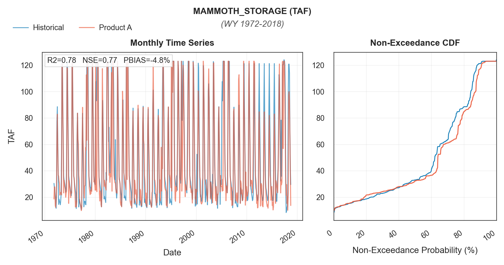
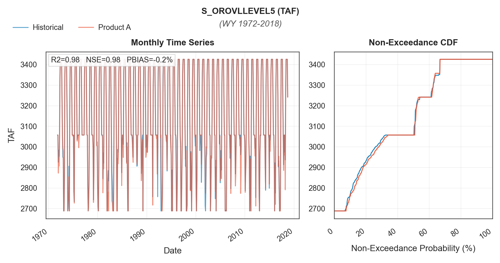
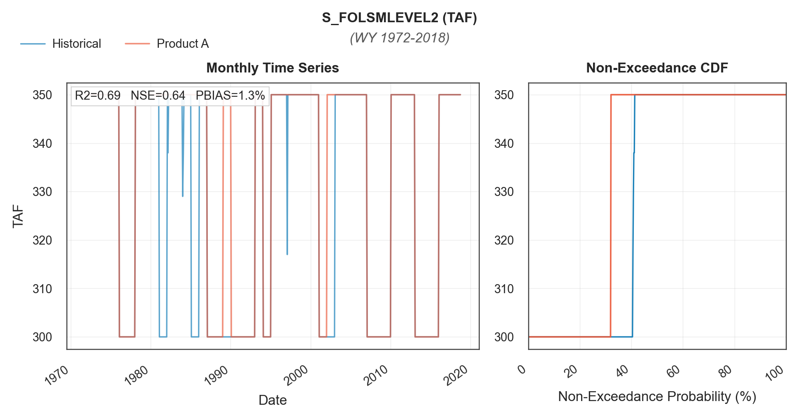
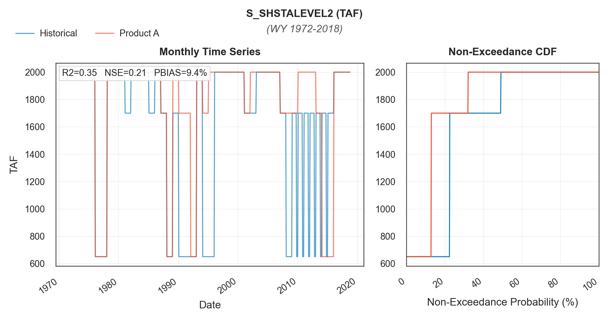
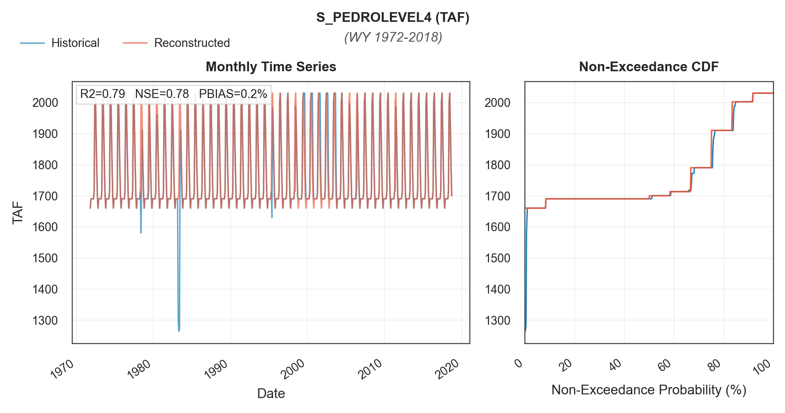

# mod_reservoir/storage_curves

```{admonition} Repository Module
:class: tip

**Module:** `mod_reservoir/storage_curves/`  
Reservoir storage reconstruction and rule curves
```
## Methodology Overview

Reservoir storage curves define operational "level" targets, flood control
reservation space, top of conservation, and minimum pool thresholds for
major California reservoirs in CalSim3.

Seven series are reconstructed and grouped by how they are generated:

1. **Quantile Mapping**: reconstructs the target series from a strongly
   correlated hydrologic basis series by mapping between their monthly
   empirical distributions; trained on 1921-1971 and applied on 1972-2018
   for validation, then trained on the full historical record and applied
   to the Product B stochastic sequences; used for Mammoth Pool storage
   (`MAMMOTH_STORAGE`) with Millerton inflow as the basis
2. **Wetness Index Rule Curve**: implements the USACE flood
   control rule curve for Lake Oroville, in which daily Feather River
   basin precipitation drives an antecedent wetness index that sets the
   required flood reservation space and the daily top of conservation
   target; end of month values are extracted from the daily values for
   the CalSim input series (`S_OROVLLEVEL5`)
3. **WYT Target Assignment**: assigns the fixed storage target defined
   for each Sacramento Valley water year type (W/AN/BN/D/C) in the
   DCR 2023 CalSim 3 benchmark to the synthetic WYT classification,
   applied on a calendar year basis so October-December retain the
   prior water year's classification; used for Shasta Level 2, Trinity
   Levels 2 and 3, and Folsom Level 2 (`S_SHSTALEVEL2`, `S_TRNTYLEVEL2`,
   `S_TRNTYLEVEL3`, `S_FOLSMLEVEL2`)
4. **Fixed Monthly Schedule**: repeats a constant 12-month storage
   schedule throughout the sequence; used for Don Pedro Level 4
   (`S_PEDROLEVEL4`), whose historical input follows the fixed schedule
   except for a few short departures


---

### 1. Quantile Mapping

Mammoth Pool storage (`MAMMOTH_STORAGE`) is the only storage curve series
reconstructed with quantile mapping. The reconstruction uses Millerton inflow as the hydrologic basis variable because it provides a
representative runoff signal with similar seasonal timing and a monthly
historical correlation of $R = 0.76$ with the Mammoth Pool storage target
over WY 1922-2021.

In DSS terms, the pair is `MAMMOTH_STORAGE / STORAGE` as the target and
`I_MLRTN / INFLOW` as the basis, with reconstructed values bounded
between 0 and 123 TAF. The procedure follows the same quantile mapping
implementation used elsewhere in the pipeline
(`utils/quantile_mapping.py`), stratified by month to preserve seasonal
distributions.
Training uses WY 1921-1971 from the DCR 2023 CalSim 3 historical
baseline (`CalSim3/__calsim_sv_default__.dss`); validation applies the
trained relationship to the Product A reconstruction of Millerton inflow
over WY 1972-2018.

#### Validation

Validation achieved $R^2 = 0.78$, with the Product A series following the
timing and magnitude of the historical CalSim input across its seasonal
range, from roughly 10-30 TAF in the drawdown months to peaks of
120-124 TAF during the spring-summer refill, although some mid to high
storage values are underestimated. Misalignments concentrate in two
contexts: minimum storage values during September through February, and
the 2012-2015 drought, when the historical input maintains storage
consistently higher than Product A. The drought departure
likely reflects maintenance or operational constraints in actual
operations.



*Mammoth Pool storage quantile mapping validation, WY 1972-2018:
the Product A series compared against the historical CalSim input
($R^2 = 0.78$).*

---

### 2. Wetness Index Rule Curve

Oroville Level 5 represents the reservoir top of conservation storage used
for flood-control operations. The rule curve follows the U.S. Army Corps of
Engineers Water Control Manual for Oroville Dam (USACE, 1970), in
which the allowable conservation storage varies seasonally and depends on
antecedent watershed wetness.

Daily precipitation is first converted to a Feather River basin
wetness index. The wetness index is then translated into a flood reservation
requirement and, finally, into a daily top of conservation storage target.
End of month values are written as the CalSim storage-level series
`S_OROVLLEVEL5`.

```{mermaid}
flowchart TD
    PRECIP["Daily Feather River<br/>Basin Precipitation"] --> WET["Wetness Index<br/>x(t) = 0.97 x(t-1) + p(t)"]
    WET --> RES["Required Flood Reservation R(x)<br/>368.2 - 737.3 TAF"]
    RES --> SMIN["Flood Season Storage Target<br/>S_min = S_max - R(x)"]

    SMIN --> SEASON
    subgraph SEASON["Seasonal Rule Curve"]
        direction LR
        RAMP["Sep 15 - Oct 15<br/>Linear Drawdown to S_min"] --> HOLD["Oct 15 - Mar 31<br/>Target Follows S_min"] --> REFILL["Mar 31 - Sep 15<br/>Refill to S_max"]
    end
    SEASON --> EOM["End of Month Values"]

    EOM --> OUT["CalSim Input Series<br/>S_OROVLLEVEL5"]

    style PRECIP fill:#264653,color:#fff
    style OUT fill:#2d6a4f,color:#fff
```

_Oroville Level 5 reconstruction workflow, from daily Feather River basin precipitation through the wetness index and seasonal rule curve to the monthly CalSim input series._

#### Storage Capacity Adjustment

The USACE Oroville flood-control rule curve was originally based on a gross
pool capacity of approximately 3,538 TAF at elevation 900 feet, with
750 TAF allocated to flood-control storage. Recent DWR bathymetric mapping
using 2021 LiDAR and 2022 multibeam-sonar data revised Lake Oroville’s
capacity to approximately 3,424.8 TAF (DWR, 2024). This is about
113 TAF, less than the original 1968 estimate.

The USACE Water Control Manual defines the flood-control requirement in terms of reservoir elevation and required flood-reservation space, and its listed storage volumes are tied to the manual’s historical area-capacity curve. CalSim `S_OROVLLEVEL5` input is expressed as a storage volume. Because of the revised bathymetry, the elevation that historically corresponded to 3,538 TAF of gross pool capacity now corresponds to only 3,424.8 TAF.


#### Wetness Index Method
The Oroville wetness-index method implements the Lake Oroville flood-control
rule-curve logic summarized by Knowles and Cronkite-Ratcliff (2018).

The wetness index is computed recursively from daily Feather River basin
precipitation:

$$
x_t = 0.97\, x_{t-1} + p_t
$$

where $x_t$ is the wetness index for day $t$, $x_{t-1}$ is the previous
day's wetness index, and $p_t$ is the basin-averaged daily precipitation.
The wetness index is bounded between 3.5 and 11.0. Lower wetness values
represent drier antecedent conditions and require less flood reservation
space; higher wetness values represent wetter antecedent conditions and
require more flood reservation space.

The flood reservation volume is interpolated between the adjusted endpoint
values:

$$
R(x_t) = \text{interp}(x_t;\ [3.5, 11.0],\ [368.2, 737.3])
$$

where $R(x_t)$ is the required flood reservation in TAF. The corresponding
minimum flood-season top-of-conservation storage is:

$$
S_{\min}(x_t) = S_{\max} - R(x_t)
$$

where $S_{\max}$ is the adjusted maximum storage capacity.

#### Seasonal Rule Curve Translation

The daily top-of-conservation target follows the seasonal structure of the
Lake Oroville flood-control rule curve:

- From September 15 to October 15, storage ramps down from the summer
  maximum storage to the wetness dependent flood season target.
- From October 15 through March 31, the target remains at the
  wetness dependent flood season storage level.
- After March 31, the target refills toward the summer maximum at the
  prescribed refill rate, capped at $S_{\max}$.

Following Knowles and Cronkite-Ratcliff (2018), the daily target storage
is calculated as a function of date $t$ and wetness index $x_t$:

$$
S(x_t, t) =
\begin{cases}
S_{\max} + \dfrac{t - \text{Sep 15}}{\text{Oct 15} - \text{Sep 15}}
\left( S_{\min}(x_t) - S_{\max} \right)
& \text{Sep 15} \le t < \text{Oct 15} \\[8pt]
S_{\min}(x_t)
& \text{Oct 15} \le t < \text{Mar 31} \\[8pt]
\min\left( S_{\max},\ S_{\min}(x_t) + b \, (t - \text{Mar 31}) \right)
& \text{Mar 31} \le t < \text{Sep 15}
\end{cases}
$$

where $b$ is the refill rate of 10 TAF per day.


#### Synthetic Hydroclimate Implementation

For synthetic sequences, the same wetness index and rule curve calculation is applied to WGEN-derived daily Oroville basin precipitation. The resulting daily storage targets are aggregated to monthly end of month values compatible with Calsim monthly input.

#### Validation

Validation against the historical CalSim input over WY 1972-2018 shows
that the wetness index approach closely reproduces the timing, magnitude,
and distribution of the historical series, with $R^2 = 0.98$, NSE = 0.98,
and negligible bias (PBIAS = -0.2%). The reconstruction captures the
seasonal drawdown from the sedimentation corrected maximum of
approximately 3,425 TAF to winter flood control levels of roughly
2,700-3,050 TAF, as well as the spring refill.

Remaining differences occur mainly in months when the rule curve
transitions between conservation storage and flood control drawdown.
They arise because the reconstruction estimates the required flood
reservation from antecedent wetness derived from Product A precipitation
over the Feather River basin rather than reproducing the historical
CalSim input directly, making the result sensitive to daily precipitation
timing and basin mean precipitation representation.



*Oroville Level 5 storage target validation, WY 1972-2018: the Product A
reconstruction compared against the historical CalSim input, shown as
monthly time series and non-exceedance CDF ($R^2 = 0.98$).*


---

### 3. WYT Target Assignment

For Shasta Level 2, Trinity Level 2, Trinity Level 3, and Folsom Level 2, the synthetic time series were generated by applying the fixed WYT dependent storage level targets from the DCR 2023 CalSim 3 benchmark to the synthetic Sacramento Valley WYT classifications. In DCR 2023, these four series are represented as fixed target storage schedules: each Sacramento Valley water year type (W/AN/BN/D/C) is assigned a constant target value.

Each series uses the Sacramento Valley WYT classification and is mapped on a calendar year basis rather than directly on a water year basis. Under this convention, January-September values use the current water year’s WYT classification, while October-December values retain the classification from the prior water year.

For example, if WY 1924 is classified as Critical, Shasta Level 2 remains at the WY 1923 target during October-December 1923, then changes to the Critical-year target beginning in January 1924.

This calendar-year mapping follows the CalSim convention used for these series. It also avoids applying the next water year’s final Sacramento Valley 40-30-30 classification at the October 1 water year boundary, when that classification would not yet be known in real time operations.


The four WYT based series and their fixed target storage values (TAF) are:

| Series | W | AN | BN | D | C | WYT index |
|--------|--:|---:|---:|--:|--:|-------|
| S_SHSTALEVEL2 | 2,000 | 2,000 | 2,000 | 1,700 | 650 | Sacramento Valley |
| S_TRNTYLEVEL2 | 1,100 | 1,100 | 1,100 | 700 | 500 | Sacramento Valley |
| S_TRNTYLEVEL3 | 1,600 | 1,600 | 1,500 | 1,300 | 1,000 | Sacramento Valley |
| S_FOLSMLEVEL2 | 350 | 350 | 350 | 300 | 300 | Sacramento Valley |

Because the synthetic series begins in October, the initial October-December period may require the prior water year’s WYT classification before that classification is available in the synthetic WYT sequence. For this initial three-month window only, the storage-level values are borrowed directly from the corresponding October-December entries in the DCR 2023 CalSim 3 benchmark DSS file. All subsequent months are populated from the synthetic WYT classifications.

#### Validation

The reconstruction was evaluated with two comparisons that separate reproduction of the target assignment logic from the effects of substituting the Product A hydrology.

The first comparison drives the target assignment with the historical Sacramento Valley WYT classification, so remaining differences reflect the fixed target mapping alone. Over WY 1972-2018, Trinity Level 2 and Trinity Level 3 match the DCR 2023 CalSim 3 inputs exactly ($R^2 = 1.00$), and Folsom Level 2 is nearly identical ($R^2 = 0.99$), with only a few isolated departures where the benchmark input briefly differs from the fixed WYT target. Shasta Level 2 achieves $R^2 = 0.61$, with clustered disagreement periods, most notably in 1995 and during 2009-2015. These departures appear to reflect operational adjustments outside the WYT target mapping: during 2009-2016, Shasta operations were influenced by drought conditions and Sacramento River temperature management requirements, including cold water pool and carryover storage considerations (USBR and DWR, 2014; SRTTG, 2016). The current synthetic workflow does not attempt to recreate those operational judgments.

The second comparison drives the target assignment with the Product A WYT classification, derived from the Product A hydrology (VIC simulations on WGEN generated weather, quantile mapped to the CalSim inflow terms that feed the Sacramento Valley index). Differences relative to the benchmark now additionally include years where the Product A classification departs from the historical classification: 14 of the 47 years in WY 1972-2018 classify differently, and in the years where the two classes carry different storage targets the Product A series steps to a different level than the benchmark. This lowers the scores to $R^2 = 0.69$ for Folsom Level 2 and $R^2 = 0.35$ for Shasta Level 2. The figures below show this second, Product A comparison.

::::{tab-set}
:::{tab-item} Folsom Level 2


*Folsom Level 2 (minimum pool) Product A validation, WY 1972-2018 ($R^2 = 0.69$, NSE = 0.64, PBIAS = 1.3%). The historical CalSim input series (blue) and the Product A series (orange) show step function behavior, alternating between the 300 and 350 TAF targets. Departures mainly reflect years where the Product A WYT classification differs from the historical classification, plus a few isolated months when the historical input includes intermediate values below the fixed targets.*
:::
:::{tab-item} Shasta Level 2


*Shasta Level 2 (S_SHSTALEVEL2) Product A validation, WY 1972-2018 ($R^2 = 0.35$, NSE = 0.21, PBIAS = 9.4%). The Product A series applies the fixed Sacramento Valley WYT targets of 650, 1,700, and 2,000 TAF to the Product A WYT classification. Departures reflect operational exceptions in the benchmark input, especially 1995 and 2009-2015, when drought operations, carryover storage, and Sacramento River temperature management overrode the WYT targets, as well as years where the Product A WYT classification differs from the historical classification.*
:::
::::

---

### 4. Fixed Monthly Schedule

Monthly schedule storage level series are defined by fixed 12-month patterns. Three series fall in this category: Folsom Level 4, Folsom Level 5, and Don Pedro Level 4. Folsom Level 4 and Folsom Level 5 repeat the same 12-month sequence throughout the historical record, so their CalSim 3 input time series are used directly.

Don Pedro Level 4 generally follows a repeated annual schedule, but departs from that pattern in a few short periods. It is therefore regenerated for the stochastic sequences using the standard 12-month schedule.

The monthly schedule series and their fixed monthly storage values (TAF) are:

| Series | Oct | Nov | Dec | Jan | Feb | Mar | Apr | May | Jun | Jul | Aug | Sep |
|--------|----:|----:|----:|----:|----:|----:|----:|----:|----:|----:|----:|----:|
| S_PEDROLEVEL4 | 1,660 | 1,690 | 1,690 | 1,690 | 1,690 | 1,690 | 1,713 | 2,002 | 2,030 | 1,910 | 1,790 | 1,700 |
| S_FOLSMLEVEL4 | 592 | 567 | 567 | 567 | 567 | 756 | 900 | 967 | 592 | 592 | 592 | 592 |
| S_FOLSMLEVEL5 | 712 | 567 | 567 | 567 | 567 | 756 | 900 | 967 | 967 | 942 | 792 | 752 |

#### Validation

Don Pedro Level 4 achieves $R^2 = 0.79$ (NSE = 0.78, PBIAS = 0.2%) against the DCR 2023 CalSim 3 input over WY 1972-2018. Because the series is a fixed repeating 12-month schedule that depends on neither the WYT classification nor the hydrology, the Product A series is identical to this reconstruction, so a single comparison suffices and the two comparison framing used for the WYT based series does not apply. The mismatches are confined to a few short periods when the historical input temporarily drops below the schedule, reaching approximately 1,270 TAF at its lowest; these are the same departures that motivated regenerating the series from the standard schedule rather than passing it through.

::::{tab-set}
:::{tab-item} Don Pedro Level 4


*Don Pedro Level 4 (S_PEDROLEVEL4) reconstruction, WY 1972-2018: the fixed 12-month schedule (approximately 1,660-2,030 TAF) against the historical CalSim input ($R^2 = 0.79$).*
:::
::::

---

### References
California Department of Water Resources (DWR). 2024. “Climate Readiness:
Using Advanced Lasers and Sonar to Determine if Lake Oroville Has Lost
Capacity.” Published June 26, 2024. California Department of Water Resources. <https://water.ca.gov/News/Blog/2024/Jun-24/Climate-Readiness---Using-Advanced-Lasers-and-Sonar-to-Determine-if-Lake-Oroville-Has-Lost-Capacity>

Knowles, N., and Cronkite-Ratcliff, C., 2018. *Modeling Managed Flows in
the Sacramento/San Joaquin Watershed, California, Under Scenarios of
Future Change for CASCaDE2*. U.S. Geological Survey Open-File Report
2018-1101. <https://doi.org/10.3133/ofr20181101>

Sacramento River Temperature Task Group (SRTTG). 2016. *Sacramento River
Temperature Task Group Annual Report of Activities: October 1, 2015
through September 30, 2016*. <https://cawaterlibrary.net/wp-content/uploads/2020/07/Final_SRTTG_2016_Annual_Report.pdf>

U.S. Army Corps of Engineers (USACE). 1970. *Oroville Dam and Reservoir,
Feather River, California: Report on Reservoir Regulation for Flood Control,
Appendix IV to Master Manual of Reservoir Regulation, Sacramento River Basin,
California*. Sacramento District, Corps of Engineers, Sacramento, California.

U.S. Bureau of Reclamation and California Department of Water Resources
(Reclamation and DWR). 2014. *CVP and SWP Drought Contingency Plan:
October 15, 2014 through January 15, 2015*. <https://www.waterboards.ca.gov/drought/docs/tucp/dcp_2014_2015.pdf>


