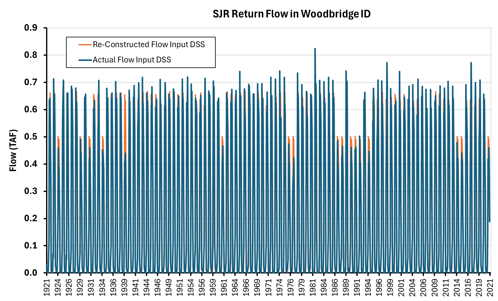
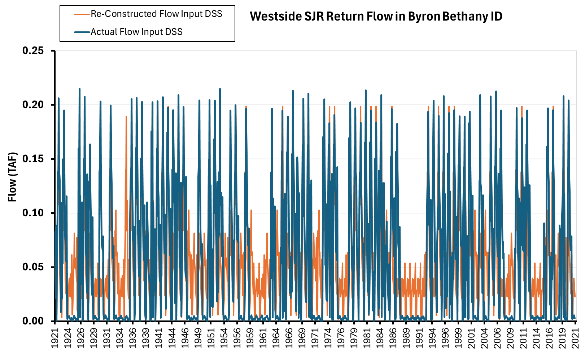

# Other Variables (143 Variables)

```{admonition} Repository Module
:class: tip

**Module:** `mod_other/miscellaneous/`  
Miscellaneous operational variables
```


Miscellaneous CalSim study variables spanning flow terms, return flows, allocations, and indices that don't fit established categories. The category illustrates the breadth of reconstruction approaches needed when standard quantile mapping proves unsuitable or when variables have unique governing logic.

:::note Archived Documentation
B120 Forecasts and Water Year Type Indexes were previously documented in separate files but are now consolidated here per the final CalSim SV inventory. See `__archive/` folder for historical documentation.
:::

## Methodology

The "Other" category encompasses 143 diverse variables requiring individualized methodologies. These include:

- **Water Year Type (WYT) Indexes**: Sacramento Valley Index (40-30-30) and San Joaquin Valley Index (60-20-20) classifications
- **B120 Forecasts**: Bulletin 120 seasonal runoff predictions (8 variables for Goodyear and Smartville)
- **Flow Terms**: NDOI accretion, Colusa Basin Drain, Knights Landing Ridge Cut
- **Allocations**: PG&E water year allocation ratios
- **Wetlands Indices**: Tule wetlands index for Tulare Basin

Methodologies range from straightforward water year type averaging (R² > 0.95) to complex threshold optimization for allocation ratios, to direct physical calculations for accretion terms.

### TULE_WET_INDX (Tule Wetlands Index)

The Tule Wetlands Index represents wetland conditions in the Tulare Basin, reconstructed through quantile mapping from VIC I_PEDRO (Lake Millerton inflow) with correlation R² = 0.71. While this correlation sits at the lower threshold for effective quantile mapping, the approach preserves the statistical relationship between Millerton inflows and wetland conditions.

Output format follows standard naming convention: `_tule_wet_indx_friant-indx_productA_1915_2019.csv` with monthly values covering the full historical reconstruction period through water year 2018.

### NDOI Precipitation Accretion

NDOI (Net Delta Outflow Index) precipitation accretion represents direct precipitation onto Delta water surfaces used in Dayflow calculations. The methodology evolved through multiple attempts, ultimately succeeding through direct calculation rather than statistical mapping.

The successful approach identifies correlation between Stockton gauge precipitation and Delta precipitation in source Excel files, then converts precipitation depth to volume with time-varying area adjustments. The formula computes monthly volume as precipitation depth (inches) divided by 12 and multiplied by Delta area with a watershed area ratio adjustment coefficient:

$$V_{precip} = \frac{P_{Stockton}}{12} \times A_{Delta} \times C_{ratio}$$

where $P_{Stockton}$ is monthly precipitation depth in inches, $A_{Delta}$ is the Delta water surface area in acres (which varies across three defined time periods covering 1930–2010 land use changes), and $C_{ratio}$ is a watershed area adjustment coefficient. Investigation into the original Dayflow calculation methodology revealed the term was extended approximately 3 years prior to this project, but complete documentation of the underlying calculation remained elusive. The December 2025 progress meeting confirmed the direct calculation approach as superior to statistical methods since it preserves the physical relationship between precipitation and accretion volume.

### Colusa Basin Drain and Knights Landing Ridge Cut

These two return flow terms presented a significant reconstruction challenge due to weak initial correlations and problematic quantile mapping overshoots. Both terms are approximately 95% correlated with each other, enabling derivation of one from the other if needed. The terms represent combined USGS gauge flows through drainage channels returning agricultural and flood waters to the Sacramento River system, with annual peaks sometimes reaching 500 TAF.

VIC flow correlation testing across approximately 200 locations identified `IERC_003` as the best predictor, achieving $R^2 = 0.70$ for Colusa Basin Drain and $R^2 = 0.52$ for Knights Landing Ridge Cut. While CBD correlation approaches the 0.7 threshold for standard quantile mapping, KLR falls well below. More critically, quantile mapping for both terms produced extreme peak overshoots up to 900 TAF compared to actual maximum values around 500 TAF. These overshoots are physically unrealistic and would cause CalSim to simulate impossible drainage flows.

The hybrid quantile mapping approach proved highly effective, averaging quantile-mapped values with water year type monthly averages:

$$V_{hybrid} = \frac{V_{QM} + V_{WYT}}{2}$$

Standard WYT averaging alone produces overly smooth patterns that miss peaks entirely. Standard QM alone overshoots peaks unrealistically. The hybrid approach balances both limitations, bringing reconstructed values within historical ranges while maintaining appropriate variability. Progress Meeting 3 slides demonstrated this improvement visually, with time series comparisons showing QM-only overshoots eliminated while WYT-only flatness was enhanced with realistic peak structure. The justification emphasizes lack of confidence in QM extrapolation alone, using WYT averages as a "post-correction second-pass adjustment" to constrain values within historical norms.

### PG&E Water Year Allocation

PG&E Water Year Allocation ratio determines contractual water allocation as a function of water availability, with values ranging from 0.40 (severe shortage) to 1.00 (full allocation). All allocation changes occur in May each year, with ratios transitioning from 1.0 down to some restricted level, then persisting through the following April before resetting.

Initial analysis extracted monthly data, identified five distinct ratio categories (1.00, approximately 0.85-0.96, 0.70-0.80, 0.60, and 0.40), and sought relationships between annual Folsom unimpaired flow and allocation level. Trial-and-error threshold selection achieved R² = 0.75, with the following structure:

| Annual Folsom Unimpaired (TAF) | Allocation Ratio |
|-------------------------------|------------------|
| < 400 | 0.40 |
| 400-800 | 0.60 |
| 800-1200 | 0.80 |
| 1200-1480 | 0.88 |
| > 1480 | 1.00 |

Excel Solver optimization using GRG Nonlinear algorithm refined thresholds to approximately 410, 800, 1200, and 1460 TAF. The logic has been transferred to Python for production runs, with application extending from May of the triggering water year through April of the following year.

### San Joaquin River Return Flows

Two return flow terms represent agricultural and miscellaneous return flows to the San Joaquin River system, reconstructed using water year type averaging.

### EBMUD Terminal Reservoir Loss

East Bay Municipal Utility District terminal reservoir loss could have used repeating pattern methodology since values post-2009 show consistent behavior. However, water year type averaging was selected for consistency with broader project framework.

### Cross Valley Canal Capacity

Two Cross Valley Canal capacity terms employ repeating pattern methodology based on post-2009 values. These operational constraints do not vary with hydrology in historical record, suggesting fixed capacity based on infrastructure limits rather than dynamic allocation.

### YBA Transfers

Yuba Accord transfers are flagged as dynamic within DCR CalSim WRESL scripts, enabling simulation-time calculation based on operational rules rather than pre-specified input time series. This flag allows CalSim to adapt transfers based on synthetic sequence conditions, maintaining operational realism without requiring pre-generation of transfer patterns. The dynamic flag was confirmed during inventory review with MSO staff, who verified that CalSim's WRESL logic computes Yuba Accord transfers endogenously based on Yuba water availability and downstream demand conditions—making pre-generation both unnecessary and potentially conflicting with the model's internal logic.

## Results

### TULE_WET_INDX

Validation over 1,248 months (WY 1915-2018) achieved R = 0.86 with RMSE = 11.61 and mean difference of +0.30. The reconstructed time series maintains physical bounds, with bias differences comparable to other regional terms.

:::note Suggested Plot
Scatter plot of actual vs reconstructed TULE_WET_INDX colored by WYT, with 1:1 line, R² = 0.86 annotation, marginal histograms showing distribution alignment, and drought period highlighting (2012-2016) to assess whether extreme dry conditions are captured.
:::

### NDOI Precipitation Accretion

The direct calculation approach achieved R² = 0.92. Mean actual value of 69.3 TAF compares to mean reconstructed value of 63.3 TAF, reflecting the slightly lower precipitation in Product A synthetic climate.


*NDOI precipitation accretion validation from Progress Meeting 3 (R² = 0.87 shown in the original QM approach; final direct calculation achieves R² = 0.92). Potential concern flagged for higher reconstructed flow volumes in some years.*

This difference is consistent with known weather generator behavior and Stockton gauge data quality issues during 1922-1926 and 1997-2000. Maximum reconstructed value of 5,300 TAF remains below 5,500 TAF threshold flagged in original analysis, indicating acceptable behavior without extreme outliers.

Some reconstructed values spike higher than historical actuals, raising questions about whether capping at historical 90th percentile would be appropriate. However, this would artificially limit larger precipitation events that might plausibly occur in extended synthetic sequences. The current approach preserves the full range of statistically plausible events, which aligns with stochastic planning objectives to explore tails of distributions.

### Colusa Basin Drain and Knights Landing Ridge Cut

Performance improvements from the hybrid approach are substantial: Colusa Basin Drain improved from R² = 0.70 (QM only) to R² = 0.78 (hybrid), while Knights Landing Ridge Cut improved from R² = 0.52 to R² = 0.66. Nash-Sutcliffe Efficiency showed even more dramatic improvement as the squared deviation penalty in NSE heavily weights the eliminated extreme overshoots. The hybrid method demonstrates clear utility for terms with moderate correlation where peak preservation is important.

:::note Suggested Plot
Three-row comparison for Colusa Basin Drain: (1) Time series showing actual, QM-only (with overshoots), WYT-only (too smooth), and hybrid (balanced), (2) Scatter plot actual vs reconstructed for all three methods with R² values, (3) Monthly box plots by method showing how hybrid eliminates extreme tails while preserving median patterns.
:::

### PG&E Water Year Allocation

The Solver-optimized thresholds achieved R² = 0.90, representing a 23% improvement over initial manual threshold selection (R² = 0.75). Validation shows good alignment between actual and reconstructed allocation ratios, with occasional mismatches explained by near-threshold years where small runoff differences cause discrete category shifts.

:::note Suggested Plot
Dual panels: (1) Time series WY 1972-2018 showing actual allocation ratio (black step function) and reconstructed (blue step function) with Folsom runoff (gray area) on secondary axis demonstrating threshold crossings. (2) Scatter plot of annual Folsom runoff vs allocation ratio with actual (gray points), threshold boundaries (red vertical lines), and reconstructed (blue points) showing how optimization places boundaries to maximize agreement.
:::

### San Joaquin River Return Flows

The irrigation district return flow achieves excellent R² = 0.97, demonstrating that seasonal patterns conditional on water year type capture the dominant behavior.


*SJR return flow (R_60N_NA4_SJR022_SV) validation from Progress Meeting 3 (R² = 0.97). WYT-based average flows closely match historical patterns.*

The other return flow category shows lower R² = 0.55, but this is considered acceptable given the relatively low volumes involved and absence of stronger predictive relationships.


*SJR return flow (R_RFS71A_OMR039_SV) validation from Progress Meeting 3 (R² = 0.55). Very small flow volume range limits achievable correlation.*

### EBMUD Terminal Reservoir Loss

Water year type averaging achieves R² = 0.99, providing excellent performance through established methodology.


*EBMUD Terminal Reservoir Loss validation from Progress Meeting 3 (R² = 0.99). WYT-based average flows provide excellent reconstruction for this well-behaved variable.*

This illustrates that multiple approaches may work for well-behaved variables, with WYT averaging selected for consistency with broader project framework.

