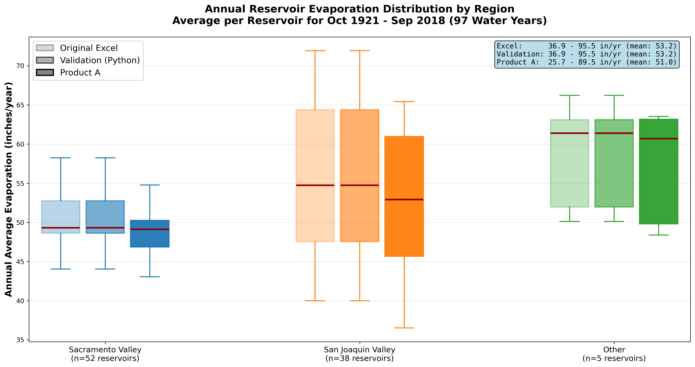

# Reservoir Evaporation (96 Variables)

```{admonition} Repository Module
:class: tip

**Module:** `mod_reservoir/evaporation/`  
Hargreaves-Samani evaporation for 95 reservoirs
```


Evaporation calculations for 95 CalSim 3.0 reservoirs distributed across three regions: 52 in the Sacramento Valley, 38 in the San Joaquin Valley, and 5 on the west side. Each reservoir has an associated Excel spreadsheet with five different reconstruction methods, but the majority employ monthly regression calibration with the Hargreaves-Samani evaporation equation.

## Methodology

### Hargreaves-Samani Equation

The Hargreaves-Samani equation provides the core evaporation calculation using temperature extremes and solar radiation as primary drivers. The equation requires daily maximum temperature, daily minimum temperature, day of year, and reservoir latitude. Monthly radiation factors and calibration coefficients specific to each reservoir adjust raw evaporation estimates to match historical patterns. These parameters were extracted from the original Excel spreadsheets and stored in a JSON database for programmatic access.

The approach employs VLOOKUP-style elevation adjustment where calibration factors vary with reservoir surface elevation. This accounts for changes in wind exposure, fetch length, and microclimate effects as reservoir levels fluctuate. The monthly calibration ensures seasonal patterns match historical evaporation observations or water balance-derived estimates.

### Python Automation

The entire Excel calculation process has been replicated in Python, avoiding the need to run 95 Excel spreadsheets multiple times for different climate scenarios. A dedicated database-extraction script (`_0_extract_reservoir_database.py`) parses the original Excel workbooks and stores all reservoir-specific parameters—monthly radiation factors, calibration coefficients, elevation adjustment tables, latitude, and surface area relationships—into a centralized JSON database. This JSON structure provides programmatic access to all 95 reservoir configurations in a single file, enabling rapid parameter lookups without repeated Excel I/O.

The JSON database also serves a documentation purpose: every parameter that governs evaporation calculations is visible, searchable, and version-controllable in a text format rather than buried across 95 separate spreadsheets. When MSO updates reservoir parameters, the database-extraction script can regenerate the JSON from updated spreadsheets, maintaining synchronization between the authoritative Excel sources and the production Python implementation.

Processing time for all 95 reservoirs is approximately 2–3 seconds, compared to hours for manual Excel processing. Individual CSV outputs are generated by region and reservoir, with a combined file providing complete evaporation time series across the domain. The regional breakdown—52 Sacramento Valley, 38 San Joaquin Valley, and 5 west side reservoirs—follows MSO's organizational convention and facilitates targeted validation against regional patterns.

## Results

Validation followed a rigorous three-step process to ensure Python implementation fidelity before applying to new climate data. Step one established baseline performance by analyzing original Excel outputs through box plots showing monthly evaporation distributions. Step two verified Python calculation accuracy by running the same input data (historical temperature) through both Excel and Python implementations. The result was exact numerical matching, validating the Python scripts reproduce Excel calculations perfectly.

Step three applied the validated Python implementation to Product A temperature data from the weather generator. The result showed slightly lower evaporation for most reservoirs compared to historical baselines. Discussion with MSO staff identified the cause as reduced daily temperature range (difference between $T_{max}$ and $T_{min}$) in the synthetic climate, which directly affects the Hargreaves-Samani calculation even when mean temperatures remain similar. The Hargreaves-Samani equation computes reference evapotranspiration approximately as:

$$ET_0 = 0.0023 \cdot (T_{mean} + 17.8) \cdot (T_{max} - T_{min})^{0.5} \cdot R_a$$

where $R_a$ is extraterrestrial radiation. Since the formula involves the square root of temperature range, a compressed diurnal cycle in synthetic climate reduces evaporation even if the mean temperature is preserved.

An important connection exists between reservoir evaporation and the reservoir storage curves module. For Oroville specifically, the evaporation calculation uses a storage-based surface area relationship where surface area varies with reservoir level. The DCR 2023 sedimentation correction—reducing maximum storage from 3,538 to 3,424.8 TAF—affects the elevation-to-area conversion and therefore influences evaporation rates. This coupling between the reservoir storage reconstruction and evaporation calculation ensures physical consistency across modules.

:::note Suggested Plot
Box plot comparison showing monthly evaporation distributions for all 95 reservoirs across three validation steps: (1) Original Excel output with historical temperature, (2) Python output with historical temperature (demonstrating exact match), (3) Python output with Product A temperature (showing slight reduction). Color-code by region (Sacramento, San Joaquin, west side).
:::


*Reservoir evaporation validation results from Progress Meeting 3 showing the three-step comparison across all 95 reservoirs. Box plots demonstrate exact Python-Excel agreement (Steps 1–2) and the slight evaporation reduction under Product A synthetic temperature (Step 3).*

