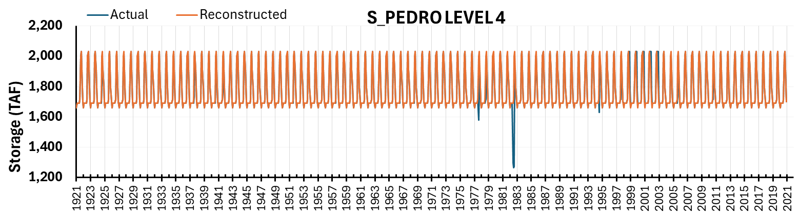
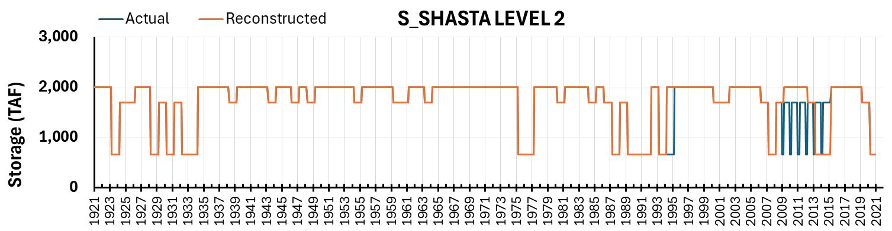
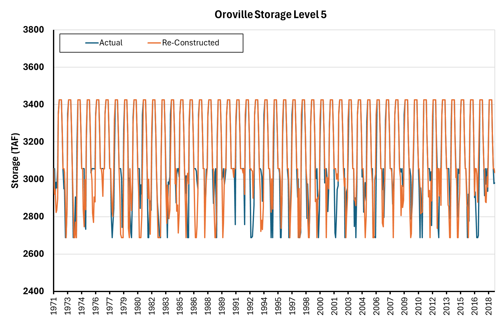

# Reservoir Storage Curves (9 Variables)

```{admonition} Repository Module
:class: tip

**Module:** `mod_reservoir/storage_curves/`  
Reservoir storage reconstruction and rule curves
```


Reservoir storage curves define operational constraints at multiple "levels" for major California reservoirs, representing flood control space, conservation pool limits, and minimum operating thresholds.




*Reservoir storage curves overview from Progress Meeting 3. Seven CalSim 3 reservoir storage levels require reconstruction. Five reservoirs have WYT-based monthly patterns available, with Trinity Levels 2 and 3 fully aligned and minor mismatches at three other reservoirs.*

## Methodology

### Mammoth Pool Storage (Flood Reservation Space)

Mammoth Pool flood reservation space was reconstructed using quantile mapping from Millerton unimpaired inflow, which serves as the hydrologic basis with correlation R = 0.7. The methodology employed split-sample validation with 1921-1971 as training period and 1972-2018 as testing period.

Recommendation from MSO staff to plot exceedance curves (for example, end-of-September storage) would provide clearer validation visualization than time series comparison, as it directly assesses whether the full distribution of storage levels is captured rather than requiring year-by-year alignment.

:::note Suggested Plot
Exceedance probability curves for Mammoth Pool flood space at end-of-September and end-of-February, comparing historical CalSim inputs (black line) against reconstructed values (blue line) for WY 1972-2018 validation period. Include confidence bands and highlight 10th, 50th, and 90th percentiles.
:::

### Oroville Level 5 (Top of Conservation / Flood Control)

Oroville Level 5 represents a complex flood control calculation based on Water Control Manual procedures rather than simple correlation approaches. The reconstruction faced a fundamental challenge: reconciling water control diagram specifications with actual CalSim storage values revealed a systematic discrepancy due to reservoir sedimentation.

#### Sedimentation Correction

DCR 2023 reporting documents a critical finding from LIDAR and SONAR bathymetric surveys showing 3% reduction in storage capacity since original construction. The original water control manual maximum storage of 3,538 TAF no longer reflects current physical capacity, which is now 3,424.8 TAF. This ~113 TAF difference reflects approximately 50 years of sediment accumulation behind Oroville Dam, accelerated by major flood events. The sedimentation correction presents a challenge as reservoir operations use elevations as control targets, not volumes. The same elevation that previously corresponded to 3,538 TAF now corresponds to 3,424.8 TAF due to changed bathymetry. 

#### Wetness Index Methodology

The reconstruction implements the USGS-documented wetness index algorithm, which recursively calculates daily wetness based on precipitation and previous day's wetness with seasonal parameter variations. Physically, the wetness index represents antecedent soil moisture and catchment wetness conditions that govern how much flood pool space the Army Corps requires—wetter conditions demand more reserved flood space since the watershed can absorb less additional precipitation before generating dangerous runoff.

The water control diagram translates wetness index to flood pool requirement, with maximum flood space of 737.3 TAF at wetness index $\geq 11$ declining to minimum flood space of 368.2 TAF at wetness index $= 1$. Original implementation used stepwise function rounding to nearest integer wetness index, but refinement to interpolate to first decimal place (e.g., 4.1, 4.2) provides smoother transitions matching CalSim behavior. This interpolation refinement was identified during Progress Meeting 3 discussions, where comparison of scatter plots between integer-stepped and interpolated wetness indices showed substantially reduced scatter in the reconstructed flood pool values.

Flood pool adjustments across the wetness index range maintain consistent operational elevations while correcting storage volumes for sedimentation. The minimum and maximum values align well with current results, and interpolation refinement addresses scatter in intermediate values. For synthetic sequences, the wetness index algorithm runs on WGEN precipitation directly, producing daily wetness values that translate through the calibrated relationship to monthly flood pool requirements without requiring intermediate model runs.

### Other Reservoir Levels

Trinity Levels 2 and 3 track Sacramento Valley index patterns, reconstructed through water year type averaging. These levels represent top-of-conservation and minimum operating constraints that follow consistent operational rules tied to annual water availability classifications. Shasta Level 2 (minimum pool) remains constant at 1,150,000 acre-feet across all conditions, reflecting a fixed physical constraint rather than variable operations.

Folsom Level 2 employs water year type averaging. Don Pedro Level 4 uses quantile mapping with Tuolumne inflow as basis, though one anomalous year in the historical record appears to lack any consistent replicable pattern. Investigation into this anomaly during the December and January progress meetings confirmed it likely represents a unique operational event (possibly maintenance drawdown or emergency release) that should not be reproduced systematically in synthetic sequences. The reconstruction algorithm produces the correct value for all other years while treating the anomaly as an irreducible discrepancy.

Additional reservoir storage discussions during the January progress meetings addressed whether Folsom and Trinity require deeper analysis beyond simple WYT averaging. For Folsom, the Level 2 minimum pool has shown remarkably consistent behavior, suggesting that WYT averaging captures the essential operational pattern without need for more complex approaches. Trinity Levels 2 and 3 similarly follow Sacramento Valley index patterns with high fidelity, validating the water year type approach for these operational constraints.

## Results

Seven reservoir storage level reconstructions show strong performance, with five achieving nearly perfect alignment and two requiring careful interpretation of historical anomalies. Trinity Levels 2 and 3 completely align with CalSim inputs using water year type patterns. Folsom Level 2, Don Pedro Level 4, and Shasta Level 2 show very limited mismatches, demonstrating robust methodology. These successes establish confidence in the water year type and quantile mapping approaches for reservoir operations.

### Mammoth Pool

Validation achieved R² = 0.83 with values predominantly aligned to actual inputs. Minor misalignments appear in two contexts: minimum storage values during September through February, and anomalous behavior during the 2012-2015 drought period where actual CalSim inputs maintain storage consistently higher than expected.


*Mammoth Pool storage quantile mapping validation from Progress Meeting 3 (R² = 0.83). Millerton inflow serves as basis with correlation R = 0.7.* The drought anomaly likely reflects maintenance or operational constraints where actual operations deviated from typical patterns. Attempting to replicate such anomalies through algorithms may be counterproductive, as the systematic reconstruction based on hydrologic relationships provides more defensible projections for synthetic sequences.

### Oroville Level 5


*Oroville Level 5 (Top of Conservation) reconstruction from Progress Meeting 3. Quantile mapping using UNIMP_OROV as basis achieves R² = 0.75. The wetness index approach translates precipitation-based wetness to flood pool requirements.*

:::note Suggested Plot
Scatter plot of wetness index vs flood pool storage for WY 1972-2018, with actual CalSim inputs (gray points), pre-sedimentation water control manual relationship (dashed red line, max 750 TAF), post-sedimentation corrected relationship (solid blue line, max 737.3 TAF), and reconstructed values (blue points). Annotate key wetness index thresholds.
:::

