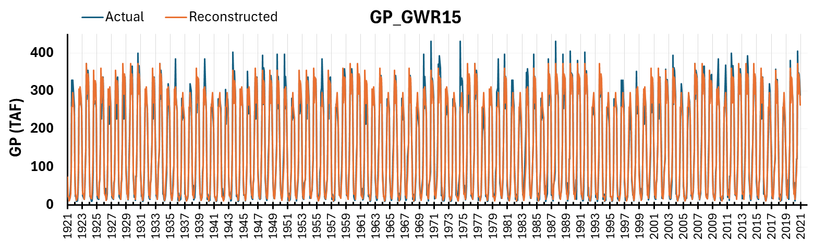
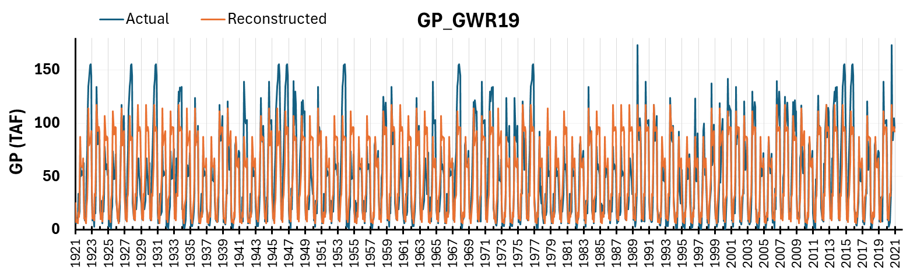
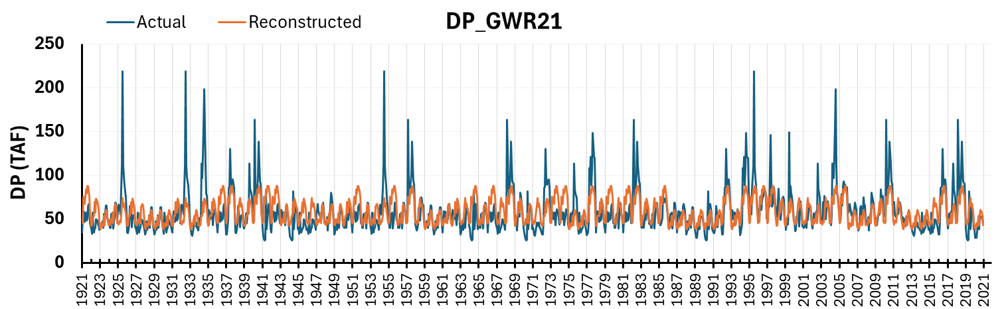

# Tulare Groundwater Terms (14 Variables)

```{admonition} Repository Module
:class: tip

**Module:** `mod_hydrology/tulare_gw/`  
Tulare Basin groundwater terms via WYT averaging
```


Groundwater pumping and deep percolation terms for Tulare Basin C2VSim areas 15-21. The 14 terms comprise seven groundwater pumping variables and seven deep percolation variables representing C2VSim fine grid solution outputs. These terms exist outside CalSim's primary water system domain, serving as placeholders that maintain groundwater dynamics in reasonable ranges without full integration into CalSim's operations.

## Methodology

Correlation testing against rim inflow variables across all 14 terms revealed correlations uniformly below 0.8, with most substantially lower. This eliminated quantile mapping as a viable approach since QM performance degrades significantly when basis-target correlation falls below 0.7. The Progress Meeting 3 presentation included an R² comparison table showing QM versus WYT performance for all 14 terms, confirming WYT averaging's superiority for these low-correlation variables. Water year type averaging emerged as the only practical methodology given these constraints.

The approach calculates monthly averages conditional on San Joaquin water year type classification (Wet, Above Normal, Below Normal, Dry, Critical), which is appropriate given Tulare Basin's location and hydrologic character. For each calendar month and water year type combination, historical values are averaged to produce representative patterns. These patterns are then applied to synthetic sequences based on reconstructed San Joaquin WYT classification.

Running C2VSim for 1,000 years would require land use projections, agricultural demand assumptions, and computational resources beyond Phase I scope. MSO staff provided important context during the October and November progress meetings, noting that these terms "are kind of like a placeholder that we just keep the groundwater in a reasonable range" and emphasizing "I really wouldn't put too much weight on this part of the data." CalSim 3 does not cover the entire Tulare region, and these terms originate from an older C2VSim fine grid solution not directly coupled to CalSim operations. The terms represent a legacy boundary condition inherited from earlier model versions where Tulare Basin dynamics were approximated rather than simulated.

This candid assessment from MSO informed the decision to accept WYT averaging despite its limitations. Investing significant effort in sophisticated reconstruction methods for variables that model developers themselves consider approximate placeholders would not be an efficient use of project resources.

## Results

### Groundwater Pumping Terms

Groundwater pumping variables show acceptable R² values ranging from moderate to strong correspondence. The best-performing examples demonstrate good overall fit with realistic seasonal patterns. The worst-performing pumping term (GP-19) still achieves acceptable results despite showing less variation than actual historical values, reflecting the inherent averaging effect of the WYT methodology. Drought period reconstruction shows less up-and-down volatility than actual values, which is expected when using categorical averaging rather than continuous predictors. Given the lack of better predictive methods, this smoothing effect represents an acceptable trade-off.



*Tulare groundwater pumping reconstruction from Progress Meeting 3. Left: GWR 15 (R² = 0.96, best performance). Right: GWR 19 (R² = 0.70, worst GP performance but still acceptable).*

### Deep Percolation Terms

Deep percolation variables exhibit lower R² values and reduced ability to capture signal variability compared to groundwater pumping. Best and worst examples spanning areas 15-21 illustrate a range of performance, with Term 15 showing poor reconstruction, while Terms 19-20 demonstrate moderate improvement. A consistent pattern of underestimation appears in deep percolation reconstruction, suggesting potential mass balance considerations merit investigation.



*Tulare deep percolation reconstruction from Progress Meeting 3. Left: GWR 17 (R² = 0.64). Right: GWR 21 (R² = 0.32, worst-performing term overall). Deep percolation terms consistently show lower R² than groundwater pumping terms.*

:::note Suggested Plot
Four-panel comparison showing best and worst examples for both GP and DP terms. Each panel includes time series (WY 1972-2018) with actual (gray) and reconstructed (blue) values, plus inset box plot by WYT showing how averages differ across water year types. Annotate R² and mean annual difference on each panel.
:::

The documented limitations are acceptable within project constraints. The groundwater pumping and deep percolation patterns provide hydrologically reasonable boundary conditions that avoid introducing systematic biases or unrealistic trends. For long-term stochastic planning focused on core system performance, maintaining plausible Tulare groundwater behavior through WYT averaging serves project objectives while acknowledging appropriate methodological boundaries.

