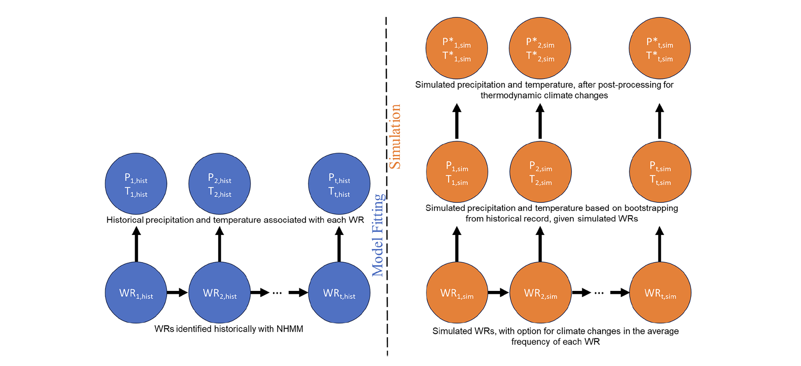
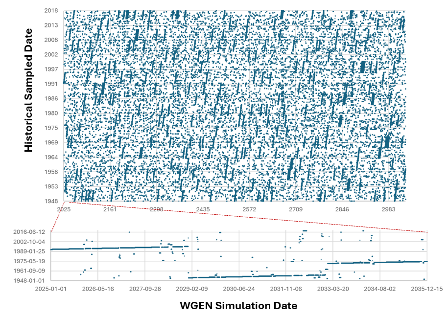
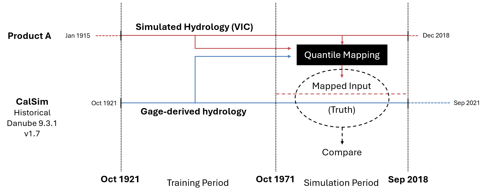
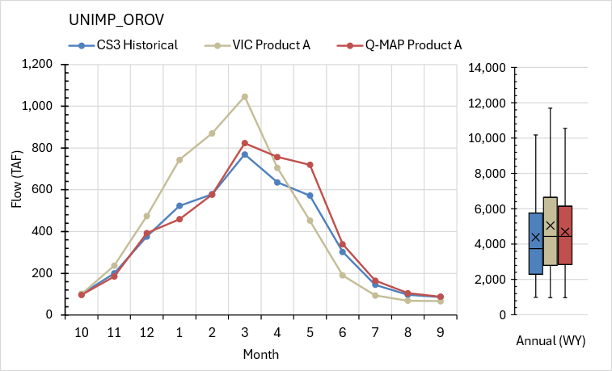
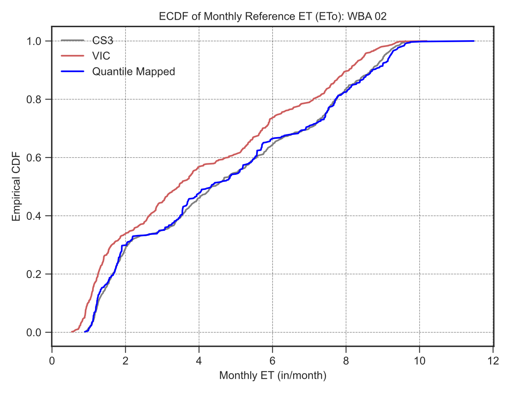

# Methods

This section describes the technical approaches used to transform synthetic weather into the full suite of CalSim 3 inputs. The pipeline starts with a Weather Generator that produces plausible daily climate sequences, passes those through physical models, and applies statistical reconstruction methods to bridge any remaining gaps.

## WGEN (the "Weather Generator")
d
The WGEN is a Non-Homogeneous Hidden Markov Model (NHMM) that generates synthetic daily temperature and precipitation by simulating transitions between eight distinct weather regimes derived from historical atmospheric circulation patterns over the western United States. For each simulated day, the model selects a weather regime, then bootstraps daily precipitation and temperature from the pool of historical days sharing that regime. This preserves observed relationships between large-scale atmospheric patterns and local weather outcomes.

The algorithm samples historical dates in **4-year blocks** to maintain multi-year persistence -- consecutive drought winters or extended pluvial periods that purely random regime simulation would underrepresent. Within each block, approximately 70--85% of days come from the same historical 4-year period; the remainder are drawn from other periods when regime transitions require alternative source dates.

For heavy precipitation events, a copula-based jittering step adds noise to resampled values, allowing the synthetic record to occasionally exceed historical maxima while preserving the statistical structure of the data.

The WGEN produces two output products. **Product A** covers the historical period (WY 1915--2018) using a mode that reproduces the historical weather regime sequence -- a synthetic parallel to observed climate used for validation. **Product B** spans 1,000 years with entirely new regime sequences unconstrained by historical chronology, producing the planning dataset.

::::{tab-set}
:::{tab-item} Algorithm Overview

*WGEN two-phase algorithm. Model fitting classifies historical weather into regimes. Simulation generates new regime sequences and bootstraps daily weather from matching historical days.*
:::
:::{tab-item} Sampling Patterns

*Sampling date patterns showing which historical dates (y-axis) are sampled for each simulation period (x-axis). Top panel: portion of the 1,000-year simulation. Bottom panel: 10-year detail. Diagonal bands indicate the 4-year block sampling structure.*
:::
:::{tab-item} Product A vs Product B
| | **Product A** (Validation) | **Product B** (Planning) |
|---|---|---|
| **Period** | WY 1915--2018 (~104 years) | 1,000 years (10 x 100-year chunks) |
| **WGEN mode** | Historical regime sequence | Unconstrained stochastic regimes |
| **QM training** | 1921--1971 (validated on 1972--2018) | Uses full historical record |
| **Purpose** | Validate methods against known CalSim inputs | Stochastic planning runs |
:::
::::

## From Weather to CalSim Inputs

Synthetic weather enters CalSim through two pathways: **model-based generation**, where physical process models are driven directly with WGEN climate, and **statistical reconstruction**, where quantile mapping or other methods transform model outputs into CalSim variables.

Six process models -- VIC, CalSimHydro, CalSimHydroEE, Small Watersheds, DCD, and Reservoir Evaporation -- produce over 1,200 variables (~80% of all generated inputs). VIC sits upstream of everything but does not produce CalSim inputs directly. Its streamflow outputs are quantile-mapped to generate the 241 rim inflow variables, and its ET outputs are quantile-mapped into CalSimHydro. In this sense, VIC drives over 1,000 variables through downstream models even though the raw VIC output is never used as-is. Wind speed, which WGEN does not produce, is handled by merging actual historical wind for Product A and sampling via WGEN date mapping for Product B.

The remaining ~20% of variables lack a direct process model and are instead reconstructed statistically. The method chosen for each variable depends on its physical characteristics and how well it correlates with available model outputs:

```{mermaid}
%%{init: {'flowchart': {'nodeSpacing': 50, 'rankSpacing': 10}}}%%
flowchart LR
    START(["Variable to<br/>Reconstruct"]) --> PHYS{"Physical<br/>model?"}
    PHYS -->|Yes| MODEL["Model-Based<br/>Generation"]
    PHYS -->|No| FORMULA{"Known<br/>physical<br/>relationship?"}
    FORMULA -->|Yes| DIRECT["Direct<br/>Calculation"]
    FORMULA -->|No| CORR{"R&sup2; with<br/>inflow?"}
    CORR -->|"> 0.5"| QM["Quantile<br/>Mapping<br/>(or Hybrid QM)"]
    CORR -->|"< 0.5"| PATTERN{"Regular<br/>seasonal<br/>pattern?"}
    PATTERN -->|Yes| WYT_AVG["WYT Monthly<br/>Averaging"]
    PATTERN -->|No| STITCH["WGEN Date-<br/>Stitching"]
    PATTERN -->|No| FLOW["Flow Index<br/>Matching"]

    style MODEL fill:#2d6a4f,color:#fff
    style QM fill:#2d6a4f,color:#fff
    style WYT_AVG fill:#2d6a4f,color:#fff
    style DIRECT fill:#2d6a4f,color:#fff
    style STITCH fill:#2d6a4f,color:#fff
    style FLOW fill:#2d6a4f,color:#fff
    style START fill:#264653,color:#fff
```

_Method selection decision tree. The appropriate reconstruction methodology for each variable is determined by available physical models, correlation strength with VIC or flow indices, seasonal pattern regularity, and WGEN date mapping availability._

## Input Generation Validation

Validation applies to the **entire suite** of generated inputs -- not just the quantile-mapped variables, but every variable produced by every module. The goal is to confirm that the full set of synthetic inputs, when taken together, produces a CalSim run that behaves consistently with the historical baseline.

The validation period is dictated by the quantile mapping train/test split. Because the overlapping historical period (1921--2018) is divided 50/46 -- training on WY 1922--1971 and testing on WY 1972--2018 -- the held-out half (1972--2018) is the only period where QM-based inputs can be independently evaluated. All other input types (model-based, WYT averaging, direct calculation, etc.) are validated over this same window for consistency. Product A VIC output is used as the validation basis, ensuring consistency with Product B -- both share the same underlying gridded climate data. Performance at the individual variable level is measured using coefficient of determination (R-squared), Nash-Sutcliffe Efficiency (NSE), and percent bias (PBIAS).

Beyond variable-level checks, Product A validation includes a **full CalSim 3 run** using the complete set of Product A inputs. This end-to-end test compares the CalSim historical baseline (driven by its original inputs) against a CalSim run driven entirely by inputs reconstructed from WGEN Product A climate. Differences in the resulting system operations -- reservoir storage, deliveries, Delta exports -- reflect the cumulative effect of all input generation procedures and reveal whether the synthetic inputs are suitable for planning-scale analysis.


_Validation Framework. The training half (WY 1922--1971) builds empirical CDFs; the testing half (1972--2018) validates mapped values against held-out CalSim truth. In the stochastic application (Product B), no truth target is available._


## Quantile Mapping

Quantile mapping (QM) is the core statistical method. It establishes an empirical relationship between a basis time series (typically VIC output) and a target (CalSim historical input), then applies that relationship to transform new basis values into CalSim-compatible values.

Each calendar month is processed independently to preserve seasonal patterns:

1. Build empirical CDFs for both basis and target from the training period
2. For each simulated basis value, interpolate its probability from the basis CDF
3. Invert the target CDF at that probability to obtain the mapped value
4. For values outside the historical range, fit a Gamma distribution for tail extrapolation
5. Zero-clip to prevent negative flows

::::{tab-set}
:::{tab-item} QM Diagram
```{mermaid}
flowchart LR
    subgraph basis["Basis Side (VIC)"]
        direction TB
        INPUT["Monthly<br/>Basis Value"] --> BCDF["Lookup in<br/>Basis CDF"]
    end

    BCDF --> RANGE{"In historical<br/>range?"}
    RANGE -->|Yes| EMP["Empirical<br/>percentile"]
    RANGE -->|No| GAMMA["Gamma-fitted<br/>percentile"]

    EMP --> INVERT
    GAMMA --> INVERT

    subgraph target["Target Side (CalSim)"]
        direction TB
        INVERT["Invert<br/>Target CDF<br/>at percentile"] --> CLIP["Zero-clip"] --> OUTPUT["Mapped<br/>CalSim Value"]
    end

    style basis fill:#e8f4f8,stroke:#264653
    style target fill:#e8f8e8,stroke:#2d6a4f
    style INPUT fill:#264653,color:#fff
    style OUTPUT fill:#2d6a4f,color:#fff
    style RANGE fill:#fff,stroke:#264653
```
_Quantile mapping transforms a basis value to a target value by passing through probability space. Each calendar month is processed independently._
:::
:::{tab-item} Example: QM Rim Inflow

_Oroville unimpaired inflow (UNIMP\_OROV) during the validation period (WY 1972--2018). Monthly average profiles (left) and annual distributions (right) compare CS3 Historical (blue), raw VIC Product A (tan), and quantile-mapped Product A (red). Quantile mapping corrects VIC's wet bias and brings the seasonal profile and annual distribution into closer agreement with the historical CalSim target._
:::
:::{tab-item} Example: QM ET

_Empirical CDF comparison for monthly reference ET at WBA 02. Gray: CalSim 3 historical (target); Red: Raw VIC output (basis); Blue: Quantile-mapped VIC._
:::
::::

### QM: Rim Inflows vs Other Terms

Quantile mapping is applied differently depending on whether a variable has a direct VIC model counterpart. **Rim inflow and ET terms** are mapped from VIC output -- an independent physical model driven by WGEN climate. A handful of **other CalSim3 terms** lack a VIC equivalent and are instead mapped from a correlated CalSim3 variable (the "matching term"), which must itself be generated first. This creates a two-stage dependency: rim inflow and ET outputs must exist before other terms can be reconstructed.

**Product A Validation Diagram** -- QM is trained on the first half of the historical record (WY 1922--1971) and applied to the held-out second half (1972--2018), where mapped values can be compared against known CalSim3 truth.

```{mermaid}
flowchart TB
    subgraph rim_a["RIM INFLOW / ET TERMS"]
        RA_sim["Basis: VIC Product A<br/>(1972-2018)"] -. sim .-> RA_qm["QM"] 
        RA_basis["Basis: VIC Product A<br/>(1921-1971)"] -. train .-> RA_qm
        RA_target["Target: CalSim3 Term<br/>(1921-1971)"] -. train .-> RA_qm -. sim .-> RA_out["QMAP Product A<br/>CalSim3 Term<br/>(1972-2018)"]
    end

    subgraph other_a["OTHER TERMS"]
    
        OA_sim["Basis: QMAP Product A<br/>of Matching Term<br/>(1972-2018)"] -.sim .-> OA_qm["QM"]
        OA_basis["Basis: CalSim3 Matching Term<br/>(1921-1971)"] -. train .-> OA_qm
        OA_target["Target: CalSim3 Term<br/>(1921-1971)"] -. train .-> OA_qm -. sim .-> OA_out["QMAP Product A<br/>CalSim3 Term<br/>(1972-2018)"]
    end

    RA_out -.->|"serves as sim basis"| OA_sim

    style RA_basis fill:#264653,color:#fff
    style RA_target fill:#2d6a4f,color:#fff
    style OA_basis fill:#264653,color:#fff
    style OA_target fill:#2d6a4f,color:#fff
    style RA_sim fill:#457b9d,color:#fff
    style OA_sim fill:#457b9d,color:#fff
    style RA_qm fill:#f4a261,color:#fff
    style OA_qm fill:#f4a261,color:#fff
    style RA_out fill:#e76f51,color:#fff
    style OA_out fill:#e76f51,color:#fff
```
_Product A validation. Dashed "train" arrows feed empirical CDFs from the training half; dashed "sim" arrows apply the fitted QM to held-out basis data. The cross-subgraph arrow shows the dependency: rim inflow outputs become the simulation basis for other terms._

**Product B Application Diagram** -- QM is trained on the full historical record (WY 1922--2018) and applied to VIC Product B (1,000 years). No held-out truth exists for comparison. The same two-stage dependency applies: rim inflow and ET outputs must be produced before other terms can be mapped.

```{mermaid}
flowchart TB
    subgraph rim_b["RIM INFLOW / ET TERMS"]
        RB_sim["Basis: VIC Product B<br/>(1000 years)"] -. sim .-> RB_qm["QM"]
        RB_basis["Basis: VIC Product A<br/>(1921-2018)"] -. train .-> RB_qm
        RB_target["Target: CalSim3 Term<br/>(1921-2018)"] -. train .-> RB_qm -. sim .-> RB_out["QMAP Product B<br/>CalSim3 Term<br/>(1000 years)"]
    end

    subgraph other_b["OTHER TERMS"]
        OB_sim["Basis: QMAP Product B<br/>of Matching Term<br/>(1000 years)"] -. sim .-> OB_qm["QM"]
        OB_basis["Basis: CalSim3 Matching Term<br/>(1921-2018)"] -. train .-> OB_qm
        OB_target["Target: CalSim3 Term<br/>(1921-2018)"] -. train .-> OB_qm -. sim .-> OB_out["QMAP Product B<br/>CalSim3 Term<br/>(1000 years)"]
    end

    RB_out -.->|"serves as sim basis"| OB_sim

    style RB_basis fill:#264653,color:#fff
    style RB_target fill:#2d6a4f,color:#fff
    style OB_basis fill:#264653,color:#fff
    style OB_target fill:#2d6a4f,color:#fff
    style RB_sim fill:#457b9d,color:#fff
    style OB_sim fill:#457b9d,color:#fff
    style RB_qm fill:#f4a261,color:#fff
    style OB_qm fill:#f4a261,color:#fff
    style RB_out fill:#e76f51,color:#fff
    style OB_out fill:#e76f51,color:#fff
```
_Product B application. The full historical record trains the CDFs. VIC Product B (1,000 years of stochastic streamflow) is the simulation basis for rim inflow terms. The dashed dependency arrow shows the same sequential requirement as Product A._

**There are several limitations in this framework which relies in large part on quantile mapping, including:**

- **Trend inheritance**: QM inherits long-term trends from the basis. If VIC shows a drying trend, mapped flows will too.
- **Sequence preservation**: Distributions are corrected but temporal sequencing follows the basis -- synthetic timing may differ from historical.
- **Tail extrapolation**: Values outside the historical range rely on Gamma distribution assumptions that may not hold for truly extreme events.
- **Correlation threshold**: QM works best when basis and target are well-correlated (R-squared > 0.7). Performance degrades for weaker pairs.

## Alternative Reconstruction Methods

For variables where quantile mapping is unsuitable -- due to weak correlation, lack of a continuous basis series, or known physical relationships -- three principal alternatives are used:

**WYT Monthly Averaging** -- computes monthly averages conditional on water year type (W/AN/BN/D/C) using Sacramento or San Joaquin indices. Effective for variables with regular seasonal patterns but weak direct correlation with VIC outputs, such as diversions and scheduled operations. A **Hybrid QM** variant averages QM output with the WYT monthly means: $(QM + WYT) / 2$. This dampens excessive QM peak overshoots while adding interannual variability that flat WYT patterns lack. 

**Direct Calculation** -- applies physical formulas where relationships are known. For example, NDOI precipitation accretion uses precip x area x coefficient (R-squared = 0.92). This category also includes threshold-based logic for allocation ratios optimized with Excel Solver, and Hargreaves-Samani reservoir evaporation computed directly from WGEN temperature inputs.

**WGEN Date-Stitching** -- leverages the WGEN's internal record of which historical dates were sampled for each synthetic day. Each synthetic month's value is a weighted average of historical values, weighted by the share of days drawn from each historical period. Applied to closure terms and other variables where the WGEN sampling pattern provides a natural link to historical conditions.

**Flow Index Matching** -- matches each synthetic water year to the single closest historical year by annual flow index similarity, then borrows that year's pattern wholesale. Applied to day volume fractions and other variables where annual hydrologic conditions, rather than daily sampling patterns, determine the appropriate historical analog.
