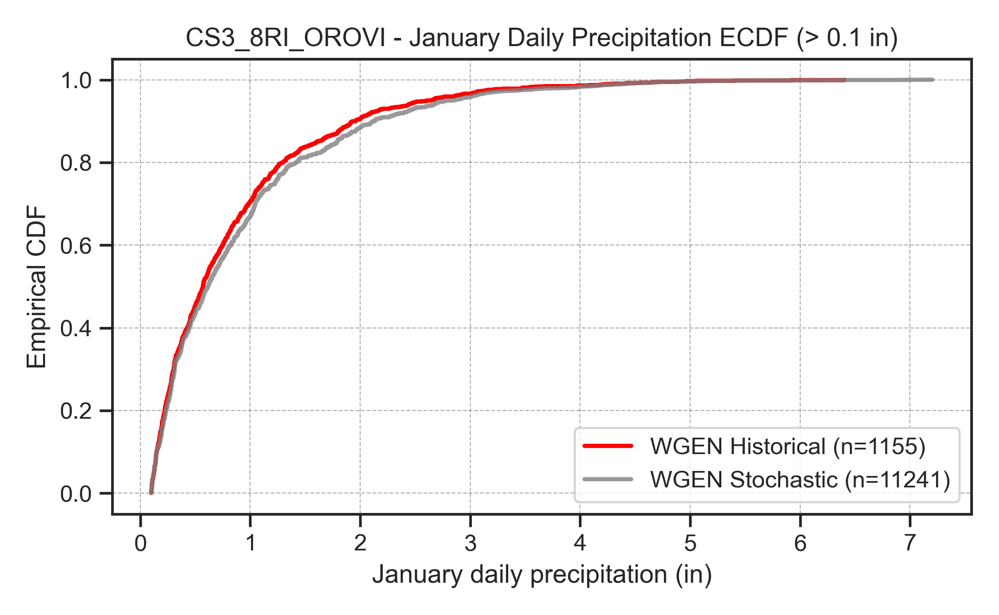

# Methods

## Weather Generator (WGEN) Product

The foundation of the stochastic input generation process is the Weather Generator (WGEN) product, which produces synthetic sequences of daily temperature and precipitation that are statistically consistent with the historical climate while exploring a broader range of conditions. The WGEN uses a Non-Homogeneous Hidden Markov Model (NHMM) to simulate transitions between weather regimes, which then drive the sampling of historical weather observations.

### Product A and Product B

The WGEN produces two distinct output products that serve different roles in the project workflow.

**Product A** covers the historical period (WY 1915–2018, approximately 104 years) and is designed for validation and sensitivity analysis. In Product A, the WGEN is run in a mode that reproduces the historical weather regime sequence, generating synthetic daily temperature and precipitation that track the observed climate trajectory. Actual historical wind speed data is merged directly. Product A outputs are single continuous time series that can be compared year-by-year against CalSim 3 historical inputs, enabling quantitative assessment of bias and reconstruction fidelity across the full historical record.

**Product B** spans 1,000 years and is the production stochastic dataset for planning analysis. The WGEN generates entirely new weather regime sequences unconstrained by historical chronology, producing plausible climate trajectories that include extended droughts, multi-year wet sequences, and other conditions not observed in the ~100-year instrumental record.

The distinction between products is central to the project's validation strategy. Product A serves as the basis for all validation metrics. For example, quantile mapping relationships are trained on the first half of the historical period (1921–1971) and tested on the second half (1972–2018) where reconstructed values can be compared directly against known CalSim inputs. Once validation confirms acceptable performance, the same methodologies are applied to Product B inputs (using the entire historical record as the training basis) to generate the 1,000-year stochastic sequences used for CalSim planning runs. This two-product structure ensures that every generation method is validated against historical truth before being applied to produce synthetic inputs.

### Algorithm Overview

The WGEN algorithm operates in two phases: model fitting and simulation. During model fitting, daily weather regimes (WRs) are identified from historical atmospheric circulation data using an NHMM. The model classifies each historical day into one of eight distinct weather regimes based on large-scale atmospheric circulation patterns over the western United States. Historical daily precipitation and temperature data across California are then associated with these historically identified weather regimes, establishing the conditional distributions that drive generation.

During simulation, the model creates new sequences of weather regimes through forward simulation of the fitted NHMM. For each simulated day, the algorithm selects a weather regime, then bootstraps daily precipitation and temperature values from the pool of historical days sharing that regime. The weather regime provides the bridge between large-scale atmospheric patterns and local weather outcomes, ensuring that generated sequences respect observed teleconnections between synoptic conditions and surface climate.

Within a given simulation day, the process works as follows: the NHMM generates a new weather regime (for example, regime 3), the algorithm identifies all historical days classified as regime 3, and one of those historical days is selected as the source for temperature and precipitation values.

*Figure 1. Overview of the weather regime-based stochastic weather generator algorithm. During model fitting (left), weather regimes are identified from historical atmospheric circulation data. During simulation (right), new weather regime sequences drive bootstrapping of precipitation and temperature values.*

A limitation of the bootstrap approach is that it cannot generate precipitation values outside the historical range. To address this limitation for extreme events, the WGEN implements a copula-based "jittering" approach that adds noise to resampled heavy precipitation data. As described in the WGEN documentation: "The block bootstrap will preserve many of the properties of the marginal and joint distributions of local weather variables, but at the expense of being able to simulate values outside the range of the instrumental record. To address this drawback specifically for heavy precipitation, the weather generator uses a copula-based jittering approach that adds noise to resampled heavy precipitation data as a post-processing step."

The jittering algorithm transforms heavy precipitation values to standard normal space (Z-scores), adds Gaussian noise ($Z_{\text{new}} = Z_{\text{old}} + \text{noise}$), and transforms back to precipitation space. This allows simulation of heavy precipitation events somewhat larger than those in the historical record while preserving the statistical structure of the data. The effect is visible in precipitation CDFs where the stochastic tails extend slightly beyond historical maxima, providing the synthetic ensemble with occasional storm events more extreme than any observed in the ~70-year sampling window.

### Base Data Sources

The WGEN relies on several foundational datasets, each contributing a specific dimension of climate information.

For precipitation, the Pierce (2021) "Unsplit Livneh" dataset covers January 1915 through December 2018 at 1/16° spatial resolution. This dataset provides the gridded daily precipitation fields that form the basis of the WGEN resampling pool. Temperature data comes from the Livneh (2013) dataset spanning January 1915 through December 2015, extended with PRISM bias-corrected data through December 2018 to complete the record. Temperature data is detrended so that the long-term mean matches the 1991-2020 period, removing secular warming trends that would otherwise create non-stationarity in the generated sequences.

Atmospheric circulation patterns are derived from NCEP/NCAR Reanalysis 1 covering January 1948 through December 2021, which provides the sea-level pressure and geopotential height fields used to classify weather regimes. As noted in the WGEN paper: "The final time series of both precipitation and temperature were truncated to the period between 1948–2018 to match the timespan of the atmospheric data used for weather regime classification." This truncation has important consequences for the stochastic product, discussed below under Wet Bias Characterization.

### Sampling Characteristics

The WGEN samples historical dates in 4-year blocks to maintain temporal consistency while allowing variation within blocks. This design choice emerged from the WGEN developers' finding that forward simulation of the fitted NHMM, when coupled with the local weather generation algorithm, "underestimated the magnitude of extreme, multi-year droughts and pluvials (i.e., simulations were over-dispersed at inter-annual timescales)." The 4-year block resampling approach preserves multi-year persistence structures—such as consecutive drought winters or extended pluvial periods—that purely random regime simulation would underrepresent.

For each simulated day, the algorithm records which historical date was sampled, creating a complete date mapping between the synthetic and historical timelines. This mapping proved essential beyond its original design purpose: it enables construction of variables that WGEN does not directly model (such as wind speed and closure terms) by tracing back to the historical conditions that generated each synthetic day.

_Figure 2. WGEN sampling date patterns showing which historical dates (y-axis) are sampled for each simulation period (x-axis). Top panel shows a portion of the 1000-year simulation; bottom panel shows detail for a 10-year period. Vertical bands indicate 4-year block sampling structure._

Analysis of the sampling patterns across the 1,000-year Product B simulation reveals that the 4-year block structure introduces substantial but not perfect coherence. Most blocks show a coverage ratio of 0.7 to 0.85, meaning 70–85% of days within any given 4-year synthetic block come from the same historical 4-year period. The remaining days are drawn from other historical periods when weather regime transitions require alternative source dates.

At the monthly level, sampling coherence is higher. Approximately 46.5% of the 12,000 synthetic months in the 1,000-year simulation are drawn entirely from a single historical month/year—a "perfect mapping" where the weighted average of contributing historical periods collapses to a single source. Another 45% of months draw from two to four distinct historical month/year combinations, with the dominant source typically contributing 60–90% of days. Less than 8% of months involve sampling from five or more distinct historical periods.

These sampling characteristics have direct implications for closure term reconstruction and other date-stitching approaches. When a synthetic month maps predominantly to a single historical month, any variable stitched from the historical record through the date mapping will closely approximate the actual historical value. Higher-entropy months with contributions from many historical periods produce weighted averages that smooth over historical variability—an acceptable trade-off given that the alternative (random assignment) would sever any connection to historical patterns.

### Wet Bias Characterization

Because atmospheric circulation data is only available from 1948 onward, WGEN sampling is restricted to the post-1948 period. This excludes the Dust Bowl era (1930s) and other pre-1948 dry periods from the sampling pool, creating a systematic wet bias in the synthetic sequences compared to the full historical record. The effect is compounded by the fact that the 1915–1947 period contains some of the driest sustained conditions in the instrumental California record. As a result, the 1948–2018 sampling window captures a wetter portion of California's observed climate than the full 1915–2018 record.

This bias produces a measurable shift in the stochastic ensemble. Analysis presented at Progress Meeting 1 showed that WGEN's 100-year historical VIC streamflow is systematically wetter than CalSim 3 historical inputs, and that the WGEN historical period represents the driest 100-year segment when compared against the ten 100-year non-overlapping stochastic windows. The 1948–2018 period, which represents the effective sampling pool, sits approximately centered within the stochastic distribution. The net effect is that the stochastic ensemble may underrepresent the severity and frequency of Dust Bowl-scale droughts.

Analysis of WGEN streamflow outputs reveals this systematic wet bias in concrete terms. The comparison below shows Oroville inflow using rolling mean comparisons at 2-year, 10-year, and 30-year windows, and a box plot of 100-year mean annual flows. The black line represents CalSim 3 historical, the red line represents WGEN historical (VIC-modeled), and gray lines represent ten 100-year non-overlapping stochastic sequences.

_Figure 3. Comparison of Oroville inflow for CalSim 3 historical (black), WGEN historical VIC (red), and 1000-year stochastic sequences (gray). Rolling mean comparisons show systematic differences across time scales. The 1948–2018 effective sampling period is nearly centered within the stochastic distribution._

_Oroville streamflow detail from the WGEN Check analysis, showing the 1948–2018 sampling period within the broader stochastic distribution._

The WGEN Check analysis further illustrates the wet bias at the precipitation forcing level. The comparison confirms the same pattern: WGEN precipitation from the post-1948 sampling window produces a wetter signal than the full historical record.

_Oroville precipitation comparison confirming the wet bias pattern at the climate forcing level._

A secondary contributor to the wet bias is the VIC model itself, which shows approximately 25–30% positive bias compared to CalSim 3 historical inputs—a consequence of VIC's calibration approach and spatial resolution. Quantile mapping addresses this distributional mismatch by aligning VIC outputs to CalSim 3 target distributions month by month, but the underlying wet signal in the WGEN sampling pool propagates through to the stochastic ensemble as a tendency toward wetter-than-historical conditions.

The geographic distribution of this bias is not uniform. Meeting discussions noted that the weather generator tends to run wet in the Sacramento Valley (northern California) and dry in Southern California, a pattern driven by the 1920–1950 period being exceptionally dry in the Sacramento basin relative to post-1948 conditions. This spatial heterogeneity means that Sacramento-dominated variables (rim inflows, CalSimHydro water budgets) are more affected by the wet bias than San Joaquin or Tulare Basin variables.