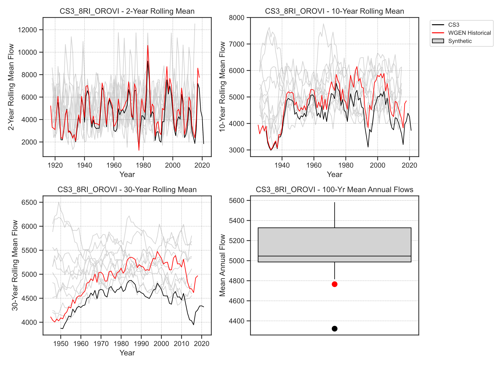
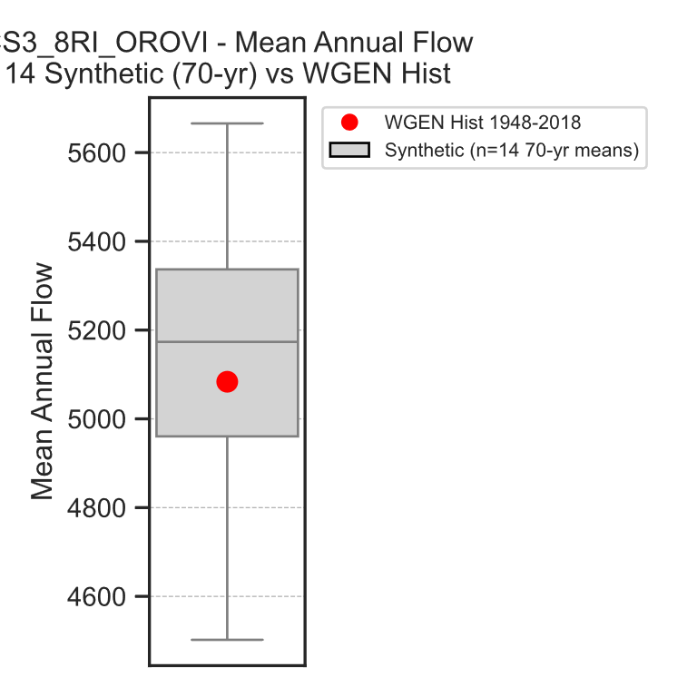
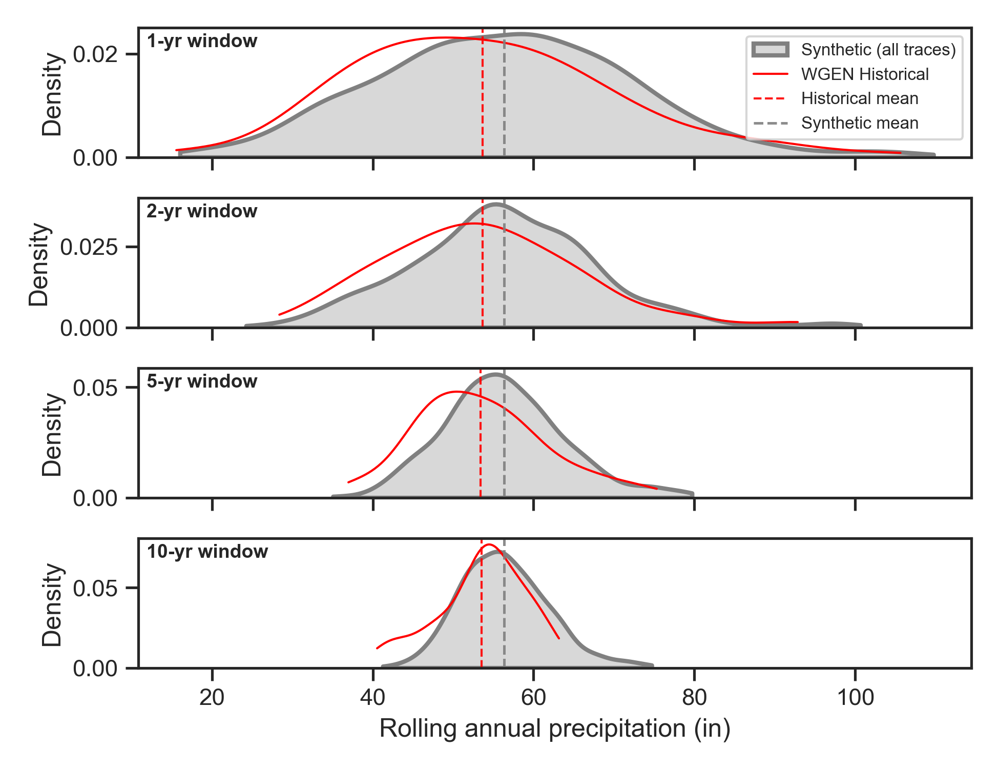

# Wrap-up

## Key Results

Phase I delivered both products and validated them against the CalSim 3 baseline (DCR 2023).

### Product A (Validation)

The historical-parallel sequence confirms the generation pipeline. At the input level, the
actively generated, time-varying variables achieve a median $R^2$ of 0.98 and mean $R^2$ of 0.90
against historical CalSim values, with 71% exceeding $R^2 \geq 0.90$. Driven end-to-end through a
CalSim 3 run, Product A reproduces annual-average deliveries, Delta flows, and reservoir storage
within roughly 0--6% of the historical baseline over WY 1972--2018. The residual differences are
systematic rather than random, tracing to a wet rim-inflow signal and an ET bias from quantile
mapping in CalSimHydro. Full detail in {doc}`Results / Product A </source/results_product_a>`.

### Product B (Planning Ensemble)

The 1,000-year, ten-trace ensemble is the primary deliverable. Its central tendency runs wetter than
the baseline, driven by the same rim-inflow hydrology bias seen in Product A (ensemble median +7%),
while its spread still brackets and extends the historical record. Trace means run wetter (Delta
outflow +6 to +35% across traces), yet individual traces reach single-year minima below the
historical worst year for deliveries, exports, and carryover storage. Running the ensemble through
CalSim 3 also surfaced operational edge cases. Eight of ten traces required targeted WRESL fixes to
complete the San Joaquin restoration cycle under out-of-range flow extremes. Full detail in
{doc}`Results / Product B </source/results_product_b>` and the
{doc}`infeasibility report </source/calsim-run/sjr_infeasibility_report>`.

## Key Findings

### VIC Model Bias

VIC-modeled flows show an approximately 25 to 30% positive bias relative to CalSim 3 historical inputs, so quantile mapping correction is applied to all VIC-derived inputs. Without it, direct use of VIC outputs would systematically overestimate water availability throughout the system.

Quantile mapping corrects the distributional bias and brings the mapped values into closer alignment with CalSim 3 historical targets over the validation period. The size of the required correction reflects the framework's dependence on upstream VIC calibration.

### WGEN Wet Bias

The exclusion of pre-1948 data from the WGEN sampling pool creates a slight wet bias in the 100-year stochastic sequences. Atmospheric circulation data from NCEP/NCAR Reanalysis 1 is only available from 1948 onward, so the WGEN cannot sample the Dust Bowl era (1930s), which seems to result in stochastic sequences underrepresenting the frequency and length of extreme dry periods. The 1948-2018 sampling period is therefore approximately centered within the stochastic distribution, whereas the full historical record including pre-1948 would likely shift the center of the stochastic distribution more in agreement with the full 1921-2018 period.

The bias is not spatially uniform. The WGEN runs wet in the Sacramento Valley and dry in Southern California, because the 1920-1950 period was exceptionally dry in the Sacramento basin relative to post-1948 conditions. The wet bias is visible end-to-end in the Product B ensemble, where 100-year mean precipitation run 0-7% above baseline and propagates to wetter system-level deliveries, Delta flows, and storage.

::::{tab-set}
:::{tab-item} Inflow (1915-2018)

*Oroville unimpaired inflow (VIC modeled, CS3_8RI_OROVI) rolling mean flows and 100-year mean annual distribution. CalSim 3 historical (black) and WGEN historical Product A (red) are compared against 10 synthetic Product B 1,000-year traces (gray) at 2-year, 10-year, and 30-year averaging windows. The 100-year box plot (lower right) shows the CalSim 3 mean (~4,350 TAF/yr, black dot) and WGEN historical mean (~4,800 TAF/yr, red dot) both fall below any of the n=10 100-year synthetic ensemble means.*
:::
:::{tab-item} Inflow (1948-2018)

*Mean annual Oroville unimpaired flow for 14 synthetic 70-year segments (gray box, IQR ~4,950--5,330 TAF/yr) compared to the WGEN historical 1948--2018 mean (~5,070 TAF/yr, red dot). When evaluated over the 70-year (1948-2018) historical period, the historical mean falls within the inner quartile of the synthetic distribution, showing that the WGEN does not have a wet bias relative to the historical data it was sampled from.*
:::
:::{tab-item} Precipitation

*Kernel density estimates of rolling mean annual precipitation over the Oroville watershed grids at 1-, 2-, 5-, and 10-year averaging windows. WGEN historical Product A (1915-2018) (red curve) is compared against all synthetic stochastic window traces (gray shading). The synthetic mean (gray dashed line) exceeds the historical mean (red dashed line) at all window lengths. The historical distribution is shifted drier and narrower, consistent with the post-1948 WGEN wet bias relative to the fuller 1915-2018 record.*
:::
::::

### ET Bias

ET bias is mainly propagated through CalSimHydro. VIC flux outputs (EVAP, PET_H2OSURF, PET_SHORT) are first quantile-mapped to CalSim historical ET targets, then the mapped ET is used as input to CalSimHydro alongside WGEN precipitation. The resulting bias reflects both the VIC model's ET estimation under synthetic climate and the quantile mapping transformation. Because quantile mapping corrects the distribution but not the rank ordering, shifts in the VIC ET distribution propagate through the mapping in ways that differ from a simple temperature-driven bias.

The net effect on CalSimHydro water budgets is substantial. Lower rangeland ET under quantile-mapped inputs leaves more water available for percolation, driving a +8.8% increase in deep percolation across all Water Budget Areas (~380 TAF/yr). Applied water increases +2% as irrigation compensates for higher potential ET. The ET change proved more influential than the WGEN precipitation change in driving CalSimHydro output differences.

## Recommendations

Phase I findings point to the following recommendations for Phase II refinement and production runs.

### Update ET Methodology

The current VIC-based ET quantile mapping approach should continue for Phase I completion. The Hargreaves-Samani calibrated CIMIS grass-reference ET methodology should be incorporated as a Phase II enhancement.

### Address WGEN Bias

The WGEN wet bias from post-1948 sampling excludes Dust Bowl-era (1930s) conditions from the stochastic ensemble, so drought vulnerability analysis may underestimate the frequency of the most extreme droughts. The VIC positive bias of approximately 25 to 30% in rim inflows is partially corrected through quantile mapping but reflects the framework's dependence on hydrology model calibration. 

### Plan Phase II Scope

Phase II scoping should build on the Phase I findings, particularly the model infeasibilities and operational rule modifications needed for extreme stochastic sequences. Extended droughts and multi-year wet sequences can push CalSim operational rules outside their design range and require adjustment for realistic simulation. The Phase I report should identify these areas even where the modifications fall beyond the current scope.

### DCR 2025/27 Transition

DCR 2025 retires several closure terms, which simplifies processing and eliminates the need to maintain the weighted-average methodology for variables that no longer exist in the model. DCR 2025 may also incorporate updated reservoir sedimentation data, revised operational rules, and potentially the new ET methodology. Each of these could affect stochastic input generation requirements.

When transitioning to DCR 2025, careful attention must be paid to ensuring proper alignment of module versions. CalSimHydro, External Elements (EE), Small Watersheds, Delta Channel Depletion (DCD), and the Delta Salinity Model (DSM) all need to be compatible with the DCR 2025 baseline. The integration testing phase of DCR 2025 deployment will need to verify that stochastic inputs work correctly with all updated modules.